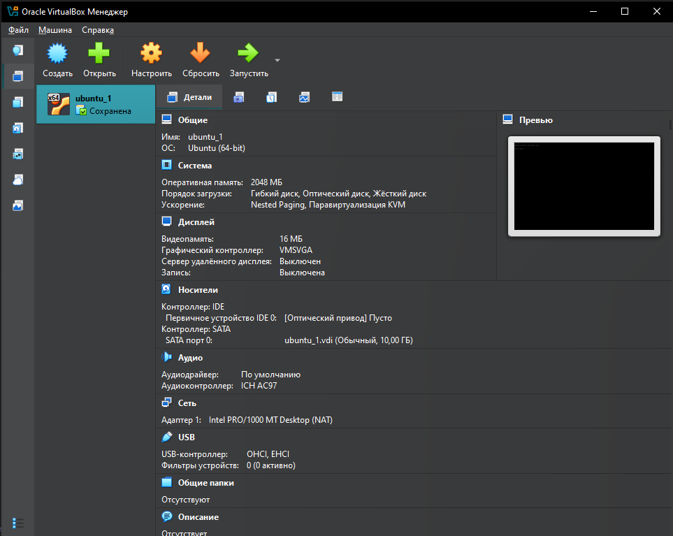
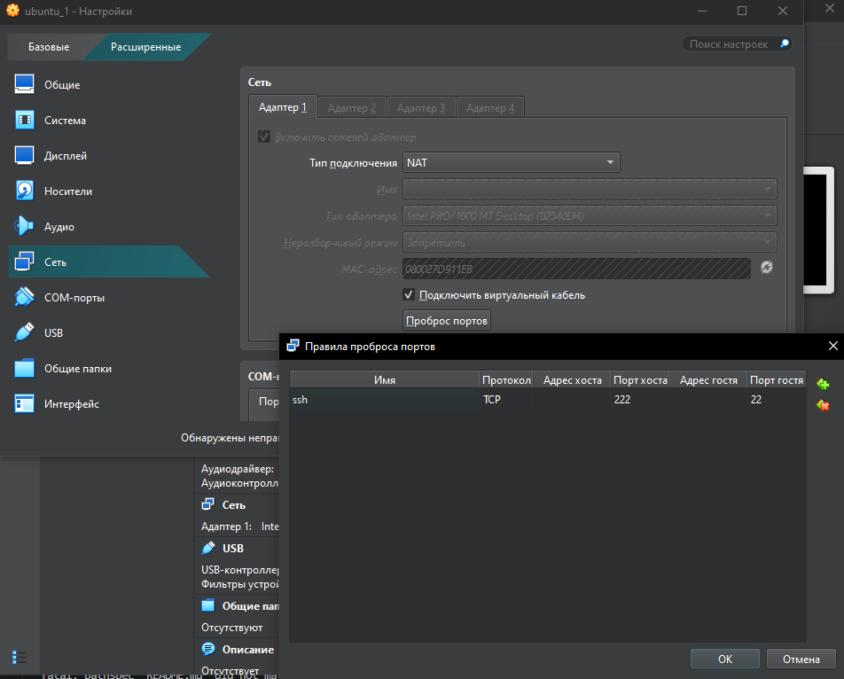
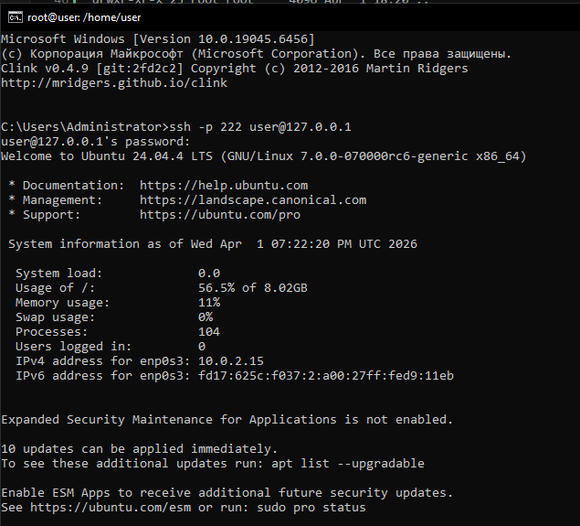

# Домашнее задание "Обновление ядра системы"

## Задание

1. Запустите ВМ c Ubuntu.
2. Обновите ядро ОС на новейшую стабильную версию из mainline-репозитория.
3. Оформите отчет в README-файле в GitHub-репозитории.

---

## Выполнение задания

### 1. Запуск ВМ с Ubuntu

- Установлено ПО **Oracle VirtualBox**.
- Загружен образ `ubuntu-24.04.4-live-server-amd64.iso`.
- Создана ВМ с именем **Ubuntu_1**.

<p align="center">
  
</p>

- Настроен проброс портов для доступа по SSH.

<p align="center">
  
</p>

- Подключение по SSH выполнено командой:

```
ssh -p 222 user@127.0.0.1
```

2. Обновите ядро ОС на новейшую стабильную версию из mainline-репозитория.
- Осуществлена проверка текущей версии ядра:
```
root@user:/home/user# uname -r
6.8.0-107-generic
```
- Поиск свежей версии ядра в  https://kernel.ubuntu.com/mainline
- Создаем в домашнем каталоге папку и переходим в нее
```
root@user:/home/user# mkdir kernel
root@user:/home/user# cd kernel/
```
- скачиваем файлы
```
wget https://kernel.ubuntu.com/mainline/v7.0-rc6/amd64/linux-headers-7.0.0-070000rc6-generic_7.0.0-070000rc6.202603292342_amd64.deb
wget https://kernel.ubuntu.com/mainline/v7.0-rc6/amd64/linux-headers-7.0.0-070000rc6_7.0.0-070000rc6.202603292342_all.deb
wget https://kernel.ubuntu.com/mainline/v7.0-rc6/amd64/linux-image-unsigned-7.0.0-070000rc6-generic_7.0.0-070000rc6.202603292342_amd64.deb
wget https://kernel.ubuntu.com/mainline/v7.0-rc6/amd64/linux-modules-7.0.0-070000rc6-generic_7.0.0-070000rc6.202603292342_amd64.deb
```
- проверяем что они скачались
```
root@user:/home/user/kernel# ll
total 202476
drwxr-xr-x 2 root root      4096 Apr  1 18:28 ./
drwxr-x--- 5 user user      4096 Apr  1 18:27 ../
-rw-r--r-- 1 root root  14757364 Mar 30 00:22 linux-headers-7.0.0-070000rc6_7.0.0-070000rc6.202603292342_all.deb
-rw-r--r-- 1 root root   6005224 Mar 30 00:21 linux-headers-7.0.0-070000rc6-generic_7.0.0-070000rc6.202603292342_amd64.deb
-rw-r--r-- 1 root root  17275072 Mar 30 00:21 linux-image-unsigned-7.0.0-070000rc6-generic_7.0.0-070000rc6.202603292342_amd64.deb
-rw-r--r-- 1 root root 169277632 Mar 30 00:21 linux-modules-7.0.0-070000rc6-generic_7.0.0-070000rc6.202603292342_amd64.deb
```
- Устанавливаем все пакеты:
```sudo dpkg -i *.deb```
- Проверяем, что ядро появилось в /boot
```
root@user:/home/user/kernel# ls -al /boot/
total 205292
drwxr-xr-x  4 root root     4096 Apr  1 18:31 .
drwxr-xr-x 23 root root     4096 Apr  1 18:20 ..
-rw-r--r--  1 root root   287601 Mar 13 13:27 config-6.8.0-107-generic
-rw-r--r--  1 root root   307873 Mar 29 23:42 config-7.0.0-070000rc6-generic
drwxr-xr-x  5 root root     4096 Apr  1 18:31 grub
lrwxrwxrwx  1 root root       34 Apr  1 18:31 initrd.img -> initrd.img-7.0.0-070000rc6-generic
-rw-r--r--  1 root root 76332157 Apr  1 18:22 initrd.img-6.8.0-107-generic
-rw-r--r--  1 root root 80847605 Apr  1 18:31 initrd.img-7.0.0-070000rc6-generic
lrwxrwxrwx  1 root root       28 Apr  1 18:20 initrd.img.old -> initrd.img-6.8.0-107-generic
drwx------  2 root root    16384 Apr  1 18:15 lost+found
-rw-------  1 root root  9125925 Mar 13 13:27 System.map-6.8.0-107-generic
-rw-------  1 root root 10982210 Mar 29 23:42 System.map-7.0.0-070000rc6-generic
lrwxrwxrwx  1 root root       31 Apr  1 18:31 vmlinuz -> vmlinuz-7.0.0-070000rc6-generic
-rw-------  1 root root 15042952 Mar 13 17:46 vmlinuz-6.8.0-107-generic
-rw-------  1 root root 17240576 Mar 29 23:42 vmlinuz-7.0.0-070000rc6-generic
lrwxrwxrwx  1 root root       25 Apr  1 18:20 vmlinuz.old -> vmlinuz-6.8.0-107-generic
```
- Перезагружаем ВМ
- Проверяем версию ядра
```
root@user:/home/user# uname -r
7.0.0-070000rc6-generic
```

