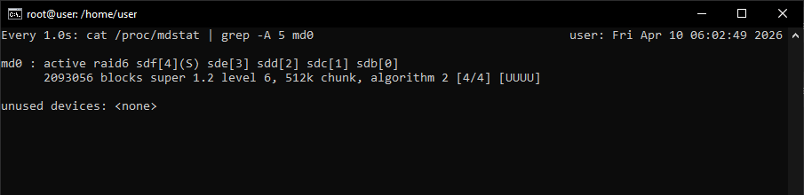

# Домашнее задание "Работа с mdadm"

## Задание

1. Добавьте в виртуальную машину несколько дисков  
2. Соберите RAID-0/1/5/10 на выбор  
3. Сломайте и почините RAID  
4. Создайте GPT таблицу, пять разделов и смонтируйте их в системе  

---

## Выполнение

### 1. Добавление дисков

Проверяем исходное состояние:

```bash
root@user:/home/user# lsblk
NAME                      MAJ:MIN RM  SIZE RO TYPE MOUNTPOINTS
sda                         8:0    0   10G  0 disk
├─sda1                      8:1    0    1M  0 part
├─sda2                      8:2    0  1.8G  0 part /boot
└─sda3                      8:3    0  8.2G  0 part
  └─ubuntu--vg-ubuntu--lv 252:0    0  8.2G  0 lvm  /
sr0                        11:0    1 1024M  0 rom
```

Добавляем 5 дисков в ВМ:

<div align="center">
  
</div>

Запускаем ВМ и проверяем:

```bash
root@user:/home/user# lsblk
NAME                      MAJ:MIN RM  SIZE RO TYPE MOUNTPOINTS
sda                         8:0    0   10G  0 disk
├─sda1                      8:1    0    1M  0 part
├─sda2                      8:2    0  1.8G  0 part /boot
└─sda3                      8:3    0  8.2G  0 part
  └─ubuntu--vg-ubuntu--lv 252:0    0  8.2G  0 lvm  /
sdb                         8:16   0    1G  0 disk
sdc                         8:32   0    1G  0 disk
sdd                         8:48   0    1G  0 disk
sde                         8:64   0    1G  0 disk
sdf                         8:80   0    1G  0 disk
sr0                        11:0    1 1024M  0 rom
```

### 2. Сборка RAID 5

Собираем RAID 5 на четырёх дисках `sd{b,c,d,e}`:

<details>
<summary>Команда сборки RAID</summary>

```bash
sudo mdadm --create --verbose /dev/md0 -l 5 -n 4 /dev/sd{b,c,d,e}
```
</details>

```bash
root@user:/home/user# sudo mdadm --create --verbose /dev/md0 -l 5 -n 4 /dev/sd{b,c,d,e}
mdadm: layout defaults to left-symmetric
mdadm: chunk size defaults to 512K
mdadm: size set to 1046528K
mdadm: Defaulting to version 1.2 metadata
mdadm: array /dev/md0 started.
```

Проверяем результат:

```bash
root@user:/home/user# cat /proc/mdstat
Personalities : [raid0] [raid1] [raid4] [raid5] [raid6] [raid10] [linear]
md0 : active raid5 sde[4] sdd[2] sdc[1] sdb[0]
      3139584 blocks super 1.2 level 5, 512k chunk, algorithm 2 [4/4] [UUUU]
```

```bash
root@user:/home/user# lsblk
NAME                      MAJ:MIN RM  SIZE RO TYPE  MOUNTPOINTS
sda                         8:0    0   10G  0 disk
├─sda1                      8:1    0    1M  0 part
├─sda2                      8:2    0  1.8G  0 part  /boot
└─sda3                      8:3    0  8.2G  0 part
  └─ubuntu--vg-ubuntu--lv 252:0    0  8.2G  0 lvm   /
sdb                         8:16   0    1G  0 disk
└─md0                       9:0    0    3G  0 raid5
sdc                         8:32   0    1G  0 disk
└─md0                       9:0    0    3G  0 raid5
sdd                         8:48   0    1G  0 disk
└─md0                       9:0    0    3G  0 raid5
sde                         8:64   0    1G  0 disk
└─md0                       9:0    0    3G  0 raid5
sdf                         8:80   0    1G  0 disk
sr0                        11:0    1 1024M  0 rom
```

### 3. Поломка и восстановление RAID

Помечаем диск `sde` как сбойный:

```bash
root@user:/home/user# mdadm /dev/md0 --fail /dev/sde
mdadm: set /dev/sde faulty in /dev/md0
```

Проверяем состояние:

```bash
root@user:/home/user# cat /proc/mdstat
Personalities : [raid0] [raid1] [raid4] [raid5] [raid6] [raid10] [linear]
md0 : active raid5 sde[4](F) sdd[2] sdc[1] sdb[0]
      3139584 blocks super 1.2 level 5, 512k chunk, algorithm 2 [4/3] [UUU_]
```

<details>
<summary>Детальная информация о RAID</summary>

```bash
root@user:/home/user# mdadm --detail /dev/md0
/dev/md0:
           Version : 1.2
     Creation Time : Wed Apr  8 05:48:35 2026
        Raid Level : raid5
        Array Size : 3139584 (2.99 GiB 3.21 GB)
     Used Dev Size : 1046528 (1022.00 MiB 1071.64 MB)
      Raid Devices : 4
     Total Devices : 4
       Persistence : Superblock is persistent

       Update Time : Wed Apr  8 05:57:48 2026
             State : clean, degraded
    Active Devices : 3
   Working Devices : 3
    Failed Devices : 1
     Spare Devices : 0

            Layout : left-symmetric
        Chunk Size : 512K

Consistency Policy : resync

              Name : user:0  (local to host user)
              UUID : 5202d9e6:1640079f:f734788a:fda7864b
            Events : 20

    Number   Major   Minor   RaidDevice State
       0       8       16        0      active sync   /dev/sdb
       1       8       32        1      active sync   /dev/sdc
       2       8       48        2      active sync   /dev/sdd
       -       0        0        3      removed
```
</details>

Удаляем сбойный диск:

```bash
root@user:/home/user# mdadm /dev/md0 --remove /dev/sde
mdadm: hot removed /dev/sde from /dev/md0
```

Добавляем новый диск `sdf`:

```bash
root@user:/home/user# mdadm /dev/md0 --add /dev/sdf
mdadm: added /dev/sdf
```

Проверяем восстановление:

```bash
root@user:/home/user# cat /proc/mdstat
Personalities : [raid0] [raid1] [raid4] [raid5] [raid6] [raid10] [linear]
md0 : active raid5 sdf[4] sdd[2] sdc[1] sdb[0]
      3139584 blocks super 1.2 level 5, 512k chunk, algorithm 2 [4/4] [UUUU]
```

```bash
root@user:/home/user# lsblk
NAME                      MAJ:MIN RM  SIZE RO TYPE  MOUNTPOINTS
sda                         8:0    0   10G  0 disk
├─sda1                      8:1    0    1M  0 part
├─sda2                      8:2    0  1.8G  0 part  /boot
└─sda3                      8:3    0  8.2G  0 part
  └─ubuntu--vg-ubuntu--lv 252:0    0  8.2G  0 lvm   /
sdb                         8:16   0    1G  0 disk
└─md0                       9:0    0    3G  0 raid5
sdc                         8:32   0    1G  0 disk
└─md0                       9:0    0    3G  0 raid5
sdd                         8:48   0    1G  0 disk
└─md0                       9:0    0    3G  0 raid5
sde                         8:64   0    1G  0 disk
sdf                         8:80   0    1G  0 disk
└─md0                       9:0    0    3G  0 raid5
sr0                        11:0    1 1024M  0 rom
```

### 4. Создание GPT разделов и монтирование

Создаём GPT таблицу на RAID-массиве:

```bash
root@user:/home/user# parted -s /dev/md0 mklabel gpt
```

Создаём 5 разделов:

<details>
<summary>Команды создания разделов</summary>

```bash
parted /dev/md0 mkpart primary ext4 0% 20%
parted /dev/md0 mkpart primary ext4 20% 40%
parted /dev/md0 mkpart primary ext4 40% 60%
parted /dev/md0 mkpart primary ext4 60% 80%
parted /dev/md0 mkpart primary ext4 80% 100%
```
</details>

```bash
root@user:/home/user# parted /dev/md0 mkpart primary ext4 0% 20%
Information: You may need to update /etc/fstab.
root@user:/home/user# parted /dev/md0 mkpart primary ext4 20% 40%
Information: You may need to update /etc/fstab.
root@user:/home/user# parted /dev/md0 mkpart primary ext4 40% 60%
Information: You may need to update /etc/fstab.
root@user:/home/user# parted /dev/md0 mkpart primary ext4 60% 80%
Information: You may need to update /etc/fstab.
root@user:/home/user# parted /dev/md0 mkpart primary ext4 80% 100%
Information: You may need to update /etc/fstab.
```

Проверяем созданные разделы:

```bash
root@user:/home/user# lsblk /dev/md0
NAME    MAJ:MIN RM   SIZE RO TYPE  MOUNTPOINTS
md0       9:0    0     3G  0 raid5
├─md0p1 259:0    0   612M  0 part
├─md0p2 259:1    0 613.5M  0 part
├─md0p3 259:2    0   612M  0 part
├─md0p4 259:3    0 613.5M  0 part
└─md0p5 259:4    0   612M  0 part
```

Создаём файловые системы:

<details>
<summary>Создание ФС на всех разделах</summary>

```bash
for i in $(seq 1 5); do mkfs.ext4 -F /dev/md0p$i; done
```
</details>

Монтируем разделы:

<details>
<summary>Монтирование разделов</summary>

```bash
mkdir -p /raid/part{1,2,3,4,5}
for i in $(seq 1 5); do mount /dev/md0p$i /raid/part$i; done
```
</details>

Проверяем результат:

```bash
root@user:/home/user# df -h | grep md0
/dev/md0p1                         586M   24K  543M   1% /raid/part1
/dev/md0p2                         587M   24K  544M   1% /raid/part2
/dev/md0p3                         586M   24K  543M   1% /raid/part3
/dev/md0p4                         587M   24K  544M   1% /raid/part4
/dev/md0p5                         586M   24K  543M   1% /raid/part5
```

---

## Результат

<div align="center">
  
</div>

**Задание выполнено.** ✅

### Дополнительное задание: RAID-6 с мониторингом и S.M.A.R.T.

## Цель работы

1. Настроить RAID-6 на 5 дисках (4 активных + 1 запасной)  
2. Имитировать отказ диска и показать процесс восстановления в реальном времени через `watch`  
3. Выполнить проверку S.M.A.R.T. перед сборкой RAID  

---

## 1. Очистка предыдущей конфигурации RAID

### Размонтирование разделов

```bash
umount /raid/part{1,2,3,4,5}

<details> 
<summary>Результат выполнения</summary>
umount: /raid/part1: not mounted.
umount: /raid/part2: not mounted.
umount: /raid/part3: not mounted.
umount: /raid/part4: not mounted.
umount: /raid/part5: not mounted.

</details>
Проверка текущего состояния дисков
```bash
lsblk

<details> 
<summary>Вывод до остановки RAID</summary>
NAME                      MAJ:MIN RM   SIZE RO TYPE  MOUNTPOINTS
sda                         8:0    0    10G  0 disk
├─sda1                      8:1    0     1M  0 part
├─sda2                      8:2    0   1.8G  0 part  /boot
└─sda3                      8:3    0   8.2G  0 part
  └─ubuntu--vg-ubuntu--lv 252:0    0   8.2G  0 lvm   /
sdb                         8:16   0     1G  0 disk
└─md127                     9:127  0     3G  0 raid5
  ├─md127p1               259:0    0   612M  0 part
  ├─md127p2               259:1    0 613.5M  0 part
  ├─md127p3               259:2    0   612M  0 part
  ├─md127p4               259:3    0 613.5M  0 part
  └─md127p5               259:4    0   612M  0 part
sdc                         8:32   0     1G  0 disk
└─md127                     9:127  0     3G  0 raid5
sdd                         8:48   0     1G  0 disk
└─md127                     9:127  0     3G  0 raid5
sde                         8:64   0     1G  0 disk
sdf                         8:80   0     1G  0 disk
└─md127                     9:127  0     3G  0 raid5
sr0                        11:0    1  1024M  0 rom
</details>

Останавливаем работу RAID массива:
```
root@user:/home/user# mdadm --stop /dev/md127
mdadm: stopped /dev/md127
```

Удаляем суперблоки со всех дисков, которые были в RAID:
```
root@user:/home/user# mdadm --zero-superblock /dev/sdb
root@user:/home/user# mdadm --zero-superblock /dev/sdc
root@user:/home/user# mdadm --zero-superblock /dev/sdd
root@user:/home/user# mdadm --zero-superblock /dev/sdf
```

Смотрим, что RAID массива больше нет:
root@user:/home/user# cat /proc/mdstat
<details> <summary>Результат</summary>
Personalities : [raid0] [raid1] [raid4] [raid5] [raid6] [raid10] [linear]
unused devices: <none>
</details>

Диски в исходном состоянии
```
root@user:/home/user# lsblk
```

<details> <summary>Диски в исходном состоянии</summary>
NAME                      MAJ:MIN RM  SIZE RO TYPE MOUNTPOINTS
sda                         8:0    0   10G  0 disk
├─sda1                      8:1    0    1M  0 part
├─sda2                      8:2    0  1.8G  0 part /boot
└─sda3                      8:3    0  8.2G  0 part
  └─ubuntu--vg-ubuntu--lv 252:0    0  8.2G  0 lvm  /
sdb                         8:16   0    1G  0 disk
sdc                         8:32   0    1G  0 disk
sdd                         8:48   0    1G  0 disk
sde                         8:64   0    1G  0 disk
sdf                         8:80   0    1G  0 disk
sr0                        11:0    1 1024M  0 rom
</details>

Удаляем созданные директории:
```
root@user:/home/user# rm -rf /raid
```
Устанавливаем smartmontools (если не установлен):
```
apt update && apt install smartmontools -y
```

Проверяем S.M.A.R.T. статус всех дисков:
smartctl -H /dev/sdb
smartctl -H /dev/sdc
smartctl -H /dev/sdd
smartctl -H /dev/sde
smartctl -H /dev/sdf

<details> 
<summary>Результат проверки</summary>
smartctl 7.4 2023-08-01 r5530 [x86_64-linux-7.0.0-070000rc6-generic] (local build)
Copyright (C) 2002-23, Bruce Allen, Christian Franke, www.smartmontools.org
SMART support is: Unavailable - device lacks SMART capability.
</details>

Примечание: Виртуальные диски в VMware/VirtualBox по умолчанию не поддерживают S.M.A.R.T.
Вывод: Пропускаем этот пункт и продолжаем настройку RAID. ✅

Создаём RAID-6 массив из 5 дисков (4 активных + 1 запасной):
root@user:/home/user# mdadm --create --verbose /dev/md0 --level=6 --raid-devices=4 --spare-devices=1 /dev/sdb /dev/sdc /dev/sdd /dev/sde /dev/sdf
<details> 
<summary>Процесс создания</summary>
mdadm: layout defaults to left-symmetric
mdadm: layout defaults to left-symmetric
mdadm: chunk size defaults to 512K
mdadm: /dev/sde appears to be part of a raid array:
       level=raid5 devices=4 ctime=Wed Apr  8 05:48:35 2026
mdadm: size set to 1046528K
Continue creating array? yes
Continue creating array? (y/n) y
mdadm: Defaulting to version 1.2 metadata
mdadm: array /dev/md0 started.
</details>


Проверяем состояние массива:
```
root@user:/home/user# cat /proc/mdstat
```
<details> 
<summary>Вывод</summary>
Personalities : [raid0] [raid1] [raid4] [raid5] [raid6] [raid10] [linear]
md0 : active raid6 sdf[4](S) sde[3] sdd[2] sdc[1] sdb[0]
      2093056 blocks super 1.2 level 6, 512k chunk, algorithm 2 [4/4] [UUUU]

unused devices: <none>
</details>

```
root@user:/home/user# mdadm --detail /dev/md0
```
<details> 
<summary>Детальная информация</summary>
/dev/md0:
           Version : 1.2
     Creation Time : Fri Apr 10 05:59:42 2026
        Raid Level : raid6
        Array Size : 2093056 (2044.00 MiB 2143.29 MB)
     Used Dev Size : 1046528 (1022.00 MiB 1071.64 MB)
      Raid Devices : 4
     Total Devices : 5
       Persistence : Superblock is persistent

       Update Time : Fri Apr 10 05:59:51 2026
             State : clean
    Active Devices : 4
   Working Devices : 5
    Failed Devices : 0
     Spare Devices : 1

            Layout : left-symmetric
        Chunk Size : 512K

Consistency Policy : resync

              Name : user:0  (local to host user)
              UUID : 798e91b3:14e4a021:a2bcd2b4:68f987f0
            Events : 17

    Number   Major   Minor   RaidDevice State
       0       8       16        0      active sync   /dev/sdb
       1       8       32        1      active sync   /dev/sdc
       2       8       48        2      active sync   /dev/sdd
       3       8       64        3      active sync   /dev/sde

       4       8       80        -      spare   /dev/sdf

</details>

Запускаем watch для отслеживания процесса синхронизации:
```
watch -n 1 'cat /proc/mdstat | grep -A 5 md0'
```


Имитируем отказ диска (выдёргиваем один диск)
```
root@user:/home/user# mdadm /dev/md0 --fail /dev/sde
mdadm: set /dev/sde faulty in /dev/md0
```

тем временем в параллельно открытом окне watch  можно наблюдать за rebuild'ом.

Восстанавливаем RAID
Удаляем сбойный диск:
```
user:/home/user# mdadm /dev/md0 --remove /dev/sde
mdadm: hot removed /dev/sde from /dev/md0
```
Добавляем запасной диск:
```
user:/home/user# mdadm /dev/md0 --add /dev/sde
mdadm: added /dev/sde
```
Можно наблюдать за процессом recovery через watch:
watch -n 1 'cat /proc/mdstat | grep -A 5 md0'

Проверяем  RAID
```
user:/home/user# lsblk | grep -A 6 md0
└─md0                       9:0    0    2G  0 raid6
sdc                         8:32   0    1G  0 disk
└─md0                       9:0    0    2G  0 raid6
sdd                         8:48   0    1G  0 disk
└─md0                       9:0    0    2G  0 raid6
sde                         8:64   0    1G  0 disk
└─md0                       9:0    0    2G  0 raid6
sdf                         8:80   0    1G  0 disk
└─md0                       9:0    0    2G  0 raid6
sr0                        11:0    1 1024M  0 rom
```

✅ RAID-6 массив из 5 дисков (4 активных + 1 горячий запасной) успешно:

- Собран

- Протестирован на отказоустойчивость

- Восстановлен после имитации отказа диска

- Процесс recovery отслежен в реальном времени через watch