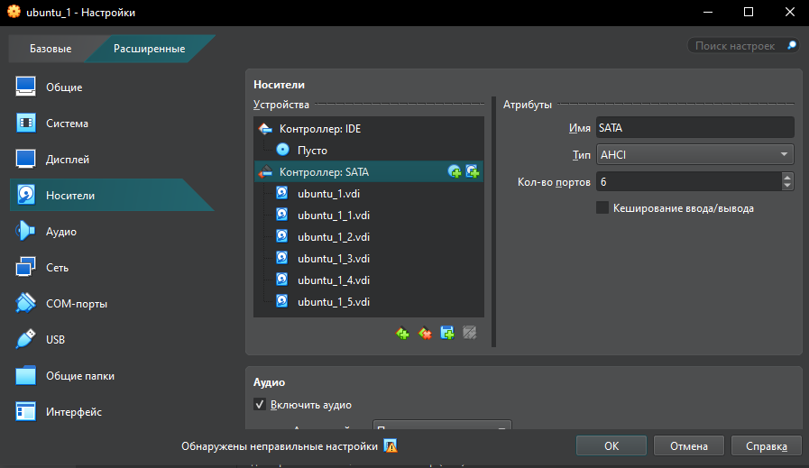
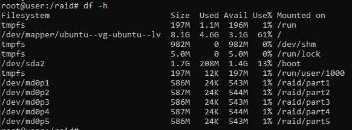

# Домашнее задание "Работа с mdadm"

## Задание

1. Добавьте в виртуальную машину несколько дисков
2. Соберите RAID-0/1/5/10 на выбор
3. Сломайте и почините RAID
4. Создайте GPT таблицу, пять разделов и смонтируйте их в системе.

---

## Выполнение задания

### 1. Добавьте в виртуальную машину несколько дисков
Проверяем диски в ВМ:
```
root@user:/home/user# lsblk
NAME                      MAJ:MIN RM  SIZE RO TYPE MOUNTPOINTS
sda                         8:0    0   10G  0 disk
├─sda1                      8:1    0    1M  0 part
├─sda2                      8:2    0  1.8G  0 part /boot
└─sda3                      8:3    0  8.2G  0 part
  └─ubuntu--vg-ubuntu--lv 252:0    0  8.2G  0 lvm  /
sr0                        11:0    1 1024M  0 rom
```

Добавляем в ВМ 5 дисков

Запускаем ВМ, проверяем диски:
```
root@user:/home/user# lsblk
NAME                      MAJ:MIN RM  SIZE RO TYPE MOUNTPOINTS
sda                         8:0    0   10G  0 disk
├─sda1                      8:1    0    1M  0 part
├─sda2                      8:2    0  1.8G  0 part /boot
└─sda3                      8:3    0  8.2G  0 part
  └─ubuntu--vg-ubuntu--lv 252:0    0  8.2G  0 lvm  /
sdb                         8:16   0    1G  0 disk
sdc                         8:32   0    1G  0 disk
sdd                         8:48   0    1G  0 disk
sde                         8:64   0    1G  0 disk
sdf                         8:80   0    1G  0 disk
sr0                        11:0    1 1024M  0 rom
```

### 2. Соберите RAID-0/1/5/10 на выбор

Собираем 5 Raid на 4 дисках sd{b,c,d,e}:
```
root@user:/home/user# sudo mdadm --create --verbose /dev/md0 -l 5 -n 4 /dev/sd{b,c,d,e}
mdadm: layout defaults to left-symmetric
mdadm: layout defaults to left-symmetric
mdadm: chunk size defaults to 512K
mdadm: size set to 1046528K
mdadm: Defaulting to version 1.2 metadata
mdadm: array /dev/md0 started.
```
Проверим, что RAID собрался корректно:
```

root@user:/home/user# cat /proc/mdstat
Personalities : [raid0] [raid1] [raid4] [raid5] [raid6] [raid10] [linear]
md0 : active raid5 sde[4] sdd[2] sdc[1] sdb[0]
      3139584 blocks super 1.2 level 5, 512k chunk, algorithm 2 [4/4] [UUUU]
```
Получили итоговый вариант с дисками:
```

root@user:/home/user# lsblk
NAME                      MAJ:MIN RM  SIZE RO TYPE  MOUNTPOINTS
sda                         8:0    0   10G  0 disk
├─sda1                      8:1    0    1M  0 part
├─sda2                      8:2    0  1.8G  0 part  /boot
└─sda3                      8:3    0  8.2G  0 part
  └─ubuntu--vg-ubuntu--lv 252:0    0  8.2G  0 lvm   /
sdb                         8:16   0    1G  0 disk
└─md0                       9:0    0    3G  0 raid5
sdc                         8:32   0    1G  0 disk
└─md0                       9:0    0    3G  0 raid5
sdd                         8:48   0    1G  0 disk
└─md0                       9:0    0    3G  0 raid5
sde                         8:64   0    1G  0 disk
└─md0                       9:0    0    3G  0 raid5
sdf                         8:80   0    1G  0 disk
sr0                        11:0    1 1024M  0 rom
```

### 3. Сломайте и почините RAID

“Зафейлим” одно из блочное устройство sde:
```
root@user:/home/user# mdadm /dev/md0 --fail /dev/sde
mdadm: set /dev/sde faulty in /dev/md0
```
Проверяем
```
root@user:/home/user# cat /proc/mdstat
Personalities : [raid0] [raid1] [raid4] [raid5] [raid6] [raid10] [linear]
md0 : active raid5 sde[4](F) sdd[2] sdc[1] sdb[0]
      3139584 blocks super 1.2 level 5, 512k chunk, algorithm 2 [4/3] [UUU_]
```

По итогу видим следующее:
[4/3] — ожидается 4 диска, активно 3
[UUU_] — первые три диска Up, четвёртый — неактивен
(F) — faulty (сбойный)

Более детально:
```
root@user:/home/user# mdadm --detail /dev/md0
/dev/md0:
           Version : 1.2
     Creation Time : Wed Apr  8 05:48:35 2026
        Raid Level : raid5
        Array Size : 3139584 (2.99 GiB 3.21 GB)
     Used Dev Size : 1046528 (1022.00 MiB 1071.64 MB)
      Raid Devices : 4
     Total Devices : 4
       Persistence : Superblock is persistent

       Update Time : Wed Apr  8 05:57:48 2026
             State : clean, degraded
    Active Devices : 3
   Working Devices : 3
    Failed Devices : 1
     Spare Devices : 0

            Layout : left-symmetric
        Chunk Size : 512K

Consistency Policy : resync

              Name : user:0  (local to host user)
              UUID : 5202d9e6:1640079f:f734788a:fda7864b
            Events : 20

    Number   Major   Minor   RaidDevice State
       0       8       16        0      active sync   /dev/sdb
       1       8       32        1      active sync   /dev/sdc
       2       8       48        2      active sync   /dev/sdd
       -       0        0        3      removed
```

Удалим “сломанный” диск из массива:
```
root@user:/home/user# mdadm /dev/md0 --remove /dev/sde
mdadm: hot removed /dev/sde from /dev/md0
```

Далее добавляем новый диск sdf в массив (5 диск в ВМ, который мы не использовали для создания Raid-массива)
```
root@user:/home/user# mdadm /dev/md0 --add /dev/sdf
mdadm: added /dev/sdf
```
Проверяем результат:
```
root@user:/home/user# cat /proc/mdstat
Personalities : [raid0] [raid1] [raid4] [raid5] [raid6] [raid10] [linear]
md0 : active raid5 sdf[4] sdd[2] sdc[1] sdb[0]
      3139584 blocks super 1.2 level 5, 512k chunk, algorithm 2 [4/4] [UUUU]
```
```
root@user:/home/user# lsblk
NAME                      MAJ:MIN RM  SIZE RO TYPE  MOUNTPOINTS
sda                         8:0    0   10G  0 disk
├─sda1                      8:1    0    1M  0 part
├─sda2                      8:2    0  1.8G  0 part  /boot
└─sda3                      8:3    0  8.2G  0 part
  └─ubuntu--vg-ubuntu--lv 252:0    0  8.2G  0 lvm   /
sdb                         8:16   0    1G  0 disk
└─md0                       9:0    0    3G  0 raid5
sdc                         8:32   0    1G  0 disk
└─md0                       9:0    0    3G  0 raid5
sdd                         8:48   0    1G  0 disk
└─md0                       9:0    0    3G  0 raid5
sde                         8:64   0    1G  0 disk
sdf                         8:80   0    1G  0 disk
└─md0                       9:0    0    3G  0 raid5
sr0                        11:0    1 1024M  0 rom
```

### 4. Создайте GPT таблицу, пять разделов и смонтируйте их в системе.


Создаем новую таблицу разделов GPT на RAID-массиве /dev/md0
```
root@user:/home/user# parted -s /dev/md0 mklabel gpt
```
Разбиваем RAID-массив /dev/md0 на 5 логических разделов, каждый из которых займёт указанный процент от общего объёма массива
Создаем партиции
 parted /dev/md0 mkpart primary ext4 0% 20%
 parted /dev/md0 mkpart primary ext4 20% 40%
 parted /dev/md0 mkpart primary ext4 40% 60%
 parted /dev/md0 mkpart primary ext4 60% 80%
 parted /dev/md0 mkpart primary ext4 80% 100%

```
root@user:/home/user# parted /dev/md0 mkpart primary ext4 0% 20%
Information: You may need to update /etc/fstab.
root@user:/home/user# parted /dev/md0 mkpart primary ext4 20% 40%
Information: You may need to update /etc/fstab.
root@user:/home/user# parted /dev/md0 mkpart primary ext4 40% 60%
Information: You may need to update /etc/fstab.
root@user:/home/user# parted /dev/md0 mkpart primary ext4 60% 80%
Information: You may need to update /etc/fstab.
root@user:/home/user# parted /dev/md0 mkpart primary ext4 80% 100%
Information: You may need to update /etc/fstab.
```

Проверяем результат:
```
root@user:/home/user# lsblk /dev/md0
NAME    MAJ:MIN RM   SIZE RO TYPE  MOUNTPOINTS
md0       9:0    0     3G  0 raid5
├─md0p1 259:0    0   612M  0 part
├─md0p2 259:1    0 613.5M  0 part
├─md0p3 259:2    0   612M  0 part
├─md0p4 259:3    0 613.5M  0 part
└─md0p5 259:4    0   612M  0 part
```

Создаем на этих партициях афйловую систему:
```
root@user:/home/user# for i in $(seq 1 5); do mkfs.ext4 -F /dev/md0p$i; done
```
создаём каталоги и монтируем в них каждый из 5 разделов RAID-массива
```
root@user:/home/user# mkdir -p /raid/part{1,2,3,4,5}
root@user:/home/user# for i in $(seq 1 5); do mount /dev/md0p$i /raid/part$i; done
```

Проверяем результат:
```
root@user:/home/user# df -h | grep md0
/dev/md0p1                         586M   24K  543M   1% /raid/part1
/dev/md0p2                         587M   24K  544M   1% /raid/part2
/dev/md0p3                         586M   24K  543M   1% /raid/part3
/dev/md0p4                         587M   24K  544M   1% /raid/part4
/dev/md0p5                         586M   24K  543M   1% /raid/part5
```

Задание выполнено.

