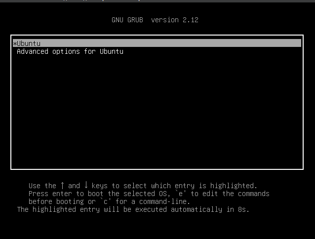
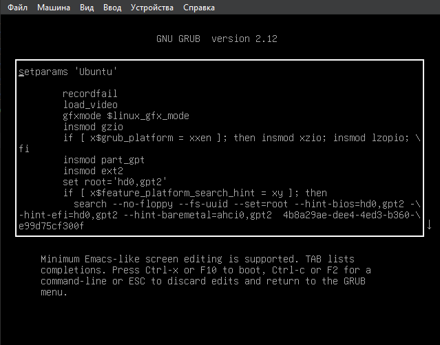
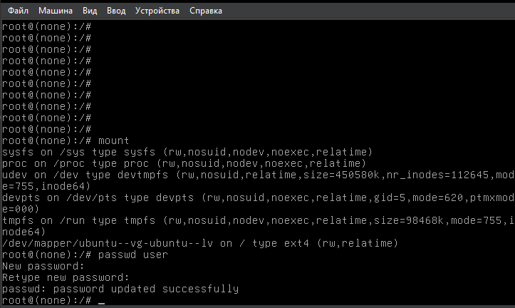
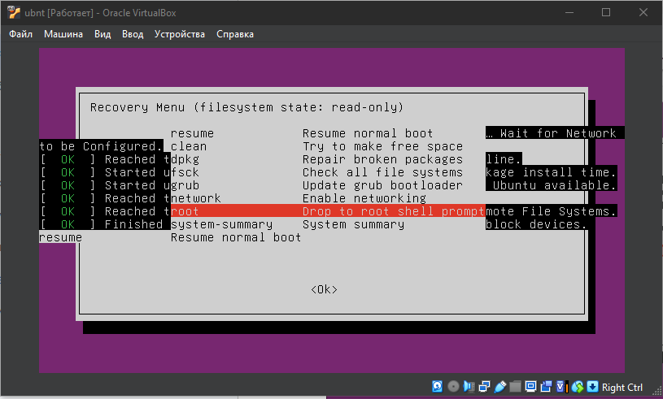
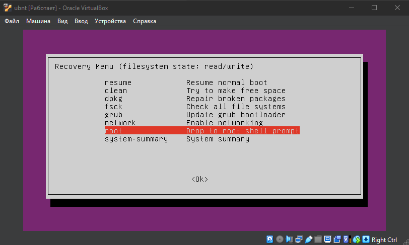
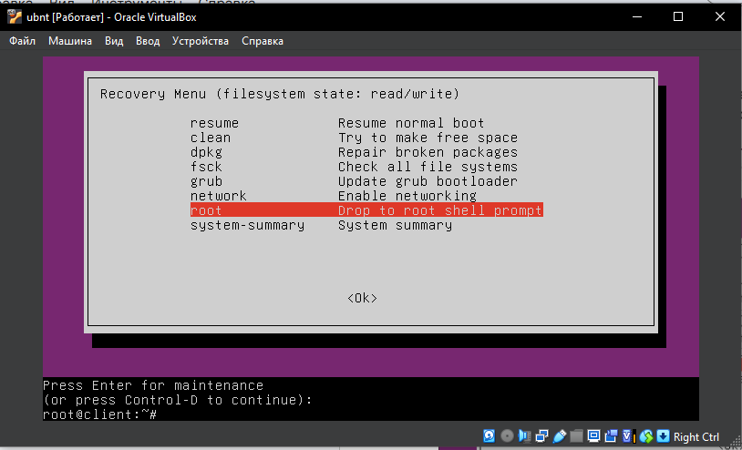

# Домашнее задание "Работа с Загрузчиком"

## Задание

- Включить отображение меню Grub.
- Попасть в систему без пароля несколькими способами.
- Установить систему с LVM, после чего переименовать VG.

---

## Выполнение домашнего задания

Работа выполняется на ОС Ubuntu 24.04.4 LTS

### 1. Включить отображение меню Grub.


По умолчанию меню загрузчика Grub скрыто и нет задержки при загрузке. Для отображения меню нужно отредактировать конфигурационный файл.
```bash
root@client:/home/user# nano /etc/default/grub
```
Комментируем строку, скрывающую меню и ставим задержку для выбора пункта меню в 10 секунд.
```bash
#GRUB_TIMEOUT_STYLE=hidden
GRUB_TIMEOUT=10
```

Обновляем конфигурацию загрузчика и перезагружаемся для проверки.
```bash
root@client:/home/user# nano /etc/default/grub
root@client:/home/user# update-grub
Sourcing file `/etc/default/grub'
Generating grub configuration file ...
Found linux image: /boot/vmlinuz-6.8.0-111-generic
Found initrd image: /boot/initrd.img-6.8.0-111-generic
Warning: os-prober will not be executed to detect other bootable partitions.
Systems on them will not be added to the GRUB boot configuration.
Check GRUB_DISABLE_OS_PROBER documentation entry.
Adding boot menu entry for UEFI Firmware Settings ...
done
root@client:/home/user# 
```
При загрузке в окне виртуальной машины мы должны увидеть меню загрузчика.


### 2. Попасть в систему без пароля несколькими способами

Для получения доступа необходимо открыть GUI VirtualBox (или другой системы виртуализации), запустить виртуальную машину и при выборе ядра для загрузки нажать e - в данном контексте edit. Попадаем в окно, где мы можем изменить параметры загрузки:


Способ 1. init=/bin/bash
В конце строки, начинающейся с linux, добавляем init=/bin/bash (или перед этим сменить ro на rw, для загрузки сразу в режиме Read-Write) и нажимаем сtrl-x для загрузки в систему
В целом на этом все, Вы попали в систему. Но есть один нюанс. Рутовая файловая
система при этом монтируется в режиме Read-Only. Если вы хотите перемонтировать ее в режим Read-Write, можно воспользоваться командой:
root@none:~# mount -o remount,rw /
После чего можно убедиться, записав данные в любой файл или прочитав вывод
команды:
root@none:~# mount | grep root


Способ 2. Recovery mode
В меню загрузчика на первом уровне выбрать второй пункт (Advanced options…), далее загрузить пункт меню с указанием recovery mode в названии. 
Получим меню режима восстановления.

В этом меню сначала включаем поддержку сети (network) для того, чтобы файловая система перемонтировалась в режим read/write (либо это можно сделать вручную).
Далее выбираем пункт root и попадаем в консоль с пользователем root. Если вы ранее устанавливали пароль для пользователя root (по умолчанию его нет), то необходимо его ввести. 

В этой консоли можно производить любые манипуляции с системой.


### 3. Установить систему с LVM, после чего переименовать VG
Мы установили систему Ubuntu 22.04 со стандартной разбивкой диска с использованием  LVM.
Первым делом посмотрим текущее состояние системы (список Volume Group):
```bash
root@client:/home/user# vgs
  VG        #PV #LV #SN Attr   VSize  VFree
  ubuntu-vg   1   1   0 wz--n- <8.25g    0 
```

Нас интересует вторая строка с именем Volume Group. Приступим к переименованию:
```bash
root@client:/home/user# vgrename ubuntu-vg ubuntu-otus
  Volume group "ubuntu-vg" successfully renamed to "ubuntu-otus"
```

Далее правим /boot/grub/grub.cfg. Везде заменяем старое название VG на новое (в файле дефис меняется на два дефиса ubuntu--vg ubuntu--otus).
После чего можем перезагружаться и, если все сделано правильно, успешно грузимся с новым именем Volume Group и проверяем:
```bash
root@client:/home/user# vgs
  VG          #PV #LV #SN Attr   VSize  VFree
  ubuntu-otus   1   1   0 wz--n- <8.25g    0 
```
При желании можно так же заменить название Logical Volume.

