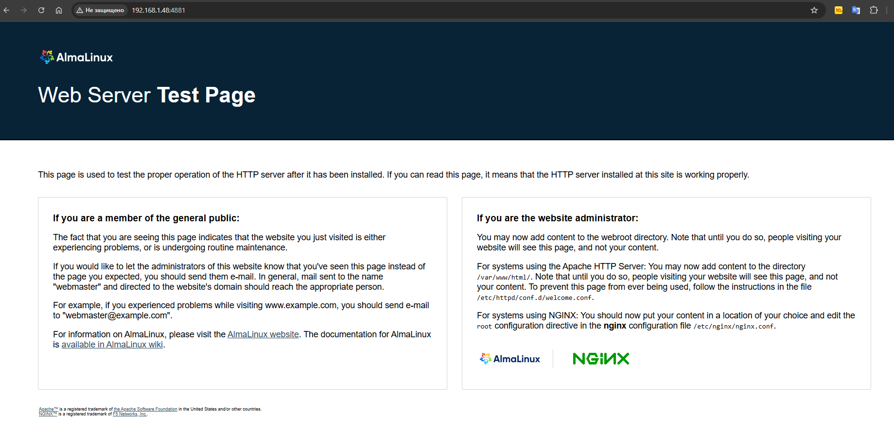
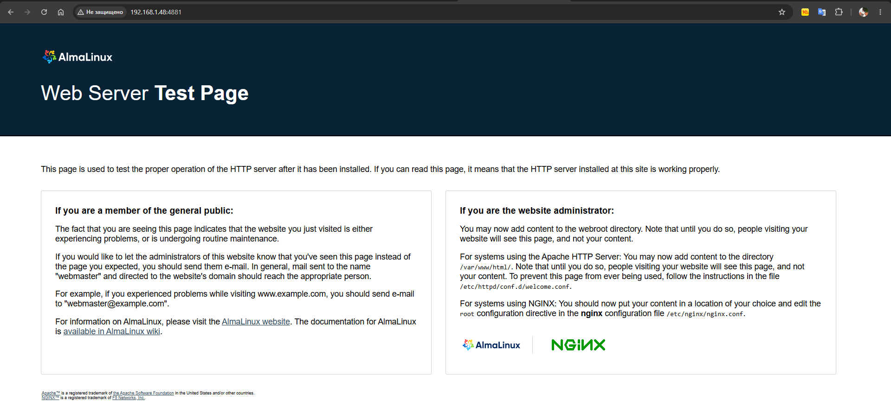

# Домашнее задание "Практика c SELinux"

## Задание

1. Запустить Nginx на нестандартном порту 3-мя разными способами:
   - переключатели setsebool;
   - добавление нестандартного порта в имеющийся тип;
   - формирование и установка модуля SELinux.

2. Обеспечить работоспособность приложения при включенном selinux.
   - развернуть приложенный стенд https://github.com/Nickmob/vagrant_selinux_dns_problems; 
   - выяснить причину неработоспособности механизма обновления зоны (см. README);
   - предложить решение (или решения) для данной проблемы;
   - выбрать одно из решений для реализации, предварительно обосновав выбор;
   - реализовать выбранное решение и продемонстрировать его работоспособность.
---

## Выполнение задания

Создаём виртуальную машину
```bash
[root@localhost user]# cat /etc/os-release 
NAME="AlmaLinux"
VERSION="9.8 (Olive Jaguar)"
ID="almalinux"
ID_LIKE="rhel centos fedora"
VERSION_ID="9.8"
PLATFORM_ID="platform:el9"
PRETTY_NAME="AlmaLinux 9.8 (Olive Jaguar)"
```


### 1. Запуск nginx на нестандартном порту 3-мя разными способами 

Проверим, что в ОС отключен файервол (tcли включен, то выключаем): 

```bash
[root@localhost user]# systemctl status firewalld
● firewalld.service - firewalld - dynamic firewall daemon
     Loaded: loaded (/usr/lib/systemd/system/firewalld.service; enabled; preset: enabled)
     Active: active (running) since Fri 2026-06-05 01:40:21 EDT; 7min ago
       Docs: man:firewalld(1)
   Main PID: 803 (firewalld)
      Tasks: 2 (limit: 10502)
     Memory: 38.8M (peak: 40.8M)
        CPU: 368ms
     CGroup: /system.slice/firewalld.service
             └─803 /usr/bin/python3 -s /usr/sbin/firewalld --nofork --nopid

Jun 05 01:40:20 localhost systemd[1]: Starting firewalld - dynamic firewall daemon...
Jun 05 01:40:21 localhost systemd[1]: Started firewalld - dynamic firewall daemon.
[root@localhost user]# 
[root@localhost user]# 
[root@localhost user]# systemctl stop firewalld
[root@localhost user]# systemctl disable firewalld
Removed "/etc/systemd/system/multi-user.target.wants/firewalld.service".
Removed "/etc/systemd/system/dbus-org.fedoraproject.FirewallD1.service".
[root@localhost user]# systemctl status firewalld
○ firewalld.service - firewalld - dynamic firewall daemon
     Loaded: loaded (/usr/lib/systemd/system/firewalld.service; disabled; preset: enabled)
     Active: inactive (dead)
       Docs: man:firewalld(1)

Jun 05 01:40:20 localhost systemd[1]: Starting firewalld - dynamic firewall daemon...
Jun 05 01:40:21 localhost systemd[1]: Started firewalld - dynamic firewall daemon.
Jun 05 01:48:35 localhost.localdomain systemd[1]: Stopping firewalld - dynamic firewall daemon...
Jun 05 01:48:35 localhost.localdomain systemd[1]: firewalld.service: Deactivated successfully.
Jun 05 01:48:35 localhost.localdomain systemd[1]: Stopped firewalld - dynamic firewall daemon.
```
Также можно проверить, что установлен и конфигурация nginx настроена без ошибок:
```bash
[root@localhost user]# nginx -t
bash: nginx: command not found...
Install package 'nginx-core' to provide command 'nginx'? [N/y] y


 * Waiting in queue... 
 * Loading list of packages.... 
The following packages have to be installed:
 nginx-core-2:1.20.1-28.el9_8.2.alma.1.x86_64   nginx minimal core
 nginx-filesystem-2:1.20.1-28.el9_8.2.alma.1.noarch     The basic directory layout for the Nginx server
Proceed with changes? [N/y] y


 * Waiting in queue... 
 * Waiting for authentication... 
 * Waiting in queue... 
 * Downloading packages... 
 * Requesting data... 
 * Testing changes... 
 * Installing packages... 
nginx: the configuration file /etc/nginx/nginx.conf syntax is ok
nginx: configuration file /etc/nginx/nginx.conf test is successful
```

Далее проверим режим работы SELinux: getenforce 
```bash 
[root@localhost user]# getenforce
Enforcing
```
Должен отображаться режим Enforcing. Данный режим означает, что SELinux будет блокировать запрещенную активность.

### - Разрешим в SELinux работу nginx на порту TCP 4881 c помощью переключателей setsebool

Находим в логах (/var/log/audit/audit.log) информацию о блокировании порта
```bash
type=AVC msg=audit(1780640006.519:222): avc:  denied  { name_bind } for  pid=32022 comm="nginx" src=4881 scontext=system_u:system_r:httpd_t:s0 tcontext=system_u:object_r:unreserved_port_t:s0 tclass=tcp_socket permissive=0
```

Копируем время, в которое был записан этот лог, и, с помощью утилиты audit2why смотрим grep 1780640006.519:222 /var/log/audit/audit.log | audit2why
```bash
[root@localhost user]# grep 1780640006.519:222 /var/log/audit/audit.log | audit2why
type=AVC msg=audit(1780640006.519:222): avc:  denied  { name_bind } for  pid=32022 comm="nginx" src=4881 scontext=system_u:system_r:httpd_t:s0 tcontext=system_u:object_r:unreserved_port_t:s0 tclass=tcp_socket permissive=0

        Was caused by:
        The boolean nis_enabled was set incorrectly. 
        Description:
        Allow nis to enabled

        Allow access by executing:
        # setsebool -P nis_enabled 1
```

Утилита audit2why покажет почему трафик блокируется. Исходя из вывода утилиты, мы видим, что нам нужно поменять параметр nis_enabled. 
Включим параметр nis_enabled и перезапустим nginx: setsebool -P nis_enabled on

```bash
[root@localhost user]# setsebool -P nis_enabled on
[root@localhost user]# systemctl restart nginx
[root@localhost user]# systemctl status nginx
● nginx.service - The nginx HTTP and reverse proxy server
     Loaded: loaded (/usr/lib/systemd/system/nginx.service; enabled; preset: disabled)
     Active: active (running) since Fri 2026-06-05 02:20:08 EDT; 6s ago
    Process: 32057 ExecStartPre=/usr/bin/rm -f /run/nginx.pid (code=exited, status=0/SUCCESS)
    Process: 32058 ExecStartPre=/usr/sbin/nginx -t (code=exited, status=0/SUCCESS)
    Process: 32059 ExecStart=/usr/sbin/nginx (code=exited, status=0/SUCCESS)
   Main PID: 32060 (nginx)
      Tasks: 2 (limit: 4470)
     Memory: 2.2M (peak: 2.3M)
        CPU: 27ms
     CGroup: /system.slice/nginx.service
             ├─32060 "nginx: master process /usr/sbin/nginx"
             └─32061 "nginx: worker process"

Jun 05 02:20:08 localhost.localdomain systemd[1]: Starting The nginx HTTP and reverse proxy server...
Jun 05 02:20:08 localhost.localdomain nginx[32058]: nginx: the configuration file /etc/nginx/nginx.conf syntax is ok
Jun 05 02:20:08 localhost.localdomain nginx[32058]: nginx: configuration file /etc/nginx/nginx.conf test is successful
```
 
Также можно проверить работу nginx из браузера. Заходим в любой браузер на хосте и переходим по адресу [http:// 192.168.1.48:4881](http://192.168.1.48:4881/)



Проверить статус параметра можно с помощью команды: getsebool -a | grep nis_enabled
```bash
[root@localhost user]# getsebool -a | grep nis_enabled
nis_enabled --> on
[root@localhost user]# 
```

Вернём запрет работы nginx на порту 4881 обратно. Для этого отключим nis_enabled: setsebool -P nis_enabled off
После отключения nis_enabled служба nginx снова не запустится.
```bash
[root@localhost user]# setsebool -P nis_enabled off
[root@localhost user]# systemctl restart nginx.service 
Job for nginx.service failed because the control process exited with error code.
See "systemctl status nginx.service" and "journalctl -xeu nginx.service" for details.
```

### - Теперь разрешим в SELinux работу nginx на порту TCP 4881 c помощью добавления нестандартного порта в имеющийся тип:

Поиск имеющегося типа, для http трафика: semanage port -l | grep http
```bash
[root@localhost user]# semanage port -l | grep http
http_cache_port_t              tcp      8080, 8118, 8123, 10001-10010
http_cache_port_t              udp      3130
http_port_t                    tcp      80, 81, 443, 488, 8008, 8009, 8443, 9000
pegasus_http_port_t            tcp      5988
pegasus_https_port_t           tcp      5989
```
Добавим порт в тип http_port_t: semanage port -a -t http_port_t -p tcp 4881
```bash
[root@localhost user]# semanage port -a -t http_port_t -p tcp 4881
[root@localhost user]# semanage port -l | grep  http_port_t
http_port_t                    tcp      4881, 80, 81, 443, 488, 8008, 8009, 8443, 9000
pegasus_http_port_t            tcp      5988
```

Теперь перезапускаем службу nginx и проверим её работу: 
```bash
[root@localhost user]# systemctl restart nginx
[root@localhost user]# systemctl status nginx
● nginx.service - The nginx HTTP and reverse proxy server
     Loaded: loaded (/usr/lib/systemd/system/nginx.service; enabled; preset: disabled)
     Active: active (running) since Fri 2026-06-05 02:29:52 EDT; 6s ago
    Process: 32119 ExecStartPre=/usr/bin/rm -f /run/nginx.pid (code=exited, status=0/SUCCESS)
    Process: 32120 ExecStartPre=/usr/sbin/nginx -t (code=exited, status=0/SUCCESS)
    Process: 32121 ExecStart=/usr/sbin/nginx (code=exited, status=0/SUCCESS)
   Main PID: 32122 (nginx)
      Tasks: 2 (limit: 4470)
     Memory: 2.2M (peak: 2.3M)
        CPU: 39ms
     CGroup: /system.slice/nginx.service
             ├─32122 "nginx: master process /usr/sbin/nginx"
             └─32123 "nginx: worker process"

Jun 05 02:29:52 localhost.localdomain systemd[1]: Starting The nginx HTTP and reverse proxy server...
Jun 05 02:29:52 localhost.localdomain nginx[32120]: nginx: the configuration file /etc/nginx/nginx.conf syntax is ok
```
Также можно проверить работу nginx из браузера. Заходим в любой браузер на хосте и переходим по адресу http://192.168.1.48:4881/


Удалить нестандартный порт из имеющегося типа можно с помощью команды: semanage port -d -t http_port_t -p tcp 4881
```bash
[root@localhost user]# semanage port -d -t http_port_t -p tcp 4881
[root@localhost user]# semanage port -l | grep  http_port_t
http_port_t                    tcp      80, 81, 443, 488, 8008, 8009, 8443, 9000
pegasus_http_port_t            tcp      5988
[root@localhost user]# systemctl restart nginx
Job for nginx.service failed because the control process exited with error code.
See "systemctl status nginx.service" and "journalctl -xeu nginx.service" for details.
[root@localhost user]# systemctl status nginx
× nginx.service - The nginx HTTP and reverse proxy server
     Loaded: loaded (/usr/lib/systemd/system/nginx.service; enabled; preset: disabled)
     Active: failed (Result: exit-code) since Fri 2026-06-05 02:32:12 EDT; 8s ago
   Duration: 2min 19.486s
    Process: 32145 ExecStartPre=/usr/bin/rm -f /run/nginx.pid (code=exited, status=0/SUCCESS)
    Process: 32146 ExecStartPre=/usr/sbin/nginx -t (code=exited, status=1/FAILURE)
        CPU: 39ms

Jun 05 02:32:12 localhost.localdomain systemd[1]: Starting The nginx HTTP and reverse proxy server...
Jun 05 02:32:12 localhost.localdomain nginx[32146]: nginx: the configuration file /etc/nginx/nginx.conf syntax is ok
Jun 05 02:32:12 localhost.localdomain nginx[32146]: nginx: [emerg] bind() to 0.0.0.0:4881 failed (13: Permission denied)
Jun 05 02:32:12 localhost.localdomain nginx[32146]: nginx: configuration file /etc/nginx/nginx.conf test failed
Jun 05 02:32:12 localhost.localdomain systemd[1]: nginx.service: Control process exited, code=exited, status=1/FAILURE
Jun 05 02:32:12 localhost.localdomain systemd[1]: nginx.service: Failed with result 'exit-code'.
Jun 05 02:32:12 localhost.localdomain systemd[1]: Failed to start The nginx HTTP and reverse proxy server.
[root@localhost user]# 
```

### - Разрешим в SELinux работу nginx на порту TCP 4881 c помощью формирования и установки модуля SELinux:
Попробуем снова запустить Nginx: systemctl start nginx
```bash
[root@localhost user]# systemctl start nginx
Job for nginx.service failed because the control process exited with error code.
See "systemctl status nginx.service" and "journalctl -xeu nginx.service" for details.
[root@localhost user]# 
```

Nginx не запустится, так как SELinux продолжает его блокировать. Посмотрим логи SELinux, которые относятся к Nginx: 
[root@selinux ~]# grep nginx /var/log/audit/audit.log
```bash
...
type=AVC msg=audit(1780641132.071:259): avc:  denied  { name_bind } for  pid=32146 comm="nginx" src=4881 scontext=system_u:system_r:httpd_t:s0 tcontext=system_u:object_r:unreserved_port_t:s0 tclass=tcp_socket permissive=0
type=SYSCALL msg=audit(1780641132.071:259): arch=c000003e syscall=49 success=no exit=-13 a0=6 a1=55e6ba21a058 a2=10 a3=7ffc01d36370 items=0 ppid=1 pid=32146 auid=4294967295 uid=0 gid=0 euid=0 suid=0 fsuid=0 egid=0 sgid=0 fsgid=0 tty=(none) ses=4294967295 comm="nginx" exe="/usr/sbin/nginx" subj=system_u:system_r:httpd_t:s0 key=(null)ARCH=x86_64 SYSCALL=bind AUID="unset" UID="root" GID="root" EUID="root" SUID="root" FSUID="root" EGID="root" SGID="root" FSGID="root"
type=SERVICE_START msg=audit(1780641132.080:260): pid=1 uid=0 auid=4294967295 ses=4294967295 subj=system_u:system_r:init_t:s0 msg='unit=nginx comm="systemd" exe="/usr/lib/systemd/systemd" hostname=? addr=? terminal=? res=failed'UID="root" AUID="unset"
type=AVC msg=audit(1780641248.734:265): avc:  denied  { name_bind } for  pid=32166 comm="nginx" src=4881 scontext=system_u:system_r:httpd_t:s0 tcontext=system_u:object_r:unreserved_port_t:s0 tclass=tcp_socket permissive=0
type=SYSCALL msg=audit(1780641248.734:265): arch=c000003e syscall=49 success=no exit=-13 a0=6 a1=562d33458058 a2=10 a3=7ffc993c2280 items=0 ppid=1 pid=32166 auid=4294967295 uid=0 gid=0 euid=0 suid=0 fsuid=0 egid=0 sgid=0 fsgid=0 tty=(none) ses=4294967295 comm="nginx" exe="/usr/sbin/nginx" subj=system_u:system_r:httpd_t:s0 key=(null)ARCH=x86_64 SYSCALL=bind AUID="unset" UID="root" GID="root" EUID="root" SUID="root" FSUID="root" EGID="root" SGID="root" FSGID="root"
type=SERVICE_START msg=audit(1780641248.742:266): pid=1 uid=0 auid=4294967295 ses=4294967295 subj=system_u:system_r:init_t:s0 msg='unit=nginx comm="systemd" exe="/usr/lib/systemd/systemd" hostname=? addr=? terminal=? res=failed'UID="root" AUID="unset"
[root@localhost user]# 
```
Воспользуемся утилитой audit2allow для того, чтобы на основе логов SELinux сделать модуль, разрешающий работу nginx на нестандартном порту: 
grep nginx /var/log/audit/audit.log | audit2allow -M nginx
```bash
[root@localhost user]# grep nginx /var/log/audit/audit.log | audit2allow -M nginx
******************** IMPORTANT ***********************
To make this policy package active, execute:

semodule -i nginx.pp

[root@localhost user]# 
```

Audit2allow сформировал модуль, и сообщил нам команду, с помощью которой можно применить данный модуль: semodule -i nginx.pp

```bash
[root@localhost user]# semodule -i nginx.pp
[root@localhost user]# systemctl start nginx
[root@localhost user]# systemctl status nginx
● nginx.service - The nginx HTTP and reverse proxy server
     Loaded: loaded (/usr/lib/systemd/system/nginx.service; enabled; preset: disabled)
     Active: active (running) since Fri 2026-06-05 02:38:10 EDT; 6s ago
    Process: 32195 ExecStartPre=/usr/bin/rm -f /run/nginx.pid (code=exited, status=0/SUCCESS)
    Process: 32196 ExecStartPre=/usr/sbin/nginx -t (code=exited, status=0/SUCCESS)
    Process: 32197 ExecStart=/usr/sbin/nginx (code=exited, status=0/SUCCESS)
   Main PID: 32198 (nginx)
      Tasks: 2 (limit: 4470)
     Memory: 2.7M (peak: 2.8M)
        CPU: 31ms
     CGroup: /system.slice/nginx.service
             ├─32198 "nginx: master process /usr/sbin/nginx"
             └─32199 "nginx: worker process"

Jun 05 02:38:10 localhost.localdomain systemd[1]: Starting The nginx HTTP and reverse proxy server...
Jun 05 02:38:10 localhost.localdomain nginx[32196]: nginx: the configuration file /etc/nginx/nginx.conf syntax is ok
Jun 05 02:38:10 localhost.localdomain nginx[32196]: nginx: configuration file /etc/nginx/nginx.conf test is successful
```

После добавления модуля nginx запустился без ошибок. При использовании модуля изменения сохранятся после перезагрузки. 
Просмотр всех установленных модулей: semodule -l
Для удаления модуля воспользуемся командой: semodule -r nginx
```bash
[root@localhost user]# semodule -r nginx
libsemanage.semanage_direct_remove_key: Removing last nginx module (no other nginx module exists at another priority).
[root@localhost user]# 
```

### 2. Обеспечение работоспособности приложения при включенном SELinux

Для того, чтобы развернуть стенд потребуется хост, с установленным git и ansible.
Выполним клонирование репозитория:
```bash
git clone https://github.com/Nickmob/vagrant_selinux_dns_problems.git
Cloning into 'vagrant_selinux_dns_problems'...
remote: Enumerating objects: 24, done.
remote: Counting objects: 100% (24/24), done.
remote: Compressing objects: 100% (18/18), done.
remote: Total 24 (delta 4), reused 21 (delta 4), pack-reused 0 (from 0)
Receiving objects: 100% (24/24), 6.40 KiB | 6.40 MiB/s, done.
Resolving deltas: 100% (4/4), done.
```

Перейдём в каталог со стендом: cd vagrant_selinux_dns_problems
Развернём 2 ВМ с помощью vagrant: vagrant up
После того, как стенд развернется, проверим ВМ с помощью команды: vagrant status
# vagrant status 
Current machine states:


ns01                      running (virtualbox)
client                    running (virtualbox)


This environment represents multiple VMs. The VMs are all listed
above with their current state. For more information about a specific
VM, run `vagrant status NAME`.


Подключимся к клиенту: vagrant ssh client

Попробуем внести изменения в зону: nsupdate -k /etc/named.zonetransfer.key

```bash
[vagrant@client ~]$ nsupdate -k /etc/named.zonetransfer.key
> server 192.168.50.10
> zone ddns.lab
> update add www.ddns.lab. 60 A 192.168.50.15
> send
update failed: SERVFAIL
> quit
[vagrant@client ~]$
```

Изменения внести не получилось. Cмотрим логи SELinux, чтобы понять в чём может быть проблема.
Для этого воспользуемся утилитой audit2why: 
```bash	
[vagrant@client ~]$ sudo -i
[root@client ~]# cat /var/log/audit/audit.log | audit2why
[root@client ~]# 
```

Видим, что на клиенте отсутствуют ошибки. 
Не закрывая сессию на клиенте, подключимся к серверу ns01 и проверим логи SELinux:
```bash
[root@ns01 ~]# cat /var/log/audit/audit.log | audit2why
type=AVC msg=audit(1780635827.000): avc:  denied  { write } for  pid=34586 comm="isc-net-0001" name="dynamic" dev="sda4" ino=24248485 scontext=system_u:system_r:named_t:s0 tcontext=unconfined_u:object_r:named_conf_t:s0 tclass=dir permissive=0


	Was caused by:
		Missing type enforcement (TE) allow rule.


		You can use audit2allow to generate a loadable module to allow this access.
[root@ns01 ~]# 
```

В логах мы видим, что ошибка в контексте безопасности. Целевой контекст named_conf_t.

У наших конфигов в /etc/named вместо типа named_zone_t используется тип named_conf_t.
Проверим данную проблему в каталоге /etc/named:
```bash
[root@ns01 ~]# ls -laZ /etc/named
drw-rwx---. root named system_u:object_r:named_conf_t:s0       .
drwxr-xr-x. root root  system_u:object_r:named_conf_t:s0       ..
drw-rwx---. root named unconfined_u:object_r:named_conf_t:s0   dynamic
-rw-rw----. root named system_u:object_r:named_conf_t:s0       named.50.168.192.rev
-rw-rw----. root named system_u:object_r:named_conf_t:s0       named.dns.lab
-rw-rw----. root named system_u:object_r:named_conf_t:s0       named.dns.lab.view1
-rw-rw----. root named system_u:object_r:named_conf_t:s0       named.newdns.lab
[root@ns01 ~]# 
```

Проблема заключается в том, что конфигурационные файлы лежат в другом каталоге. Посмотреть в каком каталоги должны лежать, файлы, чтобы на них распространялись правильные политики SELinux можно с помощью команды: sudo semanage fcontext -l | grep named
```bash
[root@ns01 ~]# sudo semanage fcontext -l | grep named
/etc/rndc.*              regular file       system_u:object_r:named_conf_t:s0 
/var/named(/.*)?         all files          system_u:object_r:named_zone_t:s0 
...
```

Изменим тип контекста безопасности для каталога /etc/named: sudo chcon -R -t named_zone_t /etc/named
```bash
[root@ns01 ~]# sudo chcon -R -t named_zone_t /etc/named
[root@ns01 ~]# 
[root@ns01 ~]# ls -laZ /etc/named
drw-rwx---. root named system_u:object_r:named_zone_t:s0 .
drwxr-xr-x. root root  system_u:object_r:etc_t:s0       ..
drw-rwx---. root named unconfined_u:object_r:named_zone_t:s0 dynamic
-rw-rw----. root named system_u:object_r:named_zone_t:s0 named.50.168.192.rev
-rw-rw----. root named system_u:object_r:named_zone_t:s0 named.dns.lab
-rw-rw----. root named system_u:object_r:named_zone_t:s0 named.dns.lab.view1
-rw-rw----. root named system_u:object_r:named_zone_t:s0 named.newdns.lab
[root@ns01 ~]# 
```

Попробуем снова внести изменения с клиента: 
```bash
[vagrant@client ~]$ nsupdate -k /etc/named.zonetransfer.key
> server 192.168.50.10
> zone ddns.lab
> update add www.ddns.lab. 60 A 192.168.50.15
> send
> quit
[vagrant@client ~]$ dig www.ddns.lab
```

Видим, что изменения применились.  После перезагрузки настройки сохранились. 
Важно, что мы не добавили новые правила в политику для назначения этого контекста в каталоге. Значит, что при перемаркировке файлов контекст вернётся на тот, который прописан в файле политики.
Для того, чтобы вернуть правила обратно, можно ввести команду: restorecon -v -R /etc/named
```bash
[root@ns01 ~]# restorecon -v -R /etc/named
restorecon reset /etc/named context system_u:object_r:named_zone_t:s0->system_u:object_r:named_conf_t:s0
restorecon reset /etc/named/named.dns.lab.view1 context system_u:object_r:named_zone_t:s0->system_u:object_r:named_conf_t:s0
restorecon reset /etc/named/named.dns.lab context system_u:object_r:named_zone_t:s0->system_u:object_r:named_conf_t:s0
restorecon reset /etc/named/dynamic context unconfined_u:object_r:named_zone_t:s0->unconfined_u:object_r:named_conf_t:s0
restorecon reset /etc/named/dynamic/named.ddns.lab context system_u:object_r:named_zone_t:s0->system_u:object_r:named_conf_t:s0
restorecon reset /etc/named/dynamic/named.ddns.lab.view1 context system_u:object_r:named_zone_t:s0->system_u:object_r:named_conf_t:s0
restorecon reset /etc/named/dynamic/named.ddns.lab.view1.jnl context system_u:object_r:named_zone_t:s0->system_u:object_r:named_conf_t:s0
restorecon reset /etc/named/named.newdns.lab context system_u:object_r:named_zone_t:s0->system_u:object_r:named_conf_t:s0
restorecon reset /etc/named/named.50.168.192.rev context system_u:object_r:named_zone_t:s0->system_u:object_r:named_conf_t:s0
[root@ns01 ~]#
```

