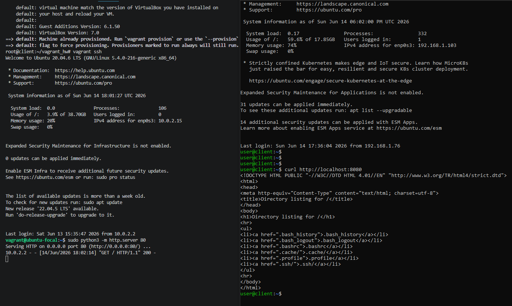
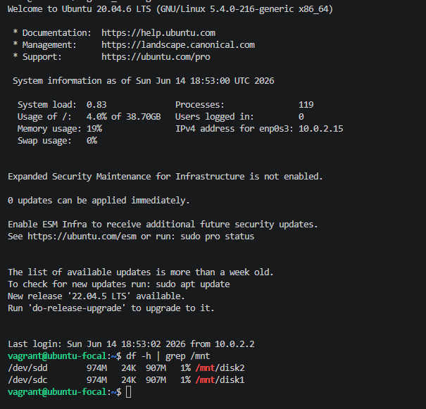
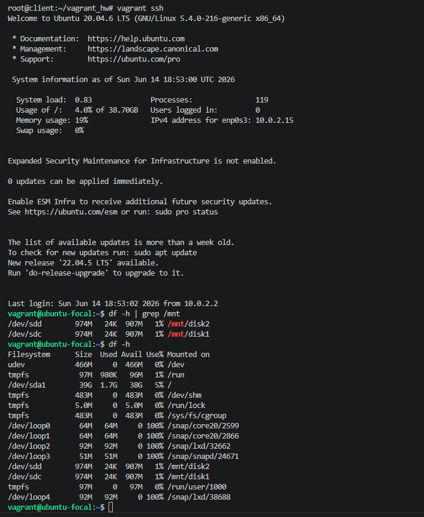
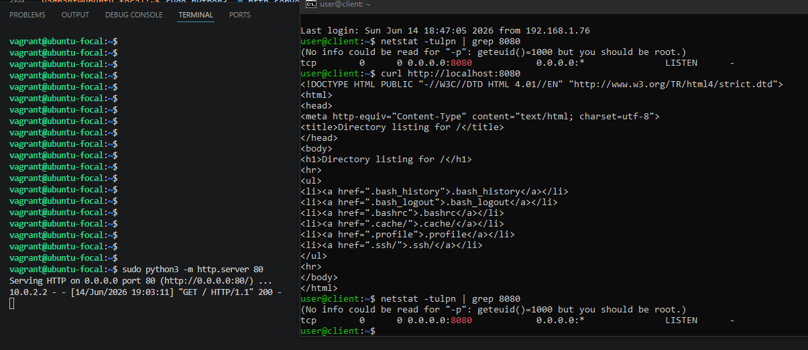

# Домашнее задание "Vagrant"

## Задание "Расширенная настройка дисков и сетей"

Цель:
научиться добавлять диски и настраивать сетевые соединения;

Описание/Пошаговая инструкция выполнения домашнего задания:

1. Подготовка окружения:
Убедитесть, что установле VirtualBox и Vagrant.
Создайте директорию для проекта.
2. Создать базовую виртуальную машину:
Использовать можно любой образ.
Настроите память ВМ: 1024 МБ.
3. Добавление дисков:
Добавьте пару виртуальных диска размером 1 ГБ каждый.
4. Настройка сети:
Настройте проброс 80 порта с гостевой системы на порт 8080 хостовой системы.
5. Провижининг:
Напишите провижининг, который:
Форматирует добавленные диски в файловую систему ext4.
Создает точки монтирования /mnt/disk1 и /mnt/disk2.
Монтирует диски в указанные директории.
Добавляет записи в /etc/fstab для автоматического монтирования при загрузке.
---

## Выполнение задания

### 1. Подготовка окружения:

Установим VirtualBox и Vagrant.
Создадим директорию для проекта и перейдем в нее.

```bash
root@client:/home/user# apt update
root@client:/home/user# apt install -y virtualbox
root@client:/home/user# VBoxManage --version
7.0.16_Ubuntur162802
root@client:/home/user# sudo apt install -y ruby-full rubygems build-essential
root@client:/home/user# sudo gem install vagrant
root@client:/home/user# vagrant --version
Vagrant 2.4.9
root@client:/home/user# mkdir ~/vagrant_hw
root@client:/home/user# cd ~/vagrant_hw
root@client:~/vagrant_hw# 
```
### 2. Создать базовую виртуальную машину:

Теперь нужно создать файл Vagrantfile, который опишет виртуальную машину.
```bash
root@client:~/vagrant_hw# nano Vagrantfile


Vagrant.configure("2") do |config|
  # Используем образ Ubuntu 20.04
  config.vm.box = "ubuntu/focal64"

  # Настройка провайдера VirtualBox
  config.vm.provider "virtualbox" do |vb|
    # Память 1024 МБ
    vb.memory = 1024
    vb.cpus = 1
  end
end

```

Запускаем виртуальную машину
```bash
root@client:~/vagrant_hw# vagrant up
You appear to be running Vagrant outside of the official installers.
Note that the installers are what ensure that Vagrant has all required
dependencies. Vagrant has detected that the following  executables are
currently unavailable:

  bsdtar

Bringing machine 'default' up with 'virtualbox' provider...
==> default: Box 'ubuntu/focal64' could not be found. Attempting to find and install...
    default: Box Provider: virtualbox
    default: Box Version: >= 0
==> default: Loading metadata for box 'ubuntu/focal64'
    default: URL: https://vagrantcloud.com/api/v2/vagrant/ubuntu/focal64
==> default: Adding box 'ubuntu/focal64' (v20240821.0.1) for provider: virtualbox
    default: Downloading: https://vagrantcloud.com/ubuntu/boxes/focal64/versions/20240821.0.1/providers/virtualbox/unknown/vagrant.box
The executable 'bsdtar' Vagrant is trying to run was not
found in the PATH variable. This is an error. Please verify
this software is installed and on the path.

```
Ошибка bsdtar not found возникает из-за того, что установили Vagrant через пакетный менеджер Ruby (gem). В Ubuntu требуется доустановить пакет libarchive-tools, который и предоставляет эту программу.

```bash
root@client:~/vagrant_hw# apt install -y libarchive-tools
```
Далее снова запускаем виртуальную машину:
```bash
root@client:~/vagrant_hw# vagrant up
Bringing machine 'default' up with 'virtualbox' provider...
==> default: Checking if box 'ubuntu/focal64' version '20240821.0.1' is up to date...
==> default: Clearing any previously set forwarded ports...
==> default: Fixed port collision for 22 => 2222. Now on port 2200.
==> default: Clearing any previously set network interfaces...
==> default: Preparing network interfaces based on configuration...
    default: Adapter 1: nat
==> default: Forwarding ports...
    default: 22 (guest) => 2200 (host) (adapter 1)
==> default: Running 'pre-boot' VM customizations...
==> default: Booting VM...
==> default: Waiting for machine to boot. This may take a few minutes...
    default: SSH address: 127.0.0.1:2200
    default: SSH username: vagrant
    default: SSH auth method: private key
    default: Warning: Remote connection disconnect. Retrying...
    default: Warning: Connection reset. Retrying...
==> default: Machine booted and ready!
==> default: Checking for guest additions in VM...
    default: The guest additions on this VM do not match the installed version of
    default: VirtualBox! In most cases this is fine, but in rare cases it can
    default: prevent things such as shared folders from working properly. If you see
    default: shared folder errors, please make sure the guest additions within the
    default: virtual machine match the version of VirtualBox you have installed on
    default: your host and reload your VM.
    default: 
    default: Guest Additions Version: 6.1.50
    default: VirtualBox Version: 7.0
==> default: Mounting shared folders...
    default: /root/vagrant_hw => /vagrant
```

Проверяем, что ВМ создалась
```bash
root@client:~/vagrant_hw# vagrant status
Current machine states:

default                   running (virtualbox)

The VM is running. To stop this VM, you can run `vagrant halt` to
shut it down forcefully, or you can run `vagrant suspend` to simply
suspend the virtual machine. In either case, to restart it again,
simply run `vagrant up`.
```
Подключаемся к ВМ 
```bash
root@client:~/vagrant_hw# vagrant ssh
Welcome to Ubuntu 20.04.6 LTS (GNU/Linux 5.4.0-216-generic x86_64)

 * Documentation:  https://help.ubuntu.com
 * Management:     https://landscape.canonical.com
 * Support:        https://ubuntu.com/pro

 System information disabled due to load higher than 1.0


Expanded Security Maintenance for Infrastructure is not enabled.

0 updates can be applied immediately.

Enable ESM Infra to receive additional future security updates.
See https://ubuntu.com/esm or run: sudo pro status


The list of available updates is more than a week old.
To check for new updates run: sudo apt update
```
Внутри ВМ проверяем память:
```bash
vagrant@ubuntu-focal:~$ free -h
              total        used        free      shared  buff/cache   available
Mem:          965Mi       121Mi       508Mi       0.0Ki       335Mi       694Mi
Swap:            0B          0B          0B
vagrant@ubuntu-focal:~$ 
```
Остановим ВМ:
```bash
root@client:~/vagrant_hw# vagrant halt
root@client:~/vagrant_hw# vagrant status
Current machine states:

default                   poweroff (virtualbox)

The VM is powered off. To restart the VM, simply run `vagrant up`
```

### 3. Добавление дисков:

Корректируем Vagrantfile

```bash
root@client:~/vagrant_hw# nano Vagrantfile


Vagrant.configure("2") do |config|
  config.vm.box = "ubuntu/focal64"
  config.vm.boot_timeout = 1200
  config.ssh.insert_key = false
  config.vm.synced_folder ".", "/vagrant", disabled: true

  # Добавляем два виртуальных диска по 1 ГБ (без указания контроллера)
  config.vm.disk :disk, size: "1GB", name: "disk1"
  config.vm.disk :disk, size: "1GB", name: "disk2"

  config.vm.provider "virtualbox" do |vb|
    vb.memory = 1024
    vb.cpus = 1
    vb.gui = false
    vb.customize ["modifyvm", :id, "--natdnshostresolver1", "on"]
    vb.customize ["modifyvm", :id, "--natdnsproxy1", "on"]
  end
end
```

Запускаем ВМ с добавленными дисками:
```bash
root@client:~/vagrant_hw# vagrant up

==> default: Destroying VM and associated drives...
Bringing machine 'default' up with 'virtualbox' provider...
==> default: Importing base box 'ubuntu/focal64'...
==> default: Matching MAC address for NAT networking...
==> default: Checking if box 'ubuntu/focal64' version '20240821.0.1' is up to date...
==> default: Setting the name of the VM: vagrant_hw_default_1781364731690_80886
==> default: Clearing any previously set network interfaces...
==> default: Preparing network interfaces based on configuration...
    default: Adapter 1: nat
==> default: Forwarding ports...
    default: 22 (guest) => 2222 (host) (adapter 1)
==> default: Configuring storage mediums...
    default: Disk 'disk1' not found in guest. Creating and attaching disk to guest...
    default: Disk 'disk2' not found in guest. Creating and attaching disk to guest...
==> default: Running 'pre-boot' VM customizations...
==> default: Booting VM...
==> default: Waiting for machine to boot. This may take a few minutes...
    default: SSH address: 127.0.0.1:2222
    default: SSH username: vagrant
    default: SSH auth method: private key
    default: Warning: Connection reset. Retrying...
    default: Warning: Remote connection disconnect. Retrying...
    default: Warning: Connection reset. Retrying...
    default: Warning: Connection reset. Retrying...
==> default: Machine booted and ready!
==> default: Checking for guest additions in VM...
    default: The guest additions on this VM do not match the installed version of
    default: VirtualBox! In most cases this is fine, but in rare cases it can
    default: prevent things such as shared folders from working properly. If you see
    default: shared folder errors, please make sure the guest additions within the
    default: virtual machine match the version of VirtualBox you have installed on
    default: your host and reload your VM.
    default: 
    default: Guest Additions Version: 6.1.50
    default: VirtualBox Version: 7.0
```
Проверим, что диски появились
```bash
root@client:~/vagrant_hw# vagrant ssh
Welcome to Ubuntu 20.04.6 LTS (GNU/Linux 5.4.0-216-generic x86_64)

 * Documentation:  https://help.ubuntu.com
 * Management:     https://landscape.canonical.com
 * Support:        https://ubuntu.com/pro

 System information disabled due to load higher than 1.0


Expanded Security Maintenance for Infrastructure is not enabled.

0 updates can be applied immediately.

Enable ESM Infra to receive additional future security updates.
See https://ubuntu.com/esm or run: sudo pro status


The list of available updates is more than a week old.
To check for new updates run: sudo apt update
New release '22.04.5 LTS' available.
Run 'do-release-upgrade' to upgrade to it.


vagrant@ubuntu-focal:~$ lsblk
NAME   MAJ:MIN RM  SIZE RO TYPE MOUNTPOINT
loop0    7:0    0 63.8M  1 loop /snap/core20/2599
loop1    7:1    0 91.9M  1 loop /snap/lxd/32662
loop2    7:2    0 50.9M  1 loop /snap/snapd/24671
sda      8:0    0   40G  0 disk 
└─sda1   8:1    0   40G  0 part /
sdb      8:16   0   10M  0 disk 
sdc      8:32   0    1G  0 disk 
sdd      8:48   0    1G  0 disk 

```


### 4. Настройка сети:

Скорректируем Vagrantfile:
```bash
cd ~/vagrant_hw
nano Vagrantfile

Vagrant.configure("2") do |config|
  config.vm.box = "ubuntu/focal64"
  config.vm.boot_timeout = 1200
  config.ssh.insert_key = false
  config.vm.synced_folder ".", "/vagrant", disabled: true

  # Пункт 4: Проброс порта 80 гостя -> 8080 хоста
  config.vm.network "forwarded_port", guest: 80, host: 8080

  # Добавляем два виртуальных диска по 1 ГБ
  config.vm.disk :disk, size: "1GB", name: "disk1"
  config.vm.disk :disk, size: "1GB", name: "disk2"

  config.vm.provider "virtualbox" do |vb|
    vb.memory = 1024
    vb.cpus = 1
    vb.gui = false
    vb.customize ["modifyvm", :id, "--natdnshostresolver1", "on"]
    vb.customize ["modifyvm", :id, "--natdnsproxy1", "on"]
  end
end
```
Проверяем результат:
```bash
root@client:~/vagrant_hw# vagrant reload
==> default: Checking if box 'ubuntu/focal64' version '20240821.0.1' is up to date...
==> default: Clearing any previously set network interfaces...
==> default: Preparing network interfaces based on configuration...
    default: Adapter 1: nat
==> default: Forwarding ports...
    default: 80 (guest) => 8080 (host) (adapter 1)
    default: 22 (guest) => 2222 (host) (adapter 1)
==> default: Configuring storage mediums...
==> default: Running 'pre-boot' VM customizations...
==> default: Booting VM...
==> default: Waiting for machine to boot. This may take a few minutes...
    default: SSH address: 127.0.0.1:2222
    default: SSH username: vagrant
    default: SSH auth method: private key
    default: Warning: Connection reset. Retrying...
    default: Warning: Connection reset. Retrying...
==> default: Machine booted and ready!
==> default: Checking for guest additions in VM...
    default: The guest additions on this VM do not match the installed version of
    default: VirtualBox! In most cases this is fine, but in rare cases it can
    default: prevent things such as shared folders from working properly. If you see
    default: shared folder errors, please make sure the guest additions within the
    default: virtual machine match the version of VirtualBox you have installed on
    default: your host and reload your VM.
    default: 
    default: Guest Additions Version: 6.1.50
    default: VirtualBox Version: 7.0
==> default: Machine already provisioned. Run `vagrant provision` or use the `--provision`
==> default: flag to force provisioning. Provisioners marked to run always will still run.
```

На гостевой ВМ (внутри) запускаем простой HTTP-сервер на порту 80
```bash
root@client:~/vagrant_hw# vagrant ssh
vagrant@ubuntu-focal:~$ sudo python3 -m http.server 80
```

На хосте (основная Ubuntu) откроем второй терминал и выполним:

curl http://localhost:8080



### 5. Провижининг:

Откорректируем Vagrantfile 

```bash
cd ~/vagrant_hw
nano Vagrantfile


Vagrant.configure("2") do |config|
  config.vm.box = "ubuntu/focal64"
  config.vm.boot_timeout = 1200
  config.ssh.insert_key = false
  config.vm.synced_folder ".", "/vagrant", disabled: true

  # Пункт 4: Проброс порта 80 гостя -> 8080 хоста
  config.vm.network "forwarded_port", guest: 80, host: 8080

  # Добавляем два виртуальных диска по 1 ГБ
  config.vm.disk :disk, size: "1GB", name: "disk1"
  config.vm.disk :disk, size: "1GB", name: "disk2"

  config.vm.provider "virtualbox" do |vb|
    vb.memory = 1024
    vb.cpus = 1
    vb.gui = false
    vb.customize ["modifyvm", :id, "--natdnshostresolver1", "on"]
    vb.customize ["modifyvm", :id, "--natdnsproxy1", "on"]
  end

  # ----- Пункт 5: Провижининг -----
  config.vm.provision "shell", inline: <<-SHELL
    # Находим все диски размером 1 ГБ (1073741824 байт) и обрабатываем их
    i=1
    for disk in /dev/sd?; do
      size=$(blockdev --getsize64 $disk)
      if [ "$size" -eq 1073741824 ]; then
        echo "Обработка диска $disk"
        # Форматирование в ext4
        mkfs.ext4 -F $disk
        # Точка монтирования /mnt/disk1, /mnt/disk2
        mount_point="/mnt/disk$i"
        mkdir -p $mount_point
        # Получение UUID
        uuid=$(blkid -s UUID -o value $disk)
        # Добавление в fstab, если ещё не добавлено
        if ! grep -q "UUID=$uuid" /etc/fstab; then
          echo "UUID=$uuid $mount_point ext4 defaults 0 2" >> /etc/fstab
        fi
        # Монтирование
        mount $mount_point
        i=$((i+1))
      fi
    done
    mount -a
    echo "=== Результат монтирования ==="
    df -h | grep /mnt/disk
  SHELL
end
```
Ключевые моменты:
Скрипт ищет диски точно 1 ГБ (sdc и sdd).
Нумерует точки монтирования последовательно: disk1, disk2.
Использует mkfs.ext4 -F – принудительное форматирование (без вопросов).
Перед добавлением в fstab проверяет, нет ли уже такой записи (идемпотентность).
После монтирования выводит результат df -h | grep /mnt/disk.


Применяем провижининг к существующей ВМ:
```bash
root@client:~/vagrant_hw# vagrant reload --provision
==> default: Checking if box 'ubuntu/focal64' version '20240821.0.1' is up to date...
==> default: Clearing any previously set network interfaces...
==> default: Preparing network interfaces based on configuration...
    default: Adapter 1: nat
==> default: Forwarding ports...
    default: 80 (guest) => 8080 (host) (adapter 1)
    default: 22 (guest) => 2222 (host) (adapter 1)
==> default: Configuring storage mediums...
==> default: Running 'pre-boot' VM customizations...
==> default: Booting VM...
==> default: Waiting for machine to boot. This may take a few minutes...
    default: SSH address: 127.0.0.1:2222
    default: SSH username: vagrant
    default: SSH auth method: private key
    default: Warning: Connection reset. Retrying...
    default: Warning: Remote connection disconnect. Retrying...
    default: Warning: Connection reset. Retrying...
==> default: Machine booted and ready!
==> default: Checking for guest additions in VM...
    default: The guest additions on this VM do not match the installed version of
    default: VirtualBox! In most cases this is fine, but in rare cases it can
    default: prevent things such as shared folders from working properly. If you see
    default: shared folder errors, please make sure the guest additions within the
    default: virtual machine match the version of VirtualBox you have installed on
    default: your host and reload your VM.
    default: 
    default: Guest Additions Version: 6.1.50
    default: VirtualBox Version: 7.0
==> default: Running provisioner: shell...
    default: Running: inline script
    default: Обработка диска /dev/sdc
    default: mke2fs 1.45.5 (07-Jan-2020)
    default: Creating filesystem with 262144 4k blocks and 65536 inodes
    default: Filesystem UUID: fb933419-9a96-4f37-80a4-f272d5f29b0e
    default: Superblock backups stored on blocks:
    default:    32768, 98304, 163840, 229376
    default: 
    default: Allocating group tables: done
    default: Writing inode tables: done
    default: Creating journal (8192 blocks): done
    default: Writing superblocks and filesystem accounting information: done
    default: 
    default: Обработка диска /dev/sdd
    default: mke2fs 1.45.5 (07-Jan-2020)
    default: Creating filesystem with 262144 4k blocks and 65536 inodes
    default: Filesystem UUID: ad8ba971-671f-474d-8789-6e007e1dfb6f
    default: Superblock backups stored on blocks:
    default:    32768, 98304, 163840, 229376
    default: 
    default: Allocating group tables: done
    default: Writing inode tables: done
    default: Creating journal (8192 blocks): done
    default: Writing superblocks and filesystem accounting information: done
    default: 
    default: === Результат монтирования ===
    default: /dev/sdc        974M   24K  907M   1% /mnt/disk1
    default: /dev/sdd        974M   24K  907M   1% /mnt/disk2
```

Проверяем результат:
```bash
root@client:~/vagrant_hw# vagrant ssh
Welcome to Ubuntu 20.04.6 LTS (GNU/Linux 5.4.0-216-generic x86_64)

 * Documentation:  https://help.ubuntu.com
 * Management:     https://landscape.canonical.com
 * Support:        https://ubuntu.com/pro

 System information as of Sun Jun 14 18:01:27 UTC 2026

  System load:  0.0               Processes:               106
  Usage of /:   3.9% of 38.70GB   Users logged in:         0
  Memory usage: 20%               IPv4 address for enp0s3: 10.0.2.15
  Swap usage:   0%


Expanded Security Maintenance for Infrastructure is not enabled.

0 updates can be applied immediately.

Enable ESM Infra to receive additional future security updates.
See https://ubuntu.com/esm or run: sudo pro status


The list of available updates is more than a week old.
To check for new updates run: sudo apt update
New release '22.04.5 LTS' available.
Run 'do-release-upgrade' to upgrade to it.


Last login: Sun Jun 14 18:01:29 2026 from 10.0.2.2
vagrant@ubuntu-focal:~$ df -h | grep /mnt
/dev/sdc        974M   24K  907M   1% /mnt/disk1
/dev/sdd        974M   24K  907M   1% /mnt/disk2
vagrant@ubuntu-focal:~$ 
```

Проверка автоматического монтирования
```bash
vagrant@ubuntu-focal:~$ sudo reboot
vagrant@ubuntu-focal:~$ Connection to 127.0.0.1 closed by remote host.
root@client:~/vagrant_hw# vagrant ssh
root@client:~/vagrant_hw# vagrant status
Current machine states:

default                   running (virtualbox)

The VM is running. To stop this VM, you can run `vagrant halt` to
shut it down forcefully, or you can run `vagrant suspend` to simply
suspend the virtual machine. In either case, to restart it again,
simply run `vagrant up`.
root@client:~/vagrant_hw# vagrant ssh
Welcome to Ubuntu 20.04.6 LTS (GNU/Linux 5.4.0-216-generic x86_64)

 * Documentation:  https://help.ubuntu.com
 * Management:     https://landscape.canonical.com
 * Support:        https://ubuntu.com/pro

 System information as of Sun Jun 14 18:53:00 UTC 2026

  System load:  0.83              Processes:               119
  Usage of /:   4.0% of 38.70GB   Users logged in:         0
  Memory usage: 19%               IPv4 address for enp0s3: 10.0.2.15
  Swap usage:   0%


Expanded Security Maintenance for Infrastructure is not enabled.

0 updates can be applied immediately.

Enable ESM Infra to receive additional future security updates.
See https://ubuntu.com/esm or run: sudo pro status


The list of available updates is more than a week old.
To check for new updates run: sudo apt update
New release '22.04.5 LTS' available.
Run 'do-release-upgrade' to upgrade to it.


Last login: Sun Jun 14 18:53:02 2026 from 10.0.2.2
vagrant@ubuntu-focal:~$ df -h | grep /mnt
/dev/sdd        974M   24K  907M   1% /mnt/disk2
/dev/sdc        974M   24K  907M   1% /mnt/disk1
```

скриншот вывода df -h | grep /mnt 



Скриншот вывода команды df -h с запущенной ВМ



Скриншот с хостовой машины вывода команды netstat -tulpn | grep 8080 с запущенной ВМ


