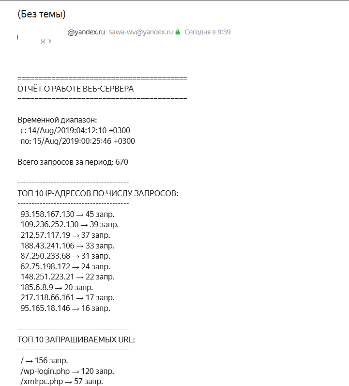

# Домашнее задание "bash-скрипт, который ежечасно формирует и отправляет на email отчёт о работе веб-сервера"

## Задание

Написать скрипт для CRON, который раз в час формирует отчёт и отправляет его на заданную почту.

Отчёт должен содержать:
- IP-адреса с наибольшим числом запросов (с момента последнего запуска);
- Запрашиваемые URL с наибольшим числом запросов (с момента последнего запуска);
- Ошибки веб-сервера/приложения (с момента последнего запуска);
- HTTP-коды ответов с указанием их количества (с момента последнего запуска).

Скрипт должен предотвращать одновременный запуск нескольких копий, до его завершения.
В письме должен быть прописан обрабатываемый временной диапазон.
---

## Выполнение задания

копируем лог в целевую дирректорию 
```bash
root@client:/home/user# cd /var/log/access.log
```
Для отправки писем будем использовать msmtp (SMTP-клиент)
```bash
apt update && apt install msmtp msmtp-mta mailutils -y
```

Настройка msmtp:
```bash
cat > /etc/msmtprc << 'EOF'
defaults
auth           on
tls            on
tls_trust_file /etc/ssl/certs/ca-certificates.crt

account        default
host           smtp.yandex.ru
port           587
from           MAIL@yandex.ru
user           MAIL@yandex.ru
password       PASS_MAIL

EOF

chmod 600 /etc/msmtprc
```


Cоздаем скрипт:
```bash
root@client:~# touch log_report.sh
root@client:~# vi log_report.sh 
root@client:~# chmod +x log_report.sh
```

<details> 
<summary>скрипт log_report.sh</summary>

```bash
#!/bin/bash

# ========== НАСТРОЙКИ (ИЗМЕНИТЕ ПОД СЕБЯ) ==========
LOG_FILE="/var/log/access.log"           # путь к вашему лог-файлу
STATE_DIR="/var/log/logmonitor"          # папка для служебных файлов
RECIPIENT="MAIL@yandex.ru"               # email получателя
TOP_N=10                                 # сколько показывать в топах
# ===================================================

# Создаём папку для состояния
mkdir -p "$STATE_DIR"

# Файлы для хранения состояния
LAST_POS_FILE="$STATE_DIR/last_position"      # байтовая позиция в логе
LAST_FIRST_LINE="$STATE_DIR/first_line"       # первая строка прошлого отчёта

# Блокировка от одновременного запуска
LOCK_FILE="/tmp/logreport.lock"
exec 200>"$LOCK_FILE"
if ! flock -n 200; then
    echo "Скрипт уже запущен"
    exit 1
fi

# Функция отправки письма через msmtp
send_report() {
    local subject="$1"
    local body="$2"
    
    (
        echo "Subject: $subject"
        echo "To: $RECIPIENT"
        echo "Content-Type: text/plain; charset=utf-8"
        echo ""
        echo "$body"
    ) | msmtp "$RECIPIENT"
}

# Текущий размер лога
CURRENT_SIZE=$(stat -c%s "$LOG_FILE" 2>/dev/null)

# Если лог не существует
if [[ -z "$CURRENT_SIZE" ]]; then
    echo "Лог-файл не найден: $LOG_FILE"
    exit 1
fi

# Определяем позицию последнего чтения
if [[ -f "$LAST_POS_FILE" ]]; then
    LAST_POS=$(cat "$LAST_POS_FILE")
else
    LAST_POS=0
fi

# Если файл был ротирован (стал меньше) — начинаем сначала
if [[ $LAST_POS -gt $CURRENT_SIZE ]]; then
    LAST_POS=0
fi

# Сохраняем первую строку предыдущего периода (для диапазона)
if [[ -f "$LAST_FIRST_LINE" ]]; then
    OLD_FIRST_LINE=$(cat "$LAST_FIRST_LINE")
else
    OLD_FIRST_LINE=""
fi

# ========== ЧИТАЕМ НОВЫЕ СТРОКИ ==========
NEW_DATA=$(dd if="$LOG_FILE" bs=1 skip="$LAST_POS" 2>/dev/null)

if [[ -z "$NEW_DATA" ]]; then
    echo "Новых записей нет"
    exit 0
fi

# Считаем количество новых строк
TOTAL=$(echo "$NEW_DATA" | wc -l)

# Получаем первую и последнюю строки периода
FIRST_LINE=$(echo "$NEW_DATA" | head -1)
LAST_LINE=$(echo "$NEW_DATA" | tail -1)

# Извлекаем временные метки из строк
FROM_TIME=$(echo "$FIRST_LINE" | grep -o '\[[^]]*\]' | head -1 | tr -d '[]')
TO_TIME=$(echo "$LAST_LINE" | grep -o '\[[^]]*\]' | head -1 | tr -d '[]')

# Определяем полный диапазон
if [[ -n "$OLD_FIRST_LINE" ]]; then
    OLD_FROM_TIME=$(echo "$OLD_FIRST_LINE" | grep -o '\[[^]]*\]' | head -1 | tr -d '[]')
    FULL_FROM_TIME="$OLD_FROM_TIME"
else
    FULL_FROM_TIME="$FROM_TIME"
fi

# ========== АНАЛИЗ ==========
# 1. Топ IP
IP_TOP=$(echo "$NEW_DATA" | awk '{print $1}' | sort | uniq -c | sort -rn | head -n "$TOP_N")

# 2. Топ URL
URL_TOP=$(echo "$NEW_DATA" | grep -oE '(GET|POST|HEAD|PUT|DELETE) [^ ]+' | awk '{print $2}' | sort | uniq -c | sort -rn | head -n "$TOP_N")

# 3. Все HTTP-коды
CODES=$(echo "$NEW_DATA" | grep -oE '"[^"]*" [0-9]{3}' | awk '{print $2}' | sort | uniq -c | sort -rn)

# 4. Ошибки (4xx и 5xx)
ERRORS=$(echo "$NEW_DATA" | grep -oE '"[^"]*" [0-9]{3}' | awk '{print $2}' | grep -E '^[45][0-9]{2}' | sort | uniq -c | sort -rn)

# ========== ФОРМИРУЕМ ОТЧЁТ ==========
REPORT="========================================
ОТЧЁТ О РАБОТЕ ВЕБ-СЕРВЕРА
========================================

Временной диапазон:
  с: $FULL_FROM_TIME
  по: $TO_TIME

Всего запросов за период: $TOTAL

----------------------------------------
ТОП $TOP_N IP-АДРЕСОВ ПО ЧИСЛУ ЗАПРОСОВ:
----------------------------------------
$(echo "$IP_TOP" | awk '{printf "  %-20s  →  %d запр.\n", $2, $1}')

----------------------------------------
ТОП $TOP_N ЗАПРАШИВАЕМЫХ URL:
----------------------------------------
$(echo "$URL_TOP" | awk '{printf "  %-60s  →  %d запр.\n", $2, $1}')

----------------------------------------
ОШИБКИ ВЕБ-СЕРВЕРА/ПРИЛОЖЕНИЯ (4xx/5xx):
----------------------------------------
$(if [[ -n "$ERRORS" ]]; then
    echo "$ERRORS" | awk '{printf "  Код %s  →  %d раз\n", $2, $1}'
else
    echo "  Ошибок не обнаружено"
fi)

----------------------------------------
HTTP-КОДЫ ОТВЕТОВ С УКАЗАНИЕМ КОЛИЧЕСТВА:
----------------------------------------
$(echo "$CODES" | awk '{printf "  %s  →  %d\n", $2, $1}')

========================================
"

# ========== ОТПРАВКА ПИСЬМА ==========
if send_report "Отчёт веб-сервера за период" "$REPORT"; then
    echo "Отчёт отправлен на $RECIPIENT"
else
    echo "Ошибка отправки письма"
    # Сохраняем локально на случай ошибки
    echo "$REPORT" > /tmp/report_failed.txt
fi

# ========== СОХРАНЯЕМ СОСТОЯНИЕ ==========
echo "$CURRENT_SIZE" > "$LAST_POS_FILE"
echo "$FIRST_LINE" > "$LAST_FIRST_LINE"

echo "Готово. Обработано строк: $TOTAL"
```
</details>

Запуск скрипта:
```bash
root@client:~# ./log_report.sh 
Отчёт отправлен на MAIL@yandex.ru
Готово. Обработано строк: 670
```

Добавьте в CRON (запуск каждый час)
```bash
crontab -e

0 * * * * /usr/local/bin/log_report.sh
```

В результате получили письмо на почту:


<details> 
<summary>ТЕЛО ПИСЬМА</summary>

```bash
========================================
ОТЧЁТ О РАБОТЕ ВЕБ-СЕРВЕРА
========================================

Временной диапазон:
  с: 14/Aug/2019:04:12:10 +0300
  по: 15/Aug/2019:00:25:46 +0300

Всего запросов за период: 670

----------------------------------------
ТОП 10 IP-АДРЕСОВ ПО ЧИСЛУ ЗАПРОСОВ:
----------------------------------------
  93.158.167.130 → 45 запр.
  109.236.252.130 → 39 запр.
  212.57.117.19 → 37 запр.
  188.43.241.106 → 33 запр.
  87.250.233.68 → 31 запр.
  62.75.198.172 → 24 запр.
  148.251.223.21 → 22 запр.
  185.6.8.9 → 20 запр.
  217.118.66.161 → 17 запр.
  95.165.18.146 → 16 запр.

----------------------------------------
ТОП 10 ЗАПРАШИВАЕМЫХ URL:
----------------------------------------
  / → 156 запр.
  /wp-login.php → 120 запр.
  /xmlrpc.php → 57 запр.
  /robots.txt → 26 запр.
  /favicon.ico → 12 запр.
  /wp-includes/js/wp-embed.min.js?ver=5.0.4 → 9 запр.
  /wp-admin/admin-post.php?page=301bulkoptions → 7 запр.
  /1 → 7 запр.
  /wp-content/uploads/2016/10/robo5.jpg → 6 запр.
  /wp-content/uploads/2016/10/robo4.jpg → 6 запр.

----------------------------------------
ОШИБКИ ВЕБ-СЕРВЕРА/ПРИЛОЖЕНИЯ (4xx/5xx):
----------------------------------------
  Код 400 → 11 раз

----------------------------------------
HTTP-КОДЫ ОТВЕТОВ С УКАЗАНИЕМ КОЛИЧЕСТВА:
----------------------------------------
  / → 157
  /wp-login.php → 120
  /xmlrpc.php → 57
  /robots.txt → 26
  /favicon.ico → 12
  400 → 11
  /wp-includes/js/wp-embed.min.js?ver=5.0.4 → 9
  /wp-admin/admin-post.php?page=301bulkoptions → 7
  /1 → 7
  /wp-content/uploads/2016/10/robo5.jpg → 6
  /wp-content/uploads/2016/10/robo4.jpg → 6
  /wp-content/uploads/2016/10/robo3.jpg → 6
  /wp-content/uploads/2016/10/robo2.jpg → 6
  /wp-content/uploads/2016/10/robo1.jpg → 6
  /wp-content/uploads/2016/10/aoc-1.jpg → 6
  /wp-content/uploads/2016/10/agreed.jpg → 6
  /wp-content/themes/llorix-one-lite/style.css?ver=1.0.0 → 6
  /wp-admin/admin-ajax.php?page=301bulkoptions → 6
  /wp-includes/js/wp-emoji-release.min.js?ver=5.0.4 → 5
  /wp-includes/css/dist/block-library/style.min.css?ver=5.0.4 → 5
  /wp-content/themes/llorix-one-lite/js/vendor/bootstrap.min.js?ver=3.3.7 → 5
  /wp-content/themes/llorix-one-lite/js/skip-link-focus-fix.js?ver=1.0.0 → 5
  /wp-content/themes/llorix-one-lite/js/custom.all.js?ver=2.0.2 → 5
  /wp-content/themes/llorix-one-lite/css/font-awesome.min.css?ver=4.4.0 → 5
  /wp-content/themes/llorix-one-lite/css/bootstrap.min.css?ver=3.3.1 → 5
  /wp-content/plugins/pc-google-analytics/assets/js/frontend.min.js?ver=1.0.0 → 5
  /wp-content/plugins/pc-google-analytics/assets/css/frontend.css?ver=1.0.0 → 5
  /wp-content/plugins/llorix-one-companion//css/style.css?ver=5.0.4 → 5
  /wp-includes/js/comment-reply.min.js?ver=5.0.4 → 4
  /wp-content/uploads/2016/10/dc.jpg → 4
  /wp-content/themes/llorix-one-lite/fonts/fontawesome-webfont.woff2?v=4.6.3 → 4
  /%D0%A3%D0%B4%D0%B0%D0%BB%D0%B5%D0%BD%D0%BD%D0%BE%D0%B5-%D0%B0%D0%B4%D0%BC%D0%B8%D0%BD%D0%B8%D1%81%D1%82%D1%80%D0%B8%D1%80%D0%BE%D0%B2%D0%B0%D0%BD%D0%B8%D0%B5-%D0%A1%D0%A3%D0%91%D0%94-oracle/ → 4
  /author/admin/ → 4
  /wp-content/uploads/2016/10/WebHostingSolution.jpg → 3
  /wp-content/themes/llorix-one-lite/js/custom.home.js?ver=1.0.0 → 3
  /wp-content/themes/llorix-one-lite/images/no-thumbnail-latest-news.jpg → 3
  /wp-content/themes/llorix-one-lite/images/loader-red.gif → 3
  /sitemap.xml → 3
  /%D0%9F%D1%80%D0%BE%D0%B5%D0%BA%D1%82%D0%B8%D1%80%D0%BE%D0%B2%D0%B0%D0%BD%D0%B8%D0%B5-%D0%BA%D0%BE%D0%BD%D1%84%D0%B8%D0%B3%D1%83%D1%80%D0%B0%D1%86%D0%B8%D0%B9-%D0%B4%D0%BB%D1%8F-%D0%B2%D1%8B%D1%81/ → 3
  /2017/11/01/standby-recover-from-service/ → 3
  /2017/09/28/ → 3
  /2017/08/03/ora-00600-internal-error-code-arguments-k2gteget-pdbid-%D0%B2-oracle-12-0-1/ → 3
  /2017/05/19/%D0%BC%D0%BE%D0%BD%D0%B8%D1%82%D0%BE%D1%80%D0%B8%D0%BD%D0%B3-%D0%B1%D1%8D%D0%BA%D0%B0%D0%BF%D0%BE%D0%B2/ → 3
  /2017/05/19/ → 3
  /?xxxxxxxxxxxx_loads=1&xxxxxxxxxxxx_filename=info.txt&xxxxxxxxxxxx_filecontent=INF0 → 2
  /wp-content/plugins/uploadify/readme.txt → 2
  /wp-content/plugins/uploadify/includes/check.php → 2
  /.well-known/security.txt → 2
  /tag/pdb/ → 2
  /tag/dublicate/ → 2
  /feed/ → 2
  /category/%d0%97%d0%b0%d0%bf%d0%b8%d1%81%d0%ba%d0%b8-%d0%b0%d0%b4%d0%bc%d0%b8%d0%bd%d0%b0/ → 2
  /author/greed/ → 2
  /admin/config.php → 2
  /2017/09/28/%D0%BF%D1%80%D0%BE%D0%B1%D0%BB%D0%B5%D0%BC%D1%8B-dataguard-%D0%BF%D1%80%D0%B8-%D0%B4%D0%BE%D0%B1%D0%B0%D0%B2%D0%BB%D0%B5%D0%BD%D0%B8%D0%B8-%D0%BD%D0%BE%D0%B2%D0%BE%D0%B9-pdb-%D0%BD%D0%B0-%D0%BE/ → 2
  /2017/09/28/%D0%BF%D1%80%D0%BE%D0%B1%D0%BB%D0%B5%D0%BC%D0%B0-%D1%81-data-pump-%D0%BD%D0%B0-pdb/ → 2
  /2017/08/03/enq-tm-contention/ → 2
  /2017/08/03/%D0%BC%D0%BE%D0%BD%D0%B8%D1%82%D0%BE%D1%80%D0%B8%D0%BD%D0%B3-%D1%81-%D0%BF%D0%BE%D0%BC%D0%BE%D1%89%D1%8C%D1%8E-sysstat/ → 2
  /2017/08/03/ → 2
  /2017/06/07/pdb-warning-%D0%BE-%D1%81%D1%83%D1%89%D0%B5%D1%81%D1%82%D0%B2%D1%83%D1%8E%D1%89%D0%B5%D0%BC-%D0%B8%D0%BC%D0%B5%D0%BD%D0%B8-%D1%81%D0%B5%D1%80%D0%B2%D0%B8%D1%81%D0%B0/ → 2
  /2017/06/07/ → 2
  /2017/05/19/%D0%BE%D0%B1%D0%BD%D0%B0%D1%80%D1%83%D0%B6%D0%B5%D0%BD%D0%B8%D0%B5-%D0%BD%D0%BE%D0%B2%D1%8B%D1%85-scsi-%D1%83%D1%81%D1%82%D1%80%D0%BE%D0%B9%D1%81%D1%82%D0%B2-%D1%80%D0%B0%D1%81%D1%88%D0%B8%D1%80/ → 2
  /wp-includes/ID3/comay.php → 1
  /wp-cron.php?doing_wp_cron=1565816515.1302280426025390625000 → 1
  /wp-cron.php?doing_wp_cron=1565813746.0306749343872070312500 → 1
  /wp-cron.php?doing_wp_cron=1565809064.3519101142883300781250 → 1
  /wp-cron.php?doing_wp_cron=1565805548.2867050170898437500000 → 1
  /wp-cron.php?doing_wp_cron=1565804989.2034769058227539062500 → 1
  /wp-cron.php?doing_wp_cron=1565803543.6812090873718261718750 → 1
  /wp-cron.php?doing_wp_cron=1565801969.5889279842376708984375 → 1
  /wp-cron.php?doing_wp_cron=1565799677.3172910213470458984375 → 1
  /wp-cron.php?doing_wp_cron=1565795656.8273639678955078125000 → 1
  /wp-cron.php?doing_wp_cron=1565794821.8002350330352783203125 → 1
  /wp-cron.php?doing_wp_cron=1565792067.0530738830566406250000 → 1
  /wp-cron.php?doing_wp_cron=1565787459.9350829124450683593750 → 1
  /wp-cron.php?doing_wp_cron=1565784086.7978200912475585937500 → 1
  /wp-cron.php?doing_wp_cron=1565780249.6808691024780273437500 → 1
  /wp-cron.php?doing_wp_cron=1565776688.9177799224853515625000 → 1
  /wp-cron.php?doing_wp_cron=1565773050.3219890594482421875000 → 1
  /wp-cron.php?doing_wp_cron=1565769624.2795310020446777343750 → 1
  /wp-cron.php?doing_wp_cron=1565767056.5768508911132812500000 → 1
  /wp-cron.php?doing_wp_cron=1565762786.4766530990600585937500 → 1
  /wp-cron.php?doing_wp_cron=1565760219.4257180690765380859375 → 1
  /wp-cron.php?doing_wp_cron=1565758629.1767649650573730468750 → 1
  /wp-cron.php?doing_wp_cron=1565755676.3754100799560546875000 → 1
  /wp-cron.php?doing_wp_cron=1565751459.7073841094970703125000 → 1
  /wp-cron.php?doing_wp_cron=1565748350.8502669334411621093750 → 1
  /wp-content/uploads/2018/08/seo_script.php → 1
  /wp-content/themes/llorix-one-lite/fonts/fontawesome-webfont.woff?v=4.6.3 → 1
  /wp-content/themes/llorix-one-lite/fonts/fontawesome-webfont.eot? → 1
  //wp-content/plugins/license.php → 1
  /web-server-%D0%BF%D0%BE%D0%B4-%D0%BA%D0%BB%D1%8E%D1%87/ → 1
  /webdav/ → 1
  /w00tw00t.at.ISC.SANS.DFind:) → 1
  /tag/transparent-tablespaces/ → 1
  /tag/sysstat/ → 1
  /tag/service/ → 1
  /tag/selinux/ → 1
  /tag/scan/ → 1
  /tag/pidstat/ → 1
  /tag/overcommit_ratio/ → 1
  /tag/oracle-rac/ → 1
  /tag/oracle-12c/ → 1
  /tag/local_listener/ → 1
  /tag/iostat/ → 1
  /tag/backup/ → 1
  /tag/asmsnmp/ → 1
  /tag/add-database/ → 1
  /sitemap-pt-post-2017-09.xml → 1
  /sitemap-pt-post-2017-06.xml → 1
  /sitemap-pt-post-2016-11.xml → 1
  /sitemap-pt-page-2016-11.xml → 1
  /manager/html → 1
  http://110.249.212.46/testget?q=23333&port=80 → 1
  http://110.249.212.46/testget?q=23333&port=443 → 1
  /category/%D0%97%D0%B0%D0%BF%D0%B8%D1%81%D0%BA%D0%B8-%D0%B0%D0%B4%D0%BC%D0%B8%D0%BD%D0%B0/ → 1
  /admin//config.php → 1
  /2017/11/01/ → 1
  /2017/06/ → 1
  /2017/05/19/%D1%81%D0%BC%D0%B5%D0%BD%D0%B0-%D0%BF%D0%B0%D1%80%D0%BE%D0%BB%D1%8F-%D1%83-asmsnmp/ → 1
  /2017/05/19/%d0%be%d0%b1%d0%bd%d0%b0%d1%80%d1%83%d0%b6%d0%b5%d0%bd%d0%b8%d0%b5-%d0%bd%d0%be%d0%b2%d1%8b%d1%85-scsi-%d1%83%d1%81%d1%82%d1%80%d0%be%d0%b9%d1%81%d1%82%d0%b2-%d1%80%d0%b0%d1%81%d1%88%d0%b8%d1%80/ → 1
  /2017/02/09/admin-managed-%D1%81%D0%B5%D1%80%D0%B2%D0%B8%D1%81%D1%8B-%D0%B4%D0%BB%D1%8F-pdb/ → 1
  /2017/01/30/%D0%BA%D0%BB%D0%BE%D0%BD%D0%B8%D1%80%D0%BE%D0%B2%D0%B0%D0%BD%D0%B8%D0%B5-pdb-%D0%B8%D0%B7-%D0%BE%D0%B4%D0%BD%D0%BE%D0%B9-%D0%BA%D0%BE%D0%BD%D1%82%D0%B5%D0%B9%D0%BD%D0%B5%D1%80%D0%BD%D0%BE%D0%B9-%D0%B1/ → 1
  /2017/01/ → 1
  /2016/12/14/virtualenv-%D0%B4%D0%BB%D1%8F-%D0%BF%D0%BB%D0%B0%D0%B3%D0%B8%D0%BD%D0%BE%D0%B2-python-scrappy-%D0%BF%D1%80%D0%BE%D0%B5%D0%BA%D1%82-%D0%BD%D0%B0-debian-jessie/ → 1
  /2016/12/05/%D0%BC%D0%B8%D0%B3%D1%80%D0%B0%D1%86%D0%B8%D1%8F-noncdb-%D0%B2-pdb/ → 1
  /2016/12/ → 1
  /2016/11/03/backup-%D0%BD%D0%B0-google-drive/ → 1
  /2016/10/26/%D0%B8%D0%B7%D0%BC%D0%B5%D0%BD%D0%B5%D0%BD%D0%B8%D0%B5-%D1%81%D0%B5%D1%82%D0%B5%D0%B2%D1%8B%D1%85-%D0%BD%D0%B0%D1%81%D1%82%D1%80%D0%BE%D0%B5%D0%BA-%D0%B4%D0%BB%D1%8F-oracle-rac/ → 1
  /2016/10/26/%D0%A1%D0%B5%D1%82%D0%B5%D0%B2%D1%8B%D0%B5-%D0%BF%D1%80%D0%BE%D0%B1%D0%BB%D0%B5%D0%BC%D1%8B-%D1%81-%D0%B7%D0%B0%D0%BF%D1%83%D1%81%D0%BA%D0%BE%D0%BC-crs/ → 1
  /2016/10/17/%D0%9F%D1%80%D0%BE%D0%B4%D0%BE%D0%BB%D0%B6%D0%B0%D0%B5%D0%BC-%D1%8D%D0%BA%D1%81%D0%BF%D0%B5%D1%80%D0%B8%D0%BC%D0%B5%D0%BD%D1%82%D1%8B-%D1%81-lacp/ → 1
  /2016/10/11/%D0%BC%D0%B8%D0%B3%D1%80%D0%B0%D1%86%D0%B8%D1%8F-%D0%B8%D0%B7-11g-%D0%B2-%D0%BA%D0%BE%D0%BD%D1%82%D0%B5%D0%B9%D0%BD%D0%B5%D1%80-12%D1%81/ → 1
  /2016/10/03/%D0%BF%D0%BE%D0%B4%D0%B3%D0%BE%D1%82%D0%BE%D0%B2%D0%BA%D0%B0-%D0%BA-%D1%83%D1%81%D1%82%D0%B0%D0%BD%D0%BE%D0%B2%D0%BA%D0%B5-oracle-12%D1%81-%D0%BD%D0%B0-centos-7/ → 1

========================================
```
</details>