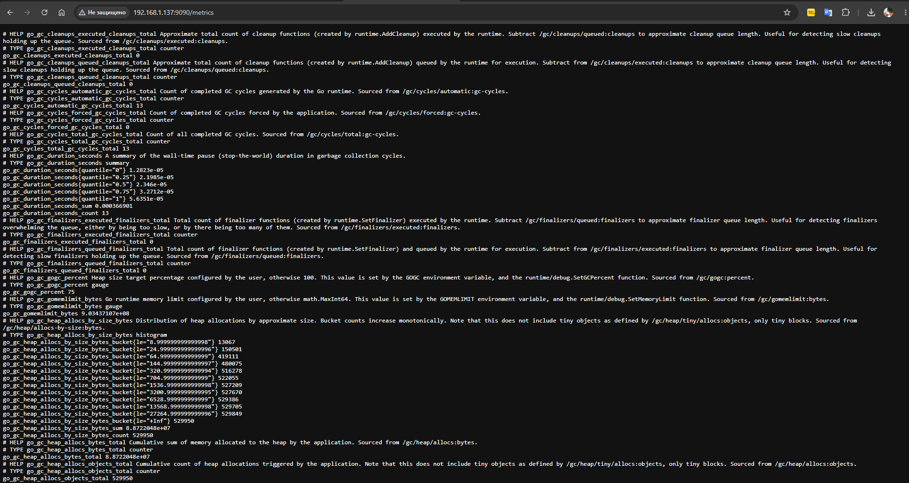
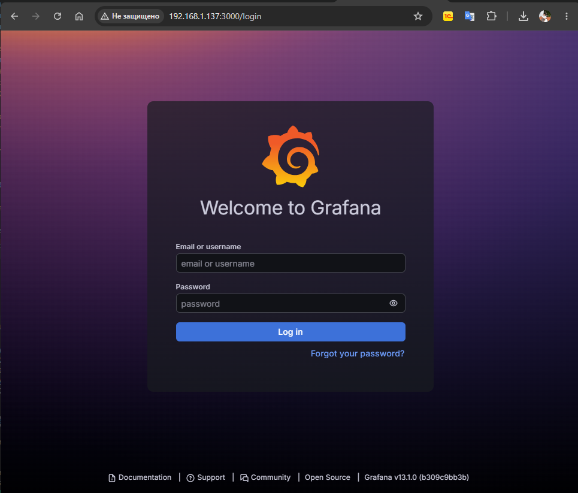
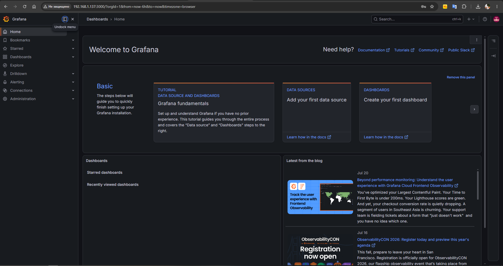
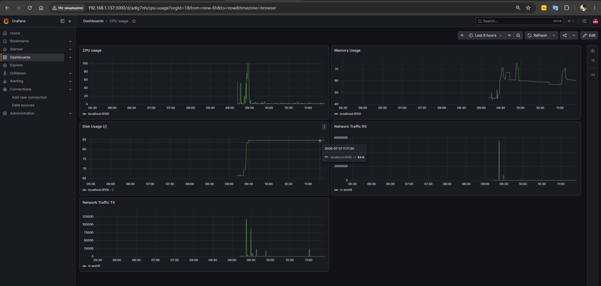

# Домашнее задание "Настройка мониторинга"

## Задание

Настроить дашборд с 4-мя графиками:
- память;
- процессор;
- диск;
- сеть.

Настроить на одной стеке prometheus - grafana.
---

## Выполнение задания

Для выполнения задания будет использоваться ОС Ubuntu 22.04.5 LTS

### 1. Обновление системы

```bash
root@user:/home/user# sudo apt update && sudo apt upgrade -y
```
### 2. Установка и настройка Node Exporter (сбор метрик системы)

Создаём системного пользователя
```bash
root@user:/home/user# sudo useradd --no-create-home --shell /bin/false node_exporter
```
Скачиваем и распаковываем
```bash
root@user:/home/user# cd /tmp
root@user:/tmp# wget https://github.com/prometheus/node_exporter/releases/download/v1.10.2/node_exporter-1.10.2.linux-amd64.tar.gz
root@user:/tmp# tar xvf node_exporter-1.10.2.linux-amd64.tar.gz
```
Копируем бинарник и назначаем права
```bash
root@user:/tmp# sudo cp node_exporter-1.10.2.linux-amd64/node_exporter /usr/local/bin/
root@user:/tmp# sudo chown node_exporter:node_exporter /usr/local/bin/node_exporter
```
Создаём systemd-сервис
```bash
root@user:/tmp# sudo tee /etc/systemd/system/node_exporter.service > /dev/null <<EOF
[Unit]
Description=Node Exporter
Wants=network-online.target
After=network-online.target

[Service]
User=node_exporter
Group=node_exporter
Type=simple
ExecStart=/usr/local/bin/node_exporter

[Install]
WantedBy=multi-user.target
EOF
```
Запускаем и включаем автозагрузку
```bash
root@user:/tmp# sudo systemctl daemon-reload
root@user:/tmp# sudo systemctl enable --now node_exporter
```
Проверяем
```bash
root@user:/tmp# systemctl status node_exporter
● node_exporter.service - Node Exporter
     Loaded: loaded (/etc/systemd/system/node_exporter.service; enabled; vendor preset: enabled)
     Active: active (running) since Tue 2026-07-21 05:58:34 UTC; 23s ago
   Main PID: 1909 (node_exporter)
      Tasks: 3 (limit: 1008)
     Memory: 2.0M
        CPU: 6ms
     CGroup: /system.slice/node_exporter.service
             └─1909 /usr/local/bin/node_exporter

Jul 21 05:58:34 user node_exporter[1909]: time=2026-07-21T05:58:34.873Z level=INFO source=node_exporter.go:141 msg=time
Jul 21 05:58:34 user node_exporter[1909]: time=2026-07-21T05:58:34.873Z level=INFO source=node_exporter.go:141 msg=timex
Jul 21 05:58:34 user node_exporter[1909]: time=2026-07-21T05:58:34.873Z level=INFO source=node_exporter.go:141 msg=udp_queues
Jul 21 05:58:34 user node_exporter[1909]: time=2026-07-21T05:58:34.873Z level=INFO source=node_exporter.go:141 msg=uname
Jul 21 05:58:34 user node_exporter[1909]: time=2026-07-21T05:58:34.873Z level=INFO source=node_exporter.go:141 msg=vmstat
Jul 21 05:58:34 user node_exporter[1909]: time=2026-07-21T05:58:34.873Z level=INFO source=node_exporter.go:141 msg=watchdog
Jul 21 05:58:34 user node_exporter[1909]: time=2026-07-21T05:58:34.873Z level=INFO source=node_exporter.go:141 msg=xfs
Jul 21 05:58:34 user node_exporter[1909]: time=2026-07-21T05:58:34.873Z level=INFO source=node_exporter.go:141 msg=zfs
Jul 21 05:58:34 user node_exporter[1909]: time=2026-07-21T05:58:34.873Z level=INFO source=tls_config.go:346 msg="Listening on" address=[::]:9100
Jul 21 05:58:34 user node_exporter[1909]: time=2026-07-21T05:58:34.873Z level=INFO source=tls_config.go:349 msg="TLS is disabled." http2=false address=[::]:9100
```

Также можно ыполнить curl http://localhost:9100/metrics. Должен отдать набор метрик.

### 3. Установка и настройка Prometheus

Создаём пользователя и директории
```bash
root@user:/tmp# sudo useradd --no-create-home --shell /bin/false prometheus
root@user:/tmp# sudo mkdir -p /etc/prometheus /var/lib/prometheus
root@user:/tmp# sudo chown prometheus:prometheus /etc/prometheus /var/lib/prometheus
```
Скачиваем Prometheus
```bash
root@user:/tmp# wget https://github.com/prometheus/prometheus/releases/download/v3.12.0/prometheus-3.12.0.linux-amd64.tar.gz
root@user:/tmp# tar xvf prometheus-3.12.0.linux-amd64.tar.gz
```
Копируем бинарники и консольные файлы
```bash
root@user:/tmp# sudo cp prometheus-3.12.0.linux-amd64/prometheus /usr/local/bin/
root@user:/tmp# sudo cp prometheus-3.12.0.linux-amd64/promtool /usr/local/bin/
```
Назначаем права
```bash
root@user:/tmp# chown prometheus:prometheus /usr/local/bin/prometheus /usr/local/bin/promtool
root@user:/tmp# chown -R prometheus:prometheus /etc/prometheus /var/lib/prometheus
```
Создаём базовый конфиг Prometheus (включает сбор собственных метрик и Node Exporter)
```bash
root@user:/tmp# cat > /etc/prometheus/prometheus.yml <<EOF
global:
  scrape_interval: 15s

scrape_configs:
  - job_name: 'prometheus'
    static_configs:
      - targets: ['localhost:9090']

  - job_name: 'node_exporter'
    static_configs:
      - targets: ['localhost:9100']
EOF
root@user:/tmp# chown prometheus:prometheus /etc/prometheus/prometheus.yml
root@user:/tmp# sudo chown prometheus:prometheus /etc/prometheus/prometheus.yml
```
Создаём systemd-сервис
```bash
root@user:/tmp# sudo tee /etc/systemd/system/prometheus.service > /dev/null <<EOF
[Unit]
Description=Prometheus
Wants=network-online.target
After=network-online.target

[Service]
User=prometheus
Group=prometheus
Type=simple
ExecStart=/usr/local/bin/prometheus \
    --config.file /etc/prometheus/prometheus.yml \
    --storage.tsdb.path /var/lib/prometheus/ \
    --web.console.templates=/etc/prometheus/consoles \
    --web.console.libraries=/etc/prometheus/console_libraries \
    --web.listen-address=0.0.0.0:9090

[Install]
WantedBy=multi-user.target
EOF
```
Запускаем и включаем автозагрузку
```bash
root@user:/tmp# sudo systemctl daemon-reload
root@user:/tmp# sudo systemctl enable --now prometheus
oot@user:/tmp# systemctl status prometheus
● prometheus.service - Prometheus
     Loaded: loaded (/etc/systemd/system/prometheus.service; enabled; vendor preset: enabled)
     Active: active (running) since Tue 2026-07-21 06:10:43 UTC; 31s ago
   Main PID: 2037 (prometheus)
      Tasks: 6 (limit: 1008)
     Memory: 106.0M
        CPU: 286ms
     CGroup: /system.slice/prometheus.service
             └─2037 /usr/local/bin/prometheus --config.file /etc/prometheus/prometheus.yml --storage.tsdb.path /var/lib/prometheus/ --web.console.templates=/etc/prometheus/consoles --web.console>
Jul 21 06:10:48 user prometheus[2037]: time=2026-07-21T06:10:48.132Z level=INFO source=head.go:927 msg="WAL replay completed" component=tsdb checkpoint_replay_duration=30.345µs wal_replay_durati>Jul 21 06:10:48 user prometheus[2037]: time=2026-07-21T06:10:48.133Z level=INFO source=main.go:1461 msg="filesystem information" fs_type=EXT4_SUPER_MAGIC
Jul 21 06:10:48 user prometheus[2037]: time=2026-07-21T06:10:48.133Z level=INFO source=main.go:1464 msg="TSDB started"
Jul 21 06:10:48 user prometheus[2037]: time=2026-07-21T06:10:48.134Z level=INFO source=main.go:1662 msg="Loading configuration file" filename=/etc/prometheus/prometheus.yml
Jul 21 06:10:48 user prometheus[2037]: time=2026-07-21T06:10:48.134Z level=INFO source=main.go:1078 msg="TSDB retention updated" duration=15d size=0B percentage=0
Jul 21 06:10:48 user prometheus[2037]: time=2026-07-21T06:10:48.143Z level=INFO source=main.go:1701 msg="Completed loading of configuration file" db_storage=103.825µs remote_storage=1.665µs web_>Jul 21 06:10:48 user prometheus[2037]: time=2026-07-21T06:10:48.144Z level=INFO source=main.go:1425 msg="Server is ready to receive web requests."
Jul 21 06:10:48 user prometheus[2037]: time=2026-07-21T06:10:48.144Z level=INFO source=tls_config.go:354 msg="Listening on" component=web address=[::]:9090
Jul 21 06:10:48 user prometheus[2037]: time=2026-07-21T06:10:48.154Z level=INFO source=tls_config.go:357 msg="TLS is disabled." component=web http2=false address=[::]:9090
Jul 21 06:10:48 user prometheus[2037]: time=2026-07-21T06:10:48.154Z level=INFO source=manager.go:209 msg="Starting rule manager..." component="rule manager"
```
Проверка метрики: curl http://localhost:9090/metrics или открыть веб-интерфейс.


### Установка Grafana
```bash
cd /tmp
root@user:/tmp# apt install -y adduser libfontconfig1 musl
Копируем предоставленный дистрибутив на сервер: C:\Users\Administrator\Downloads> scp .\grafana_13.1.0_28013217238_linux_amd64-466156-19153c.deb user@192.168.1.137:~
Переносим в целевую папку и устанавливаем
root@user:/tmp# dpkg -i grafana_13.1.0_28013217238_linux_amd64-466156-19153c.deb
root@user:/tmp# systemctl daemon-reload
root@user:/tmp# systemctl enable --now grafana-server
root@user:/tmp# systemctl status grafana-server

root@user:/tmp# systemctl status grafana-server
● grafana-server.service - Grafana instance
     Loaded: loaded (/lib/systemd/system/grafana-server.service; enabled; vendor preset: enabled)
     Active: active (running) since Tue 2026-07-21 06:26:05 UTC; 6s ago
       Docs: http://docs.grafana.org
   Main PID: 2849 (grafana)
      Tasks: 4 (limit: 1008)
     Memory: 152.1M
        CPU: 160ms
     CGroup: /system.slice/grafana-server.service
             └─2849 /usr/share/grafana/bin/grafana server --config=/etc/grafana/grafana.ini --pidfile=/run/grafana/grafana-server.pid --packaging=deb cfg:default.paths.logs=/var/log/grafana cfg:>
Jul 21 06:26:05 user systemd[1]: Started Grafana instance.

root@user:/tmp# systemctl restart grafana-server.service
```
Проверяем
Откроем браузер: http://192.168.1.137:3000/login.

Логин по умолчанию: admin / admin.
При первом входе система попросит задать новый пароль.


### Добавление источника данных (Prometheus)

На боковой панели нажмимаем Connections, в открывшемся разделе Data sources.
Нажмиаем кнопку Add data source.
В списке выбираем Prometheus и кликаем по нему.
В поле URL указываем http://localhost:9090 (если Prometheus на той же машине, что и Grafana).
Остальные параметры оставляем по умолчанию и нажмаем Save & Test.
Должно появиться зелёное сообщение «Data source is working».


### создание дашборда

1. Откройте новый дашборд
Боковое меню: + New Dashboard
Нажмите + Add visualization

2. Панель «CPU Usage»
В поле PromQL-запроса вводим:
100 - (avg by(instance) (rate(node_cpu_seconds_total{mode="idle"}[$__rate_interval])) * 100)

3. Панель «Memory Usage»
Add new element
PromQL:
100 - ((node_memory_MemAvailable_bytes) / node_memory_MemTotal_bytes) * 100

4. Панель «Disk Usage (/)»
PromQL:
100 - ((node_filesystem_avail_bytes{mountpoint="/", fstype!="rootfs"}) / node_filesystem_size_bytes{mountpoint="/", fstype!="rootfs"}) * 100
Title = Disk Usage (/)

5. Панель «Network Traffic»
PromQL_1:
rate(node_network_receive_bytes_total{device!="lo"}[$__rate_interval])
В поле Legend (под запросом) rx {{ device }}

PromQL_2:
rate(node_network_transmit_bytes_total{device!="lo"}[$__rate_interval])
Legend = tx {{ device }}

Созданная визуализация
