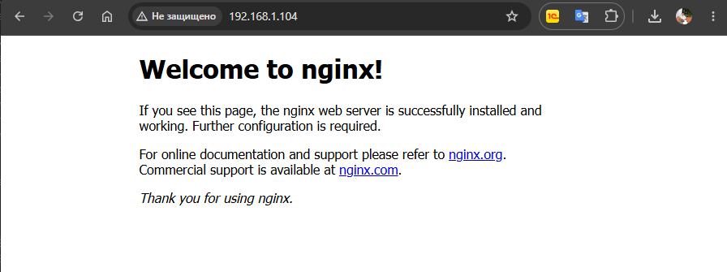
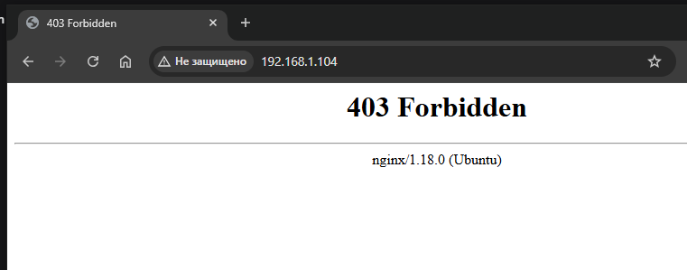

# Домашнее задание "Настраиваем центральный сервер для сбора логов"

## Цель
научится проектировать централизованный сбор логов;
рассмотреть особенности разных платформ для сбора логов.

## Задание
Поднимаем две машины — web и log.
На web поднимаем nginx.
Настраиваем центральный лог-сервер на любой системе по выбору.
Настраиваем аудит, который будет отслеживать изменения конфигураций nginx.
Все критичные логи с web должны собираться и локально и удаленно.
Все логи с nginx должны уходить на удаленный сервер (локально только критичные).
Логи аудита должны также уходить на удаленную систему.
---

## Выполнение задания

Для выполнения задания будет использоваться ОС Ubuntu 22.04.5 LTS
Создаем ВМ:
web: IP 192.168.1.104/24
log: IP 192.168.1.122/24

Поверяем корректность настройки времени (для логов это важно:):
```bash
apt update
apt install -y chrony   # или systemd-timesyncd уже есть
systemctl enable --now chrony
date   # проверить корректность

root@web:~# date
Mon Jul 27 03:26:55 PM UTC 2026

root@log:~# date
Mon Jul 27 03:26:57 PM UTC 2026
```

### 1. Настройка сервера log (центральный сбор логов через rsyslog)
Установка rsyslog
```bash
root@log:~# apt install -y rsyslog
```
Редактируем конфиг
```bash
root@log:~# vi /etc/rsyslog.conf
```
Раскомментирууем строки для приёма сообщений по UDP и TCP (порт 514):
```bash
# provides UDP syslog reception
module(load="imudp")
input(type="imudp" port="514")
# provides TCP syslog reception
module(load="imtcp")
input(type="imtcp" port="514")
```
Добавим в конфиг (чтобы логи каждого хоста складывались в отдельную папку, а внутри разделялись по программе):
Раскомментирууем строки для приёма сообщений по UDP и TCP (порт 514):
```bash
$template RemoteLogs,"/var/log/rsyslog/%HOSTNAME%/%PROGRAMNAME%.log"
*.* ?RemoteLogs
& stop
```
Сохраняем и рестартуем 
```bash
root@log:~# systemctl restart rsyslog
root@log:~# systemctl status rsyslog

systemctl status rsyslog
● rsyslog.service - System Logging Service
     Loaded: loaded (/lib/systemd/system/rsyslog.service; enabled; vendor preset: enabled)
     Active: active (running) since Mon 2026-07-27 15:34:39 UTC; 16ms ago
TriggeredBy: ● syslog.socket
       Docs: man:rsyslogd(8)
             man:rsyslog.conf(5)
             https://www.rsyslog.com/doc/
   Main PID: 2427 (rsyslogd)
      Tasks: 10 (limit: 1008)
     Memory: 1.5M
        CPU: 4ms
     CGroup: /system.slice/rsyslog.service
             └─2427 /usr/sbin/rsyslogd -n -iNONE

Jul 27 15:34:39 log systemd[1]: rsyslog.service: Deactivated successfully.
Jul 27 15:34:39 log systemd[1]: Stopped System Logging Service.
Jul 27 15:34:39 log systemd[1]: Starting System Logging Service...
Jul 27 15:34:39 log systemd[1]: Started System Logging Service.
Jul 27 15:34:39 log rsyslogd[2427]: imuxsock: Acquired UNIX socket '/run/systemd/journal/syslog' (fd 3) fro>Jul 27 15:34:39 log rsyslogd[2427]: rsyslogd's groupid changed to 113
Jul 27 15:34:39 log rsyslogd[2427]: rsyslogd's userid changed to 106
Jul 27 15:34:39 log rsyslogd[2427]: [origin software="rsyslogd" swVersion="8.2112.0" x-pid="2427" x-info="h>lines 1-22/22 (END)
```
Проверяем открытые порты:
```bash
root@log:~# ss -tulpn | grep 514
udp   UNCONN 0      0                  0.0.0.0:514       0.0.0.0:*    users:(("rsyslogd",pid=2427,fd=5))       
udp   UNCONN 0      0                     [::]:514          [::]:*    users:(("rsyslogd",pid=2427,fd=6))       
tcp   LISTEN 0      25                 0.0.0.0:514       0.0.0.0:*    users:(("rsyslogd",pid=2427,fd=7))       
tcp   LISTEN 0      25                    [::]:514          [::]:*    users:(("rsyslogd",pid=2427,fd=8))  
```

### 2. Настройка хоста web

Установим nginx
```bash
root@web:~# apt install -y nginx
root@web:~# systemctl enable --now nginx
root@web:~# systemctl status nginx.service 
● nginx.service - A high performance web server and a reverse proxy server
     Loaded: loaded (/lib/systemd/system/nginx.service; enabled; vendor preset: enabled)
     Active: active (running) since Mon 2026-07-27 15:38:59 UTC; 48s ago
       Docs: man:nginx(8)
   Main PID: 2626 (nginx)
      Tasks: 2 (limit: 1008)
     Memory: 6.0M
        CPU: 19ms
     CGroup: /system.slice/nginx.service
             ├─2626 "nginx: master process /usr/sbin/nginx -g daemon on; master_process on;"
             └─2629 "nginx: worker process" "" "" "" "" "" "" "" "" "" "" "" "" "" "" "" "" "" "" "" "" "" >
Jul 27 15:38:59 web systemd[1]: Starting A high performance web server and a reverse proxy server...
Jul 27 15:38:59 web systemd[1]: Started A high performance web server and a reverse proxy server.
```
Убеждаемся, что веб-сервер работает, открыв в браузере.


### 3.Настройка отправки логов nginx на log-сервер
Отредактируем файл /etc/nginx/nginx.conf. В секции http или server изменим параметры логов следующим образом:

```bash
http {
    ...
    access_log syslog:server=192.168.1.122:514,tag=nginx_access;
    error_log syslog:server=192.168.1.122:514,tag=nginx_error;
    # Локально хранить ТОЛЬКО критические ошибки (не дублируя обычные)
    error_log /var/log/nginx/error.log crit;
    ...
}
```
Проверяем конфигурацию и перезапускаем nginx:
```bash
root@web:~# nginx -t
nginx: the configuration file /etc/nginx/nginx.conf syntax is ok
nginx: configuration file /etc/nginx/nginx.conf test is successful
root@web:~# systemctl restart nginx
```
### 4.Настройка аудита изменений конфигураций nginx

Отредактируем файл /etc/rsyslog.d/audit.conf
```bash
cat > /etc/rsyslog.d/audit.conf <<EOF
module(load="imfile")
input(type="imfile"
      File="/var/log/audit/audit.log"
      Tag="audit"
      StateFile="state-audit"
      Severity="info"
      Facility="local0")
EOF
```
рестарт службы
```bash
root@web:~# service auditd restart
```
### 5.Отправка всех syslog-сообщений (включая аудит) на центральный сервер

Теперь настроим rsyslog на web, чтобы он пересылал все сообщения (в том числе те, что пришли от auditd) на хост log.
Добавим в конец файла /etc/rsyslog.conf (или создайте отдельный конфиг в /etc/rsyslog.d/):

```bash
*.* @192.168.100.20:514   # UDP
# Или для TCP: *.* @@192.168.100.20:514
```

Рестарт rsyslog:
```bash
root@web:~# systemctl restart rsyslog
```

### 6.Проверка работы

6.1. Логи nginx
Сгенерируем нормальные запросы, открыв в браузере несколько раз http://192.168.1.104.

Затем создадим ошибку – удалим индексный файл:

```bash
mv /var/www/html/index.nginx-debian.html /var/www/
```
Обновим страницу и получим ошибку 403.


На сервере log проверяем:

```bash
root@log:~# cat /var/log/rsyslog/web/nginx_access.log
Jul 27 19:03:41 web nginx_access: 192.168.1.76 - - [27/Jul/2026:19:03:41 +0000] "GET / HTTP/1.1" 304 0 "-" "Mozilla/5.0 (Windows NT 10.0; Win64; x64) AppleWebKit/537.36 (KHTML, like Gecko) Chrome/150.0.0.0 Safari/537.36"
Jul 27 19:03:43 web nginx_access: 192.168.1.76 - - [27/Jul/2026:19:03:43 +0000] "GET / HTTP/1.1" 304 0 "-" "Mozilla/5.0 (Windows NT 10.0; Win64; x64) AppleWebKit/537.36 (KHTML, like Gecko) Chrome/150.0.0.0 Safari/537.36"
Jul 27 19:03:44 web nginx_access: 192.168.1.76 - - [27/Jul/2026:19:03:44 +0000] "GET / HTTP/1.1" 304 0 "-" "Mozilla/5.0 (Windows NT 10.0; Win64; x64) AppleWebKit/537.36 (KHTML, like Gecko) Chrome/150.0.0.0 Safari/537.36"
Jul 27 19:03:44 web nginx_access: message repeated 3 times: [ 192.168.1.76 - - [27/Jul/2026:19:03:44 +0000] "GET / HTTP/1.1" 304 0 "-" "Mozilla/5.0 (Windows NT 10.0; Win64; x64) AppleWebKit/537.36 (KHTML, like Gecko) Chrome/150.0.0.0 Safari/537.36"]
Jul 27 19:03:45 web nginx_access: 192.168.1.76 - - [27/Jul/2026:19:03:45 +0000] "GET / HTTP/1.1" 304 0 "-" "Mozilla/5.0 (Windows NT 10.0; Win64; x64) AppleWebKit/537.36 (KHTML, like Gecko) Chrome/150.0.0.0 Safari/537.36"
Jul 27 19:03:45 web nginx_access: message repeated 5 times: [ 192.168.1.76 - - [27/Jul/2026:19:03:45 +0000] "GET / HTTP/1.1" 304 0 "-" "Mozilla/5.0 (Windows NT 10.0; Win64; x64) AppleWebKit/537.36 (KHTML, like Gecko) Chrome/150.0.0.0 Safari/537.36"]
Jul 27 19:03:46 web nginx_access: 192.168.1.76 - - [27/Jul/2026:19:03:46 +0000] "GET / HTTP/1.1" 304 0 "-" "Mozilla/5.0 (Windows NT 10.0; Win64; x64) AppleWebKit/537.36 (KHTML, like Gecko) Chrome/150.0.0.0 Safari/537.36"
Jul 27 19:03:46 web nginx_access: message repeated 2 times: [ 192.168.1.76 - - [27/Jul/2026:19:03:46 +0000] "GET / HTTP/1.1" 304 0 "-" "Mozilla/5.0 (Windows NT 10.0; Win64; x64) AppleWebKit/537.36 (KHTML, like Gecko) Chrome/150.0.0.0 Safari/537.36"]
Jul 27 19:03:54 web nginx_access: 192.168.1.76 - - [27/Jul/2026:19:03:54 +0000] "GET / HTTP/1.1" 403 196 "-" "Mozilla/5.0 (Windows NT 10.0; Win64; x64) AppleWebKit/537.36 (KHTML, like Gecko) Chrome/150.0.0.0 Safari/537.36"


root@log:~# cat /var/log/rsyslog/web/nginx_error.log
Jul 27 19:03:54 web nginx_error: 2026/07/27 19:03:54 [error] 7265#7265: *2 directory index of "/var/www/html/" is forbidden, client: 192.168.1.76, server: _, request: "GET / HTTP/1.1", host: "192.168.1.104"
```
Мы видим успешные запросы и ошибку.

6.2. Логи аудита
На web изменим конфигурацию nginx (например, отредактируем /etc/nginx/nginx.conf).
```bash
touch /etc/nginx/nginx.conf
```

На сервере log проверяем лог аудита:
```bash
root@log:~# cat /var/log/rsyslog/web/audit.log
Jul 27 19:11:55 web audit type=DAEMON_START msg=audit(1785178240.223:7164): op=start ver=3.0.7 format=enriched kernel=5.15.0-186-generic auid=4294967295 pid=7510 uid=0 ses=4294967295 subj=unconfined  res=success#035AUID="unset" UID="root"
Jul 27 19:11:55 web audit type=CONFIG_CHANGE msg=audit(1785178240.233:78): op=set audit_backlog_limit=8192 old=64 auid=4294967295 ses=4294967295 subj=unconfined res=1#035AUID="unset"
Jul 27 19:11:55 web audit type=SYSCALL msg=audit(1785178240.233:78): arch=c000003e syscall=44 success=yes exit=60 a0=3 a1=7ffdd48c5100 a2=3c a3=0 items=0 ppid=7513 pid=7523 auid=4294967295 uid=0 gid=0 euid=0 suid=0 fsuid=0 egid=0 sgid=0 fsgid=0 tty=(none) ses=4294967295 comm="auditctl" exe="/usr/sbin/auditctl" subj=unconfined key=(null)#035ARCH=x86_64 SYSCALL=sendto AUID="unset" UID="root" GID="root" EUID="root" SUID="root" FSUID="root" EGID="root" SGID="root" FSGID="root"
.......................
```
6.3. Критичные логи системы
Проверим, что важные системные сообщения (например, неудачные попытки входа) дублируются локально на web и в логах на log. 
Например, попробуем неверный пароль по SSH с другого терминала. 
```bash
C:\Users\Administrator>ssh user@192.168.1.104
user@192.168.1.104's password:
Permission denied, please try again.
user@192.168.1.104's password:
Permission denied, please try again.
user@192.168.1.104's password:
user@192.168.1.104: Permission denied (publickey,password).
```

На web посмотрим /var/log/auth.log

```bash
root@web:~# tail /var/log/auth.log
Jul 27 18:50:52 web sshd[652]: Received signal 15; terminating.
Jul 27 18:50:52 web sshd[7724]: Server listening on 0.0.0.0 port 22.
Jul 27 18:50:52 web sshd[7724]: Server listening on :: port 22.
Jul 27 19:16:16 web sshd[8359]: pam_unix(sshd:auth): authentication failure; logname= uid=0 euid=0 tty=ssh ruser= rhost=192.168.1.76  user=user
Jul 27 19:16:18 web sshd[8359]: Failed password for user from 192.168.1.76 port 47222 ssh2
Jul 27 19:16:27 web sshd[8359]: message repeated 2 times: [ Failed password for user from 192.168.1.76 port 47222 ssh2]
Jul 27 19:16:27 web sshd[8359]: Connection reset by authenticating user user 192.168.1.76 port 47222 [preauth]
Jul 27 19:16:27 web sshd[8359]: PAM 2 more authentication failures; logname= uid=0 euid=0 tty=ssh ruser= rhost=192.168.1.76  user=user
Jul 27 19:17:01 web CRON[8361]: pam_unix(cron:session): session opened for user root(uid=0) by (uid=0)
Jul 27 19:17:01 web CRON[8361]: pam_unix(cron:session): session closed for user root
```

а на log – /var/log/rsyslog/web/sshd.log 
```bash
root@log:~# tail /var/log/rsyslog/web/sshd.log
Jul 27 19:16:16 web sshd[8359]: pam_unix(sshd:auth): authentication failure; logname= uid=0 euid=0 tty=ssh ruser= rhost=192.168.1.76  user=user
Jul 27 19:16:18 web sshd[8359]: Failed password for user from 192.168.1.76 port 47222 ssh2
Jul 27 19:16:27 web sshd[8359]: message repeated 2 times: [ Failed password for user from 192.168.1.76 port 47222 ssh2]
Jul 27 19:16:27 web sshd[8359]: Connection reset by authenticating user user 192.168.1.76 port 47222 [preauth]
Jul 27 19:16:27 web sshd[8359]: PAM 2 more authentication failures; logname= uid=0 euid=0 tty=ssh ruser= rhost=192.168.1.76  user=user
```