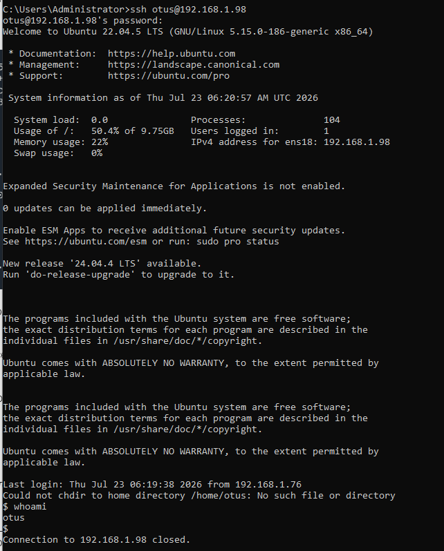
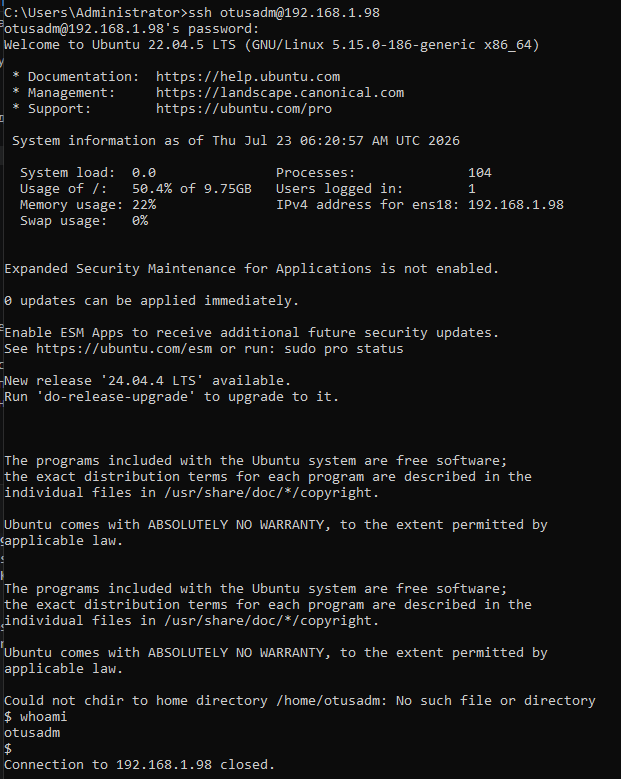
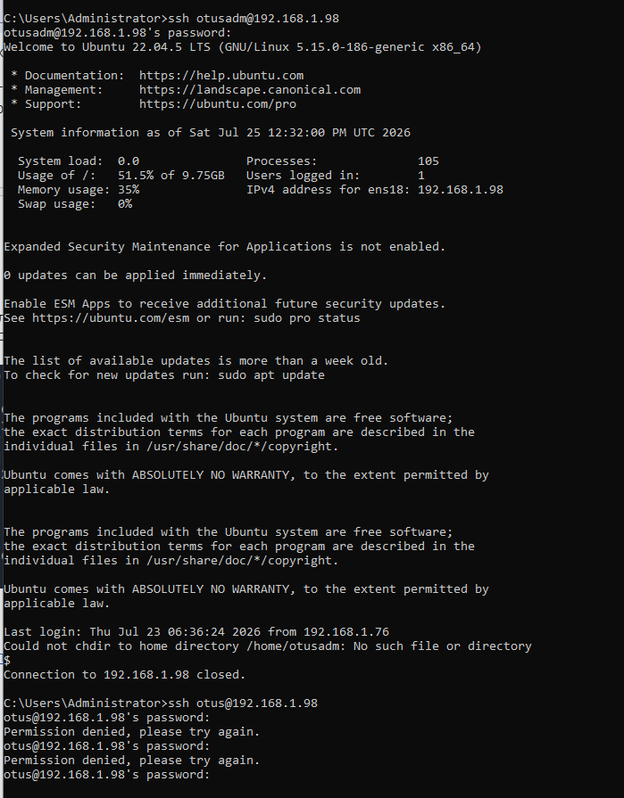

# Домашнее задание "PAM"

## Цель
Научиться создавать пользователей и добавлять им ограничения.

## Задание
Ограничить доступ к системе для всех пользователей, кроме группы администраторов, в выходные дни (суббота и воскресенье), за исключением праздничных дней.
---

## Выполнение задания

Для выполнения задания будет использоваться ОС Ubuntu 22.04.5 LTS

### 1. Настройка запрета для всех пользователей (кроме группы Admin) логина в выходные дни (Праздники не учитываются)

Подключаемся к нашей созданной ВМ: 
```bash
PS C:\Users\Administrator\Administrator-Linux.-Professional> ssh user@192.168.1.98
```
Переходим в root-пользователя: 
```bash
user@user:~$ sudo -s
```
Создаём пользователя otusadm и otus: 
```bash
root@user:/home/user# sudo useradd otusadm && sudo useradd otus
```
Создаём пользователям пароли: 
```bash
root@user:/home/user# echo "otusadm:Otus2022!" | sudo chpasswd
root@user:/home/user# echo "otus:Otus2022!" | sudo chpasswd
```
Для примера мы указываем одинаковые пароли для пользователя otus и otusadm

Создаём группу admin: 
```bash
root@user:/home/user# sudo groupadd -f admin
```
Добавляем пользователей user,root и otusadm в группу admin:
```bash
root@user:/home/user# usermod otusadm -a -G admin && usermod root -a -G admin && usermod user -a -G admin
```
Обратим внимание, что мы просто добавили пользователя otusadm в группу admin. Это не делает пользователя otusadm администратором.

После создания пользователей, нужно проверить, что они могут подключаться по SSH к нашей ВМ. Для этого пытаемся подключиться с хостовой машины: 
ssh otus@192.168.1.98
Далее вводим наш созданный пароль. 
Если всё настроено правильно, на этом моменте мы сможем подключиться по SSH под пользователем otus и otusadm



### 2. Настройка правила, по которому все пользователи кроме тех, что указаны в группе admin не смогут подключаться в выходные дни:

Проверим, что пользователи root, user и otusadm есть в группе admin:
```bash
root@user:/home/user# cat /etc/group | grep admin
admin:x:1003:otusadm,root,user
```
Информация о группах и пользователях в них хранится в файле /etc/group, пользователи указываются через запятую. 

Выберем метод PAM-аутентификации, так как у нас используется только ограничение по времени, то было бы логично использовать метод pam_time, однако, данный метод не работает с локальными группами пользователей, и, получается, что использование данного метода добавит нам большое количество однообразных строк с разными пользователями. В текущей ситуации лучше написать небольшой скрипт контроля и использовать модуль pam_exec

Создадим файл-скрипт /usr/local/bin/login.sh
```bash
root@user:/home/user# vim /usr/local/bin/login.sh

#!/bin/bash
#Первое условие: если день недели суббота или воскресенье
if [ $(date +%a) = "Sat" ] || [ $(date +%a) = "Sun" ]; then
 #Второе условие: входит ли пользователь в группу admin
 if getent group admin | grep -qw "$PAM_USER"; then
        #Если пользователь входит в группу admin, то он может подключиться
        exit 0
      else
        #Иначе ошибка (не сможет подключиться)
        exit 1
    fi
  #Если день не выходной, то подключиться может любой пользователь
  else
    exit 0
fi
```
В скрипте подписаны все условия. Скрипт работает по принципу: 
Если сегодня суббота или воскресенье, то нужно проверить, входит ли пользователь в группу admin, если не входит — то подключение запрещено. При любых других вариантах подключение разрешено. 

Добавим права на исполнение файла: 
```bash
root@user:/home/user# chmod +x /usr/local/bin/login.sh
```
Укажем в файле /etc/pam.d/sshd модуль pam_exec и наш скрипт:
```bash
root@user:/home/user# vim /etc/pam.d/sshd 

# PAM configuration for the Secure Shell service
auth required pam_exec.so debug /usr/local/bin/login.sh
```
На этом настройка завершена, нужно только проверить, что скрипт отрабатывает корректно. 

Проверяем дату
```bash
root@user:/home/user# date
Thu Jul 23 06:31:59 AM UTC 2026
```

Устанавливаем дату на выходной день
```bash
root@user:/home/user# sudo timedatectl set-ntp false
root@user:/home/user# sudo date -s "2026-07-25 12:30:00"
Sat Jul 25 12:30:00 PM UTC 2026
root@user:/home/user# date
Sat Jul 25 12:30:02 PM UTC 2026
```
Если настройки выполнены правильно, то при логине пользователя otus появится ошибка. Пользователь otusadm подключается без проблем: 




