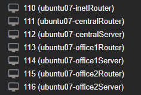
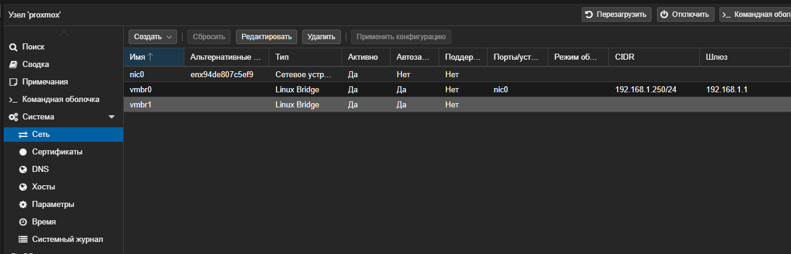
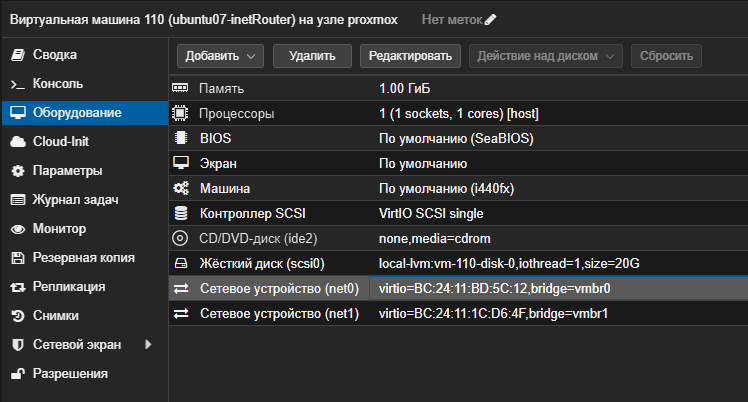
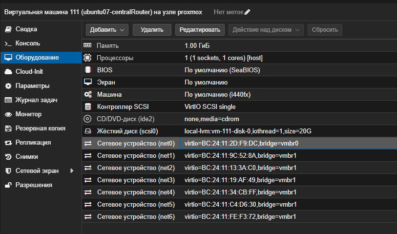
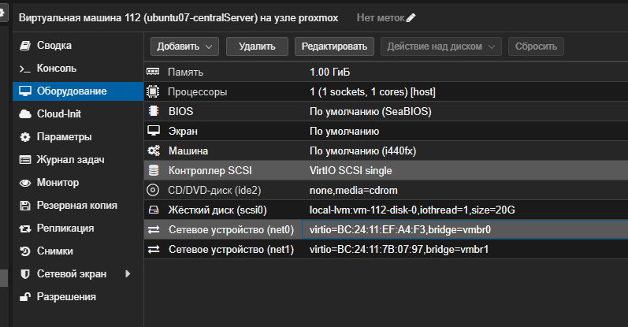
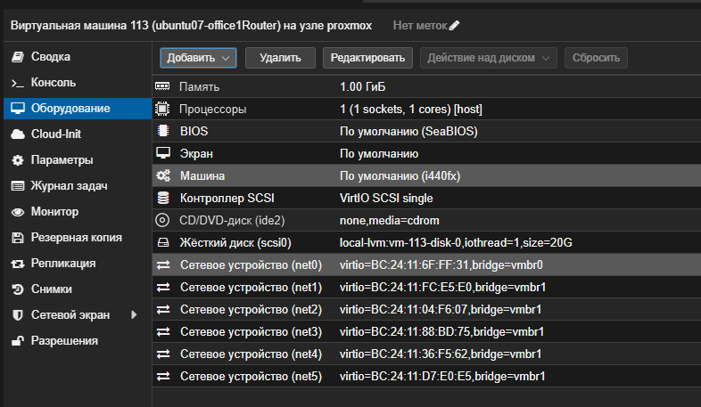
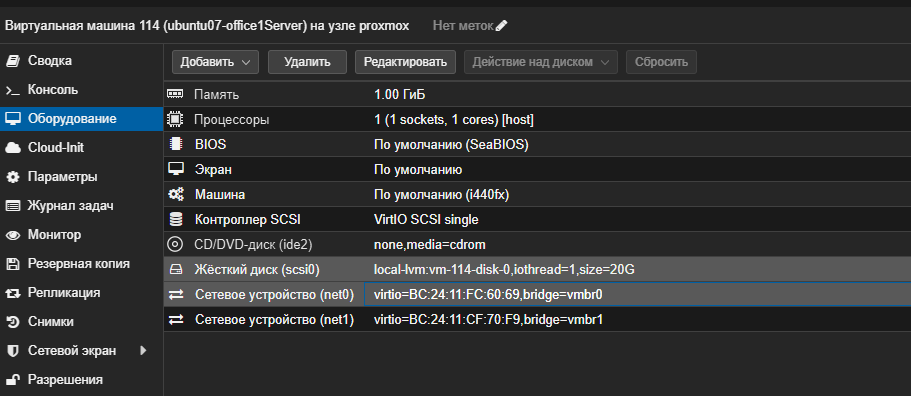
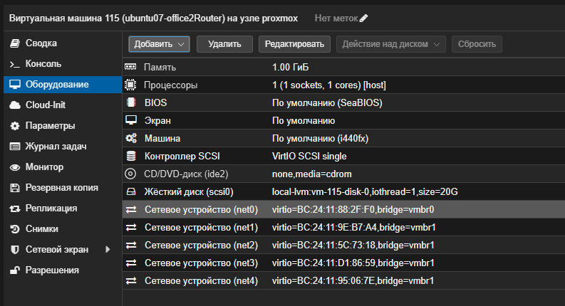
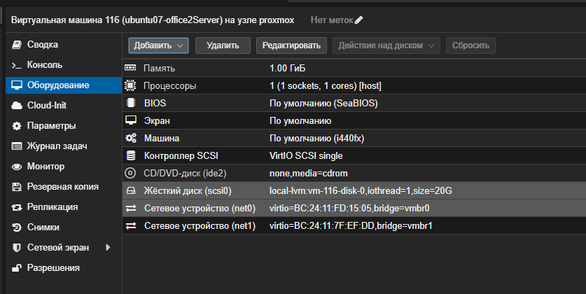

# Домашнее задание "Разворачиваем сетевую лабораторию"

## Цель
Научиться менять базовые сетевые настройки в Linux-based системах.

## Задание
В теоретической части требуется:
- Найти свободные подсети
- Посчитать количество узлов в каждой подсети, включая свободные
- Указать Broadcast-адрес для каждой подсети
- Проверить, нет ли ошибок при разбиении

Практическая часть:
- Соединить офисы в сеть согласно схеме и настроить роутинг
- Все сервера и роутеры должны ходить в инет черз inetRouter
- Все сервера должны видеть друг друга
- у всех новых серверов отключить дефолт на нат (eth0), который вагрант поднимает для связи
- при нехватке сетевых интервейсов добавить по несколько адресов на интерфейс

---

## Выполнение теоретического задания

### 1. Найти свободные подсети

После выделения всех рабочих подсетей (указанных в задании) в адресных блоках `192.168.0.0/24`, `192.168.1.0/24`, `192.168.2.0/24` и `192.168.255.0/24` были определены незанятые диапазоны. Эти диапазоны представлены в виде отдельных подсетей со следующими адресами и масками:

| Свободная подсеть | Маска (CIDR) |
| :--- | :--- |
| 192.168.0.16 | /28 |
| 192.168.0.48 | /28 |
| 192.168.0.128 | /25 |
| 192.168.255.64 | /26 |
| 192.168.255.32 | /27 |
| 192.168.255.16 | /28 |
| 192.168.255.8 | /29 |
| 192.168.255.4 | /30 |

Всего выделено **8 свободных подсетей**.

---

### 2. Посчитать количество узлов в каждой подсети, включая свободные

Количество полезных узлов (хостов) рассчитывается по формуле:

**`2^(32 – N) – 2`**, где `N` — длина маски в битах.

Ниже приведены сводные таблицы, где для каждой подсети (как рабочих, так и свободных) указано число доступных хостов.

#### Рабочие подсети

| Название / Подсеть | Маска | Количество хостов |
| :--- | :--- | :--- |
| Directors | /28 | 14 |
| Office hardware (Central) | /28 | 14 |
| Wifi (mgt network) | /26 | 62 |
| Dev (Office 1) | /26 | 62 |
| Test (Office 1) | /26 | 62 |
| Managers (Office 1) | /26 | 62 |
| Office hardware (Office 1) | /26 | 62 |
| Dev (Office 2) | /25 | 126 |
| Test (Office 2) | /26 | 62 |
| Office (Office 2) | /26 | 62 |
| Inet – central | /30 | 2 |

#### Свободные подсети

| Подсеть | Маска | Количество хостов |
| :--- | :--- | :--- |
| 192.168.0.16 | /28 | 14 |
| 192.168.0.48 | /28 | 14 |
| 192.168.0.128 | /25 | 126 |
| 192.168.255.64 | /26 | 62 |
| 192.168.255.32 | /27 | 30 |
| 192.168.255.16 | /28 | 14 |
| 192.168.255.8 | /29 | 6 |
| 192.168.255.4 | /30 | 2 |

---

### 3. Указать Broadcast-адрес для каждой подсети

Широковещательный адрес (Broadcast) — это последний адрес диапазона подсети (все биты хостовой части равны 1). Для всех подсетей (рабочих и свободных) Broadcast-адреса рассчитаны и приведены в таблицах ниже.

#### Рабочие подсети

| Подсеть | Маска | Broadcast-адрес |
| :--- | :--- | :--- |
| 192.168.0.0 | /28 | 192.168.0.15 |
| 192.168.0.32 | /28 | 192.168.0.47 |
| 192.168.0.64 | /26 | 192.168.0.127 |
| 192.168.2.0 | /26 | 192.168.2.63 |
| 192.168.2.64 | /26 | 192.168.2.127 |
| 192.168.2.128 | /26 | 192.168.2.191 |
| 192.168.2.192 | /26 | 192.168.2.255 |
| 192.168.1.0 | /25 | 192.168.1.127 |
| 192.168.1.128 | /26 | 192.168.1.191 |
| 192.168.1.192 | /26 | 192.168.1.255 |
| 192.168.255.0 | /30 | 192.168.255.3 |

#### Свободные подсети

| Подсеть | Маска | Broadcast-адрес |
| :--- | :--- | :--- |
| 192.168.0.16 | /28 | 192.168.0.31 |
| 192.168.0.48 | /28 | 192.168.0.63 |
| 192.168.0.128 | /25 | 192.168.0.255 |
| 192.168.255.64 | /26 | 192.168.255.127 |
| 192.168.255.32 | /27 | 192.168.255.63 |
| 192.168.255.16 | /28 | 192.168.255.31 |
| 192.168.255.8 | /29 | 192.168.255.15 |
| 192.168.255.4 | /30 | 192.168.255.7 |

---

### 4. Проверить, нет ли ошибок при разбиении

Выполнена проверка по трём ключевым критериям:

- **Отсутствие пересечений.** Все подсети (рабочие и свободные) расположены строго последовательно в пределах своих исходных блоков `/24`. Например, в блоке `192.168.0.0/24`: занятые диапазоны — `0–15`, `32–47`, `64–127`; свободные — `16–31`, `48–63`, `128–255`. Ни один диапазон не накладывается на другой. Аналогичная проверка выполнена для остальных блоков.

- **Достаточность хостов.** Для каждой рабочей подсети расчётное количество узлов превышает минимально необходимое (например, в подсетях `/28` — 14 хостов, что достаточно; в `/30` — ровно 2 хоста для связи маршрутизаторов). Свободные подсети не имеют требований по числу хостов, однако их размеры также рассчитаны корректно.

- **Корректность границ.** Для каждой подсети адрес сети является первым адресом диапазона, а Broadcast — последним. Следующая подсеть начинается со следующего адреса после Broadcast предыдущей, что исключает потери или дублирование адресов.

**Вывод:** ошибок при разбиении не обнаружено. Все адреса распределены без конфликтов.

## Выполнение практического задания


Всего требуется 7 ВМ (имена и IP-адреса по методичке):
| ВМ              | Роль                              | Количество сетевых интерфейсов (внутренних)                                                                                                                                 |
|-----------------|-----------------------------------|-----------------------------------------------------------------------------------------------------------------------------------------------------------------------------|
| inetRouter      | Шлюз в Интернет, NAT              | 2 (один – для связи с centralRouter, второй – для управления/выхода в Интернет через Vagrant, но в Proxmox мы создадим свои адаптеры)                                       |
| centralRouter   | Центральный маршрутизатор         | 6 интерфейсов (соединения с inetRouter, с сетями директоров, аппаратуры, управления, а также с офисными роутерами)                                                          |
| centralServer   | Сервер в сети директоров          | 2 интерфейса (сеть директоров + управление)                                                                                                                                 |
| office1Router   | Маршрутизатор офиса 1             | 5 интерфейсов (связь с центральным роутером + 4 сети офиса)                                                                                                                 |
| office1Server   | Сервер в офисе 1                  | 2 интерфейса (сеть менеджеров + управление)                                                                                                                                 |
| office2Router   | Маршрутизатор офиса 2             | 4 интерфейса (связь с центральным роутером + 3 сети офиса)                                                                                                                 |
| office2Server   | Сервер в офисе 2                  | 2 интерфейса (сеть разработчиков + управление)                                                                                                                              |

В Proxmox создаем 7 ВМ с Ubuntu 22.04. Задаем имена и адреса согласно метоичке. Количество интерфейсов должно соответствовать количеству сетей, в которых участвует ВМ (см. таблицу выше). Для соединения между ВМ используем внутренний мост (vmbr1) – изолированную сеть без NAT. Для доступа к управлению (и к Интернету для inetRouter) будем использовать отдельный мост (vmbr0) с выходом в интернет.



### Настройка сетей в Proxmox

Настроим два моста:

vmbr0 – основной мост с выходом в интернет (NAT). На него мы подключим первый адаптер (eth0) каждой ВМ для управления (SSH) и доступа в интернет (только для inetRouter).

vmbr1 – внутренний мост (без NAT, изолирован). На него подключим все остальные адаптеры каждой ВМ для связи между узлами по схеме.



#### Настройка ВМ inetRouter

Создаем ВМ
Подклчаем 2 сетевых  интерфейса

Включаем ВМ
Определим имена интерфейсов:
```bash
root@inetRouter:~# ip -br a
lo               UNKNOWN        127.0.0.1/8 ::1/128 
ens18            UP             192.168.1.99/24 metric 100 fe80::be24:11ff:febd:5c12/64 
ens19            DOWN 
```
Отключим ufw:
```bash
root@inetRouter:~# sudo systemctl disable ufw
Synchronizing state of ufw.service with SysV service script with /lib/systemd/systemd-sysv-install.
Executing: /lib/systemd/systemd-sysv-install disable ufw
Removed /etc/systemd/system/multi-user.target.wants/ufw.service.
```
Настроим Netplan для inetRouter
```bash
sudo rm /etc/netplan/50-cloud-init.yaml
sudo nano /etc/netplan/01-netcfg.yaml

network:
  version: 2
  renderer: networkd
  ethernets:
    ens18:
      dhcp4: true
    ens19:
      addresses:
        - 192.168.255.1/30

root@inetRouter:~# sudo netplan apply

** (generate:1073): WARNING **: 18:36:22.035: Permissions for /etc/netplan/01-netcfg.yaml are too open. Netplan configuration should NOT be accessible by others.

** (process:1072): WARNING **: 18:36:22.397: Permissions for /etc/netplan/01-netcfg.yaml are too open. Netplan configuration should NOT be accessible by others.

** (process:1072): WARNING **: 18:36:22.520: Permissions for /etc/netplan/01-netcfg.yaml are too open. Netplan configuration should NOT be accessible by others.

** (process:1072): WARNING **: 18:36:22.520: Permissions for /etc/netplan/01-netcfg.yaml are too open. Netplan configuration should NOT be accessible by others.
root@inetRouter:~# ip -br a
lo               UNKNOWN        127.0.0.1/8 ::1/128 
ens18            UP             192.168.1.99/24 metric 100 fe80::be24:11ff:febd:5c12/64 
ens19            UP             192.168.255.1/30 fe80::be24:11ff:fe1c:d64f/64 

```
#### Настройка ВМ centralRouter

Добавим 7 сетевых устройств :
net0 (управление): мост vmbr0
net1 (к inetRouter): мост vmbr1
net2 (к директорам): мост vmbr1
net3 (к аппаратуре): мост vmbr1
net4 (к управлению): мост vmbr1
net5 (к office1Router): мост vmbr1
net6 (к office2Router): мост vmbr1

Включаем ВМ
Определим имена интерфейсов:
```bash
root@centralRouter:/home/user# ip -br a
lo               UNKNOWN        127.0.0.1/8 ::1/128 
ens18            UP             192.168.1.45/24 metric 100 fe80::be24:11ff:fe2d:f9dc/64 
ens19            DOWN           
ens20            DOWN           
ens21            DOWN           
ens22            DOWN           
ens23            DOWN           
enp2s1           DOWN   
```
Отключим ufw:
```bash
root@centralRouter:/home/user# sudo systemctl disable ufw
Synchronizing state of ufw.service with SysV service script with /lib/systemd/systemd-sysv-install.
Executing: /lib/systemd/systemd-sysv-install disable ufw
Removed /etc/systemd/system/multi-user.target.wants/ufw.service.
```
Настроим Netplan
```bash
root@centralRouter:/home/user# sudo rm /etc/netplan/50-cloud-init.yaml
root@centralRouter:/home/user# sudo nano /etc/netplan/01-netcfg.yaml

network:
  version: 2
  renderer: networkd
  ethernets:
    ens18:
      dhcp4: true
      dhcp4-overrides:
        use-routes: false
      routes:
        - to: 0.0.0.0/0
          via: 192.168.1.1
    ens19:
      addresses:
        - 192.168.255.2/30
    ens20:
      addresses:
        - 192.168.0.1/28
    ens21:
      addresses:
        - 192.168.0.33/28
    ens22:
      addresses:
        - 192.168.0.65/26
    ens23:
      addresses:
        - 192.168.255.9/30
      routes:
        - to: 192.168.2.0/24
          via: 192.168.255.10
    enp2s1:
      addresses:
        - 192.168.255.5/30
      routes:
        - to: 192.168.1.0/24
          via: 192.168.255.6

root@centralRouter:/home/user# sudo netplan apply

** (generate:1078): WARNING **: 18:48:06.758: Permissions for /etc/netplan/01-netcfg.yaml are too open. Netplan configuration should NOT be accessible by others.

** (process:1077): WARNING **: 18:48:07.139: Permissions for /etc/netplan/01-netcfg.yaml are too open. Netplan configuration should NOT be accessible by others.

** (process:1077): WARNING **: 18:48:07.407: Permissions for /etc/netplan/01-netcfg.yaml are too open. Netplan configuration should NOT be accessible by others.

** (process:1077): WARNING **: 18:48:07.407: Permissions for /etc/netplan/01-netcfg.yaml are too open. Netplan configuration should NOT be accessible by others.

root@centralRouter:/home/user# ip -br a
lo               UNKNOWN        127.0.0.1/8 ::1/128 
ens18            UP             192.168.1.45/24 metric 100 fe80::be24:11ff:fe2d:f9dc/64 
ens19            UP             192.168.255.2/30 fe80::be24:11ff:fe9c:528a/64 
ens20            UP             192.168.0.1/28 fe80::be24:11ff:fe13:3ac0/64 
ens21            UP             192.168.0.33/28 fe80::be24:11ff:fe19:af49/64 
ens22            UP             192.168.0.65/26 fe80::be24:11ff:fe34:c0ff/64 
ens23            UP             192.168.255.9/30 fe80::be24:11ff:fec4:d630/64 
enp2s1           UP             192.168.255.5/30 fe80::be24:11ff:fefe:f372/64 
```

#### Настройка ВМ centralServer

Создаем ВМ
Подклчаем 2 сетевых  интерфейса

Включаем ВМ
Определим имена интерфейсов:
```bash
root@icentralServer:/home/user# ip -br a
lo               UNKNOWN        127.0.0.1/8 ::1/128 
ens18            UP             192.168.1.84/24 metric 100 fe80::be24:11ff:feef:a4f3/64 
ens19            DOWN  
```
Отключим ufw:
```bash
root@icentralServer:/home/user# sudo systemctl disable ufw
Synchronizing state of ufw.service with SysV service script with /lib/systemd/systemd-sysv-install.
Executing: /lib/systemd/systemd-sysv-install disable ufw
Removed /etc/systemd/system/multi-user.target.wants/ufw.service.
```
Настроим Netplan
```bash
root@icentralServer:/home/user# sudo rm /etc/netplan/50-cloud-init.yaml
root@icentralServer:/home/user# sudo nano /etc/netplan/01-netcfg.yaml

network:
  version: 2
  renderer: networkd
  ethernets:
    ens18:
      dhcp4: true
      dhcp4-overrides:
        use-routes: false
      routes:
        - to: 0.0.0.0/0
          via: 192.168.1.1
    ens19:
      addresses:
        - 192.168.0.2/28
      routes:
        - to: 0.0.0.0/0
          via: 192.168.0.1

root@icentralServer:/home/user# sudo netplan apply

** (generate:1119): WARNING **: 19:15:24.075: Permissions for /etc/netplan/01-netcfg.yaml are too open. Netplan configuration should NOT be accessible by others.

** (generate:1119): WARNING **: 19:15:24.076: Problem encountered while validating default route consistency.Please set up multiple routing tables and use `routing-policy` instead.
Error: Conflicting default route declarations for IPv4 (table: main, metric: default), first declared in ens18 but also in ens19

** (process:1118): WARNING **: 19:15:24.445: Permissions for /etc/netplan/01-netcfg.yaml are too open. Netplan configuration should NOT be accessible by others.

** (process:1118): WARNING **: 19:15:24.445: Problem encountered while validating default route consistency.Please set up multiple routing tables and use `routing-policy` instead.
Error: Conflicting default route declarations for IPv4 (table: main, metric: default), first declared in ens18 but also in ens19

** (process:1118): WARNING **: 19:15:24.565: Permissions for /etc/netplan/01-netcfg.yaml are too open. Netplan configuration should NOT be accessible by others.

** (process:1118): WARNING **: 19:15:24.565: Problem encountered while validating default route consistency.Please set up multiple routing tables and use `routing-policy` instead.
Error: Conflicting default route declarations for IPv4 (table: main, metric: default), first declared in ens18 but also in ens19

** (process:1118): WARNING **: 19:15:24.565: Permissions for /etc/netplan/01-netcfg.yaml are too open. Netplan configuration should NOT be accessible by others.

** (process:1118): WARNING **: 19:15:24.565: Problem encountered while validating default route consistency.Please set up multiple routing tables and use `routing-policy` instead.
Error: Conflicting default route declarations for IPv4 (table: main, metric: default), first declared in ens18 but also in ens19

root@icentralServer:/home/user# ip -br a
lo               UNKNOWN        127.0.0.1/8 ::1/128 
ens18            UP             192.168.1.84/24 metric 100 fe80::be24:11ff:feef:a4f3/64 
ens19            UP             192.168.0.2/28 fe80::be24:11ff:fe7b:797/64 

root@icentralServer:/home/user# ip route
default via 192.168.0.1 dev ens19 proto static 
default via 192.168.1.1 dev ens18 proto static onlink 
192.168.0.0/28 dev ens19 proto kernel scope link src 192.168.0.2 
192.168.1.0/24 dev ens18 proto kernel scope link src 192.168.1.84 metric 100 
192.168.1.1 dev ens18 proto dhcp scope link src 192.168.1.84 metric 100 

root@icentralServer:/home/user# ping -c 3 192.168.0.1
PING 192.168.0.1 (192.168.0.1) 56(84) bytes of data.
64 bytes from 192.168.0.1: icmp_seq=1 ttl=64 time=0.301 ms
64 bytes from 192.168.0.1: icmp_seq=2 ttl=64 time=0.262 ms
64 bytes from 192.168.0.1: icmp_seq=3 ttl=64 time=0.258 ms

--- 192.168.0.1 ping statistics ---
3 packets transmitted, 3 received, 0% packet loss, time 2056ms
rtt min/avg/max/mdev = 0.258/0.273/0.301/0.019 ms
```

Все три ВМ (inetRouter, centralRouter, centralServer) настроены, интерфейсы подняты, IP-адреса соответствуют схеме, и пинг до centralRouter (192.168.0.1) проходит. Это означает, что маршрутизация на центральном участке работает.

#### Настройка ВМ office1Router

Создаем ВМ
Это маршрутизатор первого офиса. У него 5 сетевых интерфейсов:
net0 – управление (vmbr0) для SSH.
net1 – связь с centralRouter (vmbr1).
net2 – сеть Dev (vmbr1).
net3 – сеть Test (vmbr1).
net4 – сеть Managers (vmbr1).
net5 – сеть Office hardware (vmbr1).

Включаем ВМ
Определим имена интерфейсов:
```bash
root@office1Router:/home/user# ip -br a
lo               UNKNOWN        127.0.0.1/8 ::1/128 
ens18            UP             192.168.1.138/24 metric 100 fe80::be24:11ff:fe6f:ff31/64 
ens19            DOWN           
ens20            DOWN           
ens21            DOWN           
ens22            DOWN           
ens23            DOWN     
```
Отключим ufw:
```bash
root@office1Router:/home/user# sudo systemctl disable ufw
Synchronizing state of ufw.service with SysV service script with /lib/systemd/systemd-sysv-install.
Executing: /lib/systemd/systemd-sysv-install disable ufw
Removed /etc/systemd/system/multi-user.target.wants/ufw.service.
```
Настроим Netplan
```bash
root@office1Router:/home/user# sudo rm /etc/netplan/50-cloud-init.yaml
root@office1Router:/home/user# sudo nano /etc/netplan/01-netcfg.yaml

network:
  version: 2
  renderer: networkd
  ethernets:
    ens18:
      dhcp4: true
      dhcp4-overrides:
        use-routes: false
      routes:
        - to: 0.0.0.0/0
          via: 192.168.1.1    # шлюз для SSH
    ens19:
      addresses:
        - 192.168.255.10/30
    ens20:
      addresses:
        - 192.168.2.1/26
    ens21:
      addresses:
        - 192.168.2.65/26
    ens22:
      addresses:
        - 192.168.2.129/26
    ens23:
      addresses:
        - 192.168.2.193/26

root@office1Router:/home/user# sudo netplan apply

** (generate:1144): WARNING **: 19:25:39.046: Permissions for /etc/netplan/01-netcfg.yaml are too open. Netplan configuration should NOT be accessible by others.

** (process:1143): WARNING **: 19:25:39.421: Permissions for /etc/netplan/01-netcfg.yaml are too open. Netplan configuration should NOT be accessible by others.

** (process:1143): WARNING **: 19:25:39.672: Permissions for /etc/netplan/01-netcfg.yaml are too open. Netplan configuration should NOT be accessible by others.

** (process:1143): WARNING **: 19:25:39.672: Permissions for /etc/netplan/01-netcfg.yaml are too open. Netplan configuration should NOT be accessible by others.
```
Включим IP‑форвардинг и добавим статические маршруты
```bash
root@office1Router:/home/user# sudo nano /etc/netplan/01-netcfg.yaml

    ens19:
      addresses:
        - 192.168.255.10/30
      routes:
        - to: 192.168.0.0/24
          via: 192.168.255.9
        - to: 192.168.1.0/24
          via: 192.168.255.9

root@office1Router:/home/user# sudo netplan apply

** (generate:1240): WARNING **: 19:27:33.928: Permissions for /etc/netplan/01-netcfg.yaml are too open. Netplan configuration should NOT be accessible by others.

** (process:1239): WARNING **: 19:27:34.300: Permissions for /etc/netplan/01-netcfg.yaml are too open. Netplan configuration should NOT be accessible by others.

** (process:1239): WARNING **: 19:27:34.512: Permissions for /etc/netplan/01-netcfg.yaml are too open. Netplan configuration should NOT be accessible by others.

** (process:1239): WARNING **: 19:27:34.512: Permissions for /etc/netplan/01-netcfg.yaml are too open. Netplan configuration should NOT be accessible by others.
```

Включим форвардинг:
```bash
root@office1Router:/home/user# echo "net.ipv4.conf.all.forwarding = 1" | sudo tee -a /etc/sysctl.conf
net.ipv4.conf.all.forwarding = 1
root@office1Router:/home/user# sudo sysctl -p
net.ipv4.conf.all.forwarding = 1


root@office1Router:/home/user# ip route
default via 192.168.1.1 dev ens18 proto static onlink
192.168.0.0/24 via 192.168.255.9 dev ens19 proto static
192.168.1.0/24 via 192.168.255.9 dev ens19 proto static
192.168.1.0/24 dev ens18 proto kernel scope link src 192.168.1.138 metric 100
192.168.1.1 dev ens18 proto dhcp scope link src 192.168.1.138 metric 100
192.168.2.0/26 dev ens20 proto kernel scope link src 192.168.2.1
192.168.2.64/26 dev ens21 proto kernel scope link src 192.168.2.65
192.168.2.128/26 dev ens22 proto kernel scope link src 192.168.2.129
192.168.2.192/26 dev ens23 proto kernel scope link src 192.168.2.193
192.168.255.8/30 dev ens19 proto kernel scope link src 192.168.255.10
root@office1Router:/home/user# 
```

#### Настройка ВМ office1Server

Создаем ВМ
Подклчаем 2 сетевых  интерфейса

Включаем ВМ
Определим имена интерфейсов:
```bash
root@office1Server:/home/user# ip -br a
lo               UNKNOWN        127.0.0.1/8 ::1/128 
ens18            UP             192.168.1.98/24 metric 100 fe80::be24:11ff:fefc:6069/64 
ens19            DOWN  
```
Отключим ufw:
```bash
root@office1Server:/home/user# sudo systemctl disable ufw
Synchronizing state of ufw.service with SysV service script with /lib/systemd/systemd-sysv-install.
Executing: /lib/systemd/systemd-sysv-install disable ufw
Removed /etc/systemd/system/multi-user.target.wants/ufw.service.
```
Настроим Netplan
```bash
root@office1Server:/home/user# sudo rm /etc/netplan/50-cloud-init.yaml
root@office1Server:/home/user# sudo nano /etc/netplan/01-netcfg.yaml

network:
  version: 2
  renderer: networkd
  ethernets:
    ens18:
      dhcp4: true
      dhcp4-overrides:
        use-routes: false
      routes:
        - to: 0.0.0.0/0
          via: 192.168.1.1 
    ens19:
      addresses:
        - 192.168.2.130/26
      routes:
        - to: 0.0.0.0/0
          via: 192.168.2.129

root@office1Server:/home/user# sudo netplan apply

** (generate:1058): WARNING **: 19:39:57.508: Permissions for /etc/netplan/01-netcfg.yaml are too open. Netplan configuration should NOT be accessible by others.

** (generate:1058): WARNING **: 19:39:57.508: Problem encountered while validating default route consistency.Please set up multiple routing tables and use `routing-policy` instead.
Error: Conflicting default route declarations for IPv4 (table: main, metric: default), first declared in ens18 but also in ens19

** (process:1057): WARNING **: 19:39:57.889: Permissions for /etc/netplan/01-netcfg.yaml are too open. Netplan configuration should NOT be accessible by others.

** (process:1057): WARNING **: 19:39:57.889: Problem encountered while validating default route consistency.Please set up multiple routing tables and use `routing-policy` instead.
Error: Conflicting default route declarations for IPv4 (table: main, metric: default), first declared in ens18 but also in ens19

** (process:1057): WARNING **: 19:39:58.011: Permissions for /etc/netplan/01-netcfg.yaml are too open. Netplan configuration should NOT be accessible by others.

** (process:1057): WARNING **: 19:39:58.011: Problem encountered while validating default route consistency.Please set up multiple routing tables and use `routing-policy` instead.
Error: Conflicting default route declarations for IPv4 (table: main, metric: default), first declared in ens18 but also in ens19

** (process:1057): WARNING **: 19:39:58.011: Permissions for /etc/netplan/01-netcfg.yaml are too open. Netplan configuration should NOT be accessible by others.

** (process:1057): WARNING **: 19:39:58.011: Problem encountered while validating default route consistency.Please set up multiple routing tables and use `routing-policy` instead.
Error: Conflicting default route declarations for IPv4 (table: main, metric: default), first declared in ens18 but also in ens19

root@office1Server:/home/user# ip route
default via 192.168.1.1 dev ens18 proto static onlink 
default via 192.168.2.129 dev ens19 proto static 
192.168.1.0/24 dev ens18 proto kernel scope link src 192.168.1.98 metric 100 
192.168.1.1 dev ens18 proto dhcp scope link src 192.168.1.98 metric 100 
192.168.2.128/26 dev ens19 proto kernel scope link src 192.168.2.130 
root@office1Server:/home/user# ping -c 3 192.168.2.129
PING 192.168.2.129 (192.168.2.129) 56(84) bytes of data.
64 bytes from 192.168.2.129: icmp_seq=1 ttl=64 time=0.473 ms
64 bytes from 192.168.2.129: icmp_seq=2 ttl=64 time=0.289 ms
^C
--- 192.168.2.129 ping statistics ---
2 packets transmitted, 2 received, 0% packet loss, time 1017ms
rtt min/avg/max/mdev = 0.289/0.381/0.473/0.092 ms
root@office1Server:/home/user# ping -c 3 8.8.8.8 
PING 8.8.8.8 (8.8.8.8) 56(84) bytes of data.
64 bytes from 8.8.8.8: icmp_seq=1 ttl=109 time=11.4 ms
64 bytes from 8.8.8.8: icmp_seq=2 ttl=109 time=11.5 ms
^C
--- 8.8.8.8 ping statistics ---
2 packets transmitted, 2 received, 0% packet loss, time 1001ms
rtt min/avg/max/mdev = 11.396/11.429/11.462/0.033 ms
```

Пинги проходят — офис 1 полностью настроен.

#### Настройка ВМ office2Router

У этого маршрутизатора 4 сетевых интерфейса:
net0 – управление (vmbr0) для SSH.
net1 – связь с centralRouter (vmbr1).
net2 – сеть Dev (192.168.1.0/25).
net3 – сеть Test (192.168.1.128/26).
net4 – сеть Office (192.168.1.192/26).


Включаем ВМ
Определим имена интерфейсов:
```bash
root@office2Router:/home/user# ip -br a
lo               UNKNOWN        127.0.0.1/8 ::1/128 
ens18            UP             192.168.1.129/24 metric 100 fe80::be24:11ff:fe88:2ff0/64 
ens19            DOWN           
ens20            DOWN           
ens21            DOWN           
ens22            DOWN 
```
Отключим ufw:
```bash
root@office2Router:/home/user# sudo systemctl disable ufw
Synchronizing state of ufw.service with SysV service script with /lib/systemd/systemd-sysv-install.
Executing: /lib/systemd/systemd-sysv-install disable ufw
Removed /etc/systemd/system/multi-user.target.wants/ufw.service.
```
Настроим Netplan
```bash
root@office2Router:/home/user# sudo rm /etc/netplan/50-cloud-init.yaml
root@office2Router:/home/user# sudo nano /etc/netplan/01-netcfg.yaml

network:
  version: 2
  renderer: networkd
  ethernets:
    ens18:
      dhcp4: true
      dhcp4-overrides:
        use-routes: false
      routes:
        - to: 0.0.0.0/0
          via: 192.168.1.1
    ens19:
      addresses:
        - 192.168.255.6/30
    ens20:
      addresses:
        - 192.168.1.1/25
    ens21:
      addresses:
        - 192.168.1.129/26
    ens22:
      addresses:
        - 192.168.1.193/26

root@office2Router:/home/user# sudo netplan apply

** (generate:1092): WARNING **: 19:47:57.125: Permissions for /etc/netplan/01-netcfg.yaml are too open. Netplan configuration should NOT be accessible by others.

** (process:1091): WARNING **: 19:47:57.517: Permissions for /etc/netplan/01-netcfg.yaml are too open. Netplan configuration should NOT be accessible by others.

** (process:1091): WARNING **: 19:47:57.711: Permissions for /etc/netplan/01-netcfg.yaml are too open. Netplan configuration should NOT be accessible by others.

** (process:1091): WARNING **: 19:47:57.711: Permissions for /etc/netplan/01-netcfg.yaml are too open. Netplan configuration should NOT be accessible by others.
```
Включим форвардинг и добавим статические маршруты:

```bash
sudo nano /etc/netplan/01-netcfg.yaml

    ens19:
      addresses:
        - 192.168.255.6/30
      routes:
        - to: 192.168.0.0/24
          via: 192.168.255.5
        - to: 192.168.2.0/24
          via: 192.168.255.5

root@office2Router:/home/user# sudo netplan apply
** (generate:1270): WARNING **: 19:59:39.152: Permissions for /etc/netplan/01-netcfg.yaml are too open. Netplan configuration should NOT be accessible by others.
** (process:1269): WARNING **: 19:59:39.542: Permissions for /etc/netplan/01-netcfg.yaml are too open. Netplan configuration should NOT be accessible by others.
** (process:1269): WARNING **: 19:59:39.795: Permissions for /etc/netplan/01-netcfg.yaml are too open. Netplan configuration should NOT be accessible by others.
** (process:1269): WARNING **: 19:59:39.795: Permissions for /etc/netplan/01-netcfg.yaml are too open. Netplan configuration should NOT be accessible by others.

root@office2Router:/home/user# echo "net.ipv4.conf.all.forwarding = 1" | sudo tee -a /etc/sysctl.conf
net.ipv4.conf.all.forwarding = 1
root@office2Router:/home/user# sudo sysctl -p
net.ipv4.conf.all.forwarding = 1
root@office2Router:/home/user# ip route
default via 192.168.1.1 dev ens18 proto static onlink
192.168.0.0/24 via 192.168.255.5 dev ens19 proto static
192.168.1.0/25 dev ens20 proto kernel scope link src 192.168.1.1
192.168.1.0/24 dev ens18 proto kernel scope link src 192.168.1.129 metric 100
192.168.1.1 dev ens18 proto dhcp scope link src 192.168.1.129 metric 100
192.168.1.128/26 dev ens21 proto kernel scope link src 192.168.1.129
192.168.1.192/26 dev ens22 proto kernel scope link src 192.168.1.193
192.168.2.0/24 via 192.168.255.5 dev ens19 proto static
192.168.255.4/30 dev ens19 proto kernel scope link src 192.168.255.6
root@office2Router:/home/user# ping -c 3 192.168.255.5
PING 192.168.255.5 (192.168.255.5) 56(84) bytes of data.
64 bytes from 192.168.255.5: icmp_seq=1 ttl=64 time=0.584 ms
64 bytes from 192.168.255.5: icmp_seq=2 ttl=64 time=0.215 ms
^C
--- 192.168.255.5 ping statistics ---
2 packets transmitted, 2 received, 0% packet loss, time 1026ms
rtt min/avg/max/mdev = 0.215/0.399/0.584/0.184 ms
root@office2Router:/home/user#
```

#### Настройка ВМ office2Server 

Создаем ВМ
Подклчаем 2 сетевых  интерфейса

Включаем ВМ
Определим имена интерфейсов:
```bash
root@office2Server:/home/user# ip -br a
lo               UNKNOWN        127.0.0.1/8 ::1/128 
ens18            UP             192.168.1.142/24 metric 100 fe80::be24:11ff:fefd:1505/64 
ens19            DOWN  
```
Отключим ufw:
```bash
root@office2Server:/home/user# sudo systemctl disable ufw
Synchronizing state of ufw.service with SysV service script with /lib/systemd/systemd-sysv-install.
Executing: /lib/systemd/systemd-sysv-install disable ufw
Removed /etc/systemd/system/multi-user.target.wants/ufw.service.
```
Настроим Netplan
```bash
root@office2Server:/home/user# sudo rm /etc/netplan/50-cloud-init.yaml
root@office2Server:/home/user# sudo nano /etc/netplan/01-netcfg.yaml

network:
  version: 2
  renderer: networkd
  ethernets:
    ens18:
      dhcp4: true
      dhcp4-overrides:
        use-routes: false
      routes:
        - to: 0.0.0.0/0
          via: 192.168.1.1      # для SSH-управления
    ens19:
      addresses:
        - 192.168.1.2/25
      routes:
        - to: 0.0.0.0/0
          via: 192.168.1.1      # шлюз в интернет через office2Router


root@office2Server:/home/user# sudo netplan apply

** (generate:1061): WARNING **: 20:05:36.698: Permissions for /etc/netplan/01-netcfg.yaml are too open. Netplan configuration should NOT be accessible by others.

** (generate:1061): WARNING **: 20:05:36.698: Problem encountered while validating default route consistency.Please set up multiple routing tables and use `routing-policy` instead.
Error: Conflicting default route declarations for IPv4 (table: main, metric: default), first declared in ens18 but also in ens19

** (process:1060): WARNING **: 20:05:37.065: Permissions for /etc/netplan/01-netcfg.yaml are too open. Netplan configuration should NOT be accessible by others.

** (process:1060): WARNING **: 20:05:37.065: Problem encountered while validating default route consistency.Please set up multiple routing tables and use `routing-policy` instead.
Error: Conflicting default route declarations for IPv4 (table: main, metric: default), first declared in ens18 but also in ens19

** (process:1060): WARNING **: 20:05:37.191: Permissions for /etc/netplan/01-netcfg.yaml are too open. Netplan configuration should NOT be accessible by others.

** (process:1060): WARNING **: 20:05:37.191: Problem encountered while validating default route consistency.Please set up multiple routing tables and use `routing-policy` instead.
Error: Conflicting default route declarations for IPv4 (table: main, metric: default), first declared in ens18 but also in ens19

** (process:1060): WARNING **: 20:05:37.191: Permissions for /etc/netplan/01-netcfg.yaml are too open. Netplan configuration should NOT be accessible by others.

** (process:1060): WARNING **: 20:05:37.191: Problem encountered while validating default route consistency.Please set up multiple routing tables and use `routing-policy` instead.
Error: Conflicting default route declarations for IPv4 (table: main, metric: default), first declared in ens18 but also in ens19

root@office2Server:/home/user# ip route
default via 192.168.1.1 dev ens18 proto static onlink
default via 192.168.1.1 dev ens19 proto static
192.168.1.0/25 dev ens19 proto kernel scope link src 192.168.1.2
192.168.1.0/24 dev ens18 proto kernel scope link src 192.168.1.142 metric 100
192.168.1.1 dev ens18 proto dhcp scope link src 192.168.1.142 metric 100
root@office2Server:/home/user# ping -c 3 192.168.1.1
PING 192.168.1.1 (192.168.1.1) 56(84) bytes of data.
64 bytes from 192.168.1.1: icmp_seq=1 ttl=64 time=0.635 ms
64 bytes from 192.168.1.1: icmp_seq=2 ttl=64 time=0.523 ms
^C
--- 192.168.1.1 ping statistics ---
2 packets transmitted, 2 received, 0% packet loss, time 1027ms
rtt min/avg/max/mdev = 0.523/0.579/0.635/0.056 ms
root@office2Server:/home/user# ping -c 3 8.8.8.8
PING 8.8.8.8 (8.8.8.8) 56(84) bytes of data.
64 bytes from 8.8.8.8: icmp_seq=1 ttl=109 time=11.4 ms
64 bytes from 8.8.8.8: icmp_seq=2 ttl=109 time=10.9 ms
64 bytes from 8.8.8.8: icmp_seq=3 ttl=109 time=11.2 ms
--- 8.8.8.8 ping statistics ---
3 packets transmitted, 3 received, 0% packet loss, time 2003ms
rtt min/avg/max/mdev = 10.910/11.157/11.361/0.186 ms
root@office2Server:/home/user# 
```

Итог:
Вы успешно настроили все 7 виртуальных машин, объединили их в единую сетевую топологию, настроили NAT на inetRouter и статические маршруты на всех роутерах. Теперь все серверы имеют доступ в интернет через inetRouter и видят друг друга.