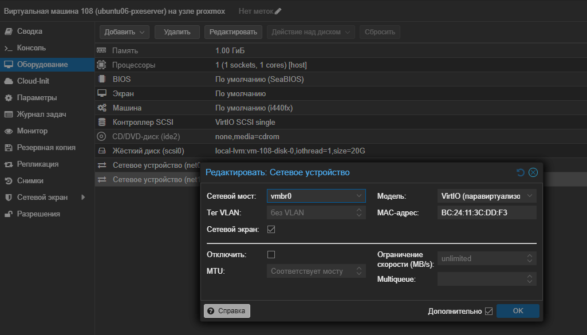
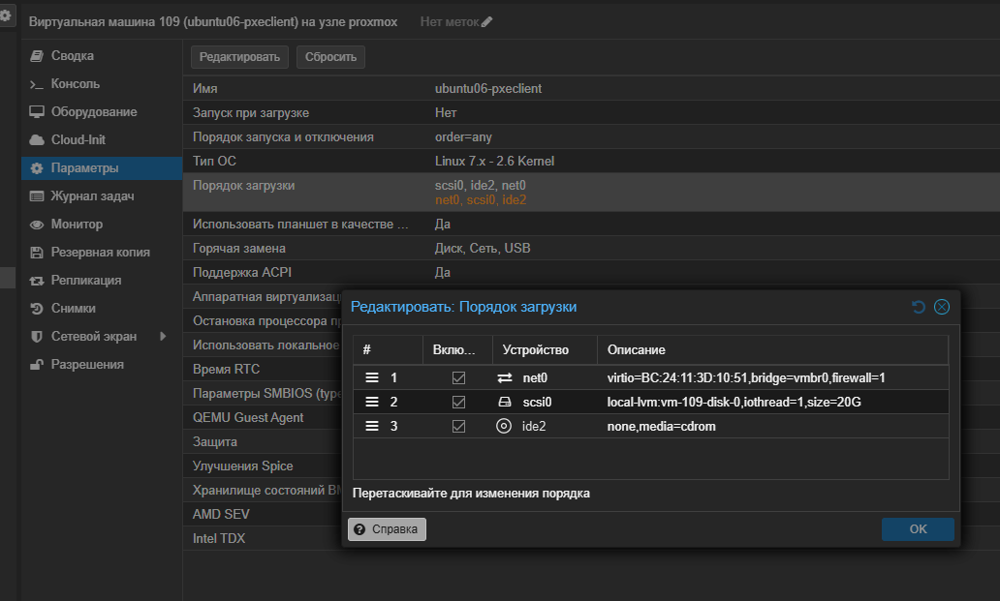
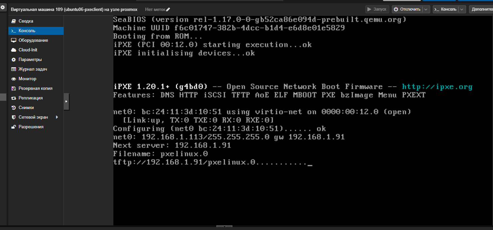
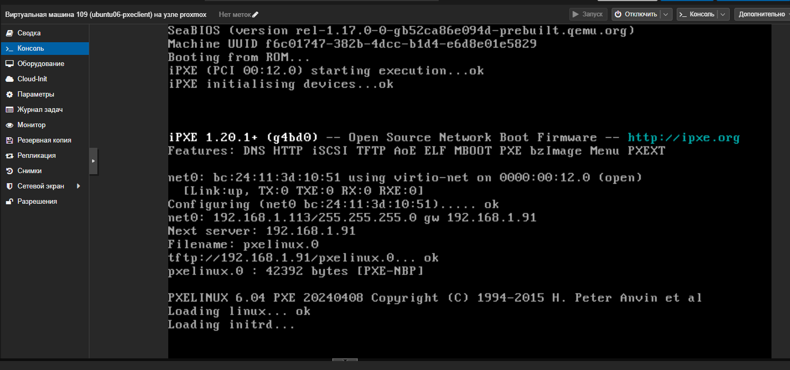
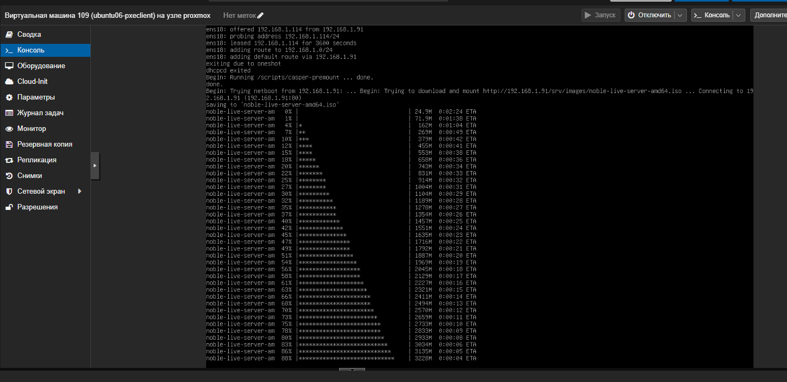
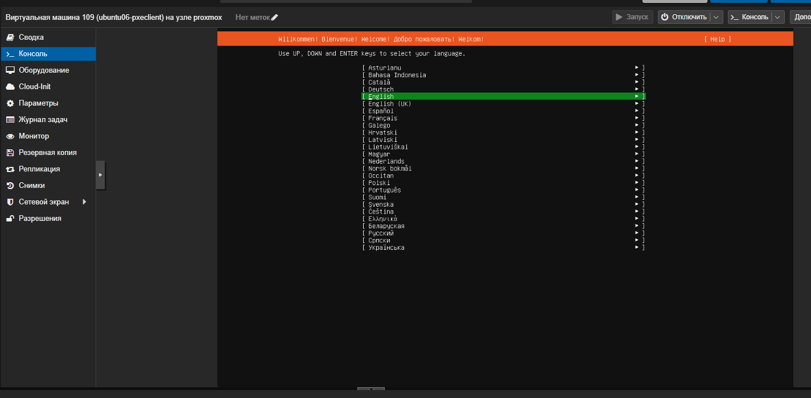

# Домашнее задание "Настройка PXE сервера для автоматической установки"

## Цель
Отработать навыки установки и настройки DHCP, TFTP, PXE загрузчика и автоматической загрузки.

## Задание
1. Настроить загрузку по сети дистрибутива Ubuntu 24
2. Установка должна проходить из HTTP-репозитория.
3. Настроить автоматическую установку c помощью файла user-data
---

## Выполнение задания
Для выполнения задания будет использоваться ОС Ubuntu 22.04.5 LTS
Создаем ВМ:
pxeserver: IP 192.168.1.90/24
pxeclient: IP 192.168.1.130/24

Добавление второго сетевого адаптера в Proxmox на pxeserver

```bash
root@pxeserver:/home/user# ip -br a
lo               UNKNOWN        127.0.0.1/8 ::1/128 
ens18            UP             192.168.1.90/24 metric 100 fe80::be24:11ff:fe30:b1c1/64 
ens19            DOWN   
```
Активация интерфейса ens19
Поднять интерфейс временно
```bash
root@pxeserver:/home/user# ip -br a
lo               UNKNOWN        127.0.0.1/8 ::1/128 
ens18            UP             192.168.1.90/24 metric 100 fe80::be24:11ff:fe30:b1c1/64 
ens19            UP             fe80::be24:11ff:fe3c:ddf3/64 
```
Определить имя файла Netplan, открыть файл в редакторе и добавить конфигурацию для ens19
```bash
root@pxeserver:/home/user# ls /etc/netplan/
50-cloud-init.yaml
                        
network:
  version: 2
  ethernets:
    ens18:
      dhcp4: false
      addresses:
        - 192.168.1.90/24
      routes:
        - to: default
          via: 192.168.1.1
      nameservers:
        addresses: [8.8.8.8]
    ens19:
      dhcp4: false
      addresses:
        - 192.168.1.91/24
```
Применяем параметры
```bash
root@pxeserver:/home/user# sudo netplan apply
root@pxeserver:/home/user# ip -br a
lo               UNKNOWN        127.0.0.1/8 ::1/128 
ens18            UP             192.168.1.90/24 fe80::be24:11ff:fe30:b1c1/64 
ens19            UP             192.168.1.91/24 fe80::be24:11ff:fe3c:ddf3/64 
```
Отключаем фаервол
```bash
root@pxeserver:/home/user# systemctl stop ufw
root@pxeserver:/home/user# systemctl disable ufw
Synchronizing state of ufw.service with SysV service script with /lib/systemd/systemd-sysv-install.
Executing: /lib/systemd/systemd-sysv-install disable ufw
Removed /etc/systemd/system/multi-user.target.wants/ufw.service.
```
Установка необходимых пакетов
```bash
root@pxeserver:/home/user# apt update
root@pxeserver:/home/user# apt install -y dnsmasq apache2 wget tar
```

Настройка DHCP и TFTP (dnsmasq)
Создадим конфигурационный файл /etc/dnsmasq.d/pxe.conf со следующим содержимым (для интерфейса ens19):
```bash
root@pxeserver:/home/user# vim /etc/dnsmasq.d/pxe.conf


interface=ens19
bind-interfaces
dhcp-range=ens19,192.168.1.100,192.168.1.120
dhcp-boot=pxelinux.0
enable-tftp
tftp-root=/srv/tftp/amd64
```

Создадим TFTP-каталог и загрузк netboot-файлов Ubuntu 24.04
```bash
root@pxeserver:/home/user# mkdir -p /srv/tftp/amd64
root@pxeserver:/home/user# cd /srv/tftp/amd64
root@pxeserver:/home/user# wget http://cdimage.ubuntu.com/ubuntu-server/noble/daily-live/current/noble-netboot-amd64.tar.gz
root@pxeserver:/srv/tftp/amd64# tar -xzvf noble-netboot-amd64.tar.gz
root@pxeserver:/srv/tftp/amd64# ll
total 199936
drwxr-xr-x 4 root root      4096 Jul 30 19:27 ./
drwxr-xr-x 3 root root      4096 Jul 30 19:16 ../
-rw-r--r-- 1 root root    966664 Apr  4  2024 bootx64.efi
drwxr-xr-x 2 root root      4096 Jul 26 10:47 grub/
-rw-r--r-- 1 root root   2344840 Mar 28  2025 grubx64.efi
-rw-r--r-- 1 root root  83178385 Jul 26 10:47 initrd
-rw-r--r-- 1 root root    118676 Apr  8  2024 ldlinux.c32
-rw-r--r-- 1 root root  17000840 Jul 26 10:47 linux
-rw-r--r-- 1 root root 101052383 Jul 26 18:42 noble-netboot-amd64.tar.gz
-rw-r--r-- 1 root root     42392 Apr  8  2024 pxelinux.0
drwxr-xr-x 2 root root      4096 Jul 26 10:47 pxelinux.cfg/
```
Перезапуск dnsmasq
```bash
root@pxeserver:/srv/tftp/amd64# systemctl restart dnsmasq
```

Создаем каталоги для ISO-образа и файлов автоустановки
```bash
root@pxeserver:/srv/tftp/amd64# mkdir -p /srv/images /srv/ks
```
Скачиваем ISO-образа Ubuntu 24.04
```bash
root@pxeserver:/srv/tftp/amd64# cd /srv/imagescd /srv/images
root@pxeserver:/srv/images# wget http://cdimage.ubuntu.com/ubuntu-server/noble/daily-live/current/noble-live-server-amd64.iso
--2026-07-30 19:31:57--  http://cdimage.ubuntu.com/ubuntu-server/noble/daily-live/current/noble-live-server-amd64.iso
Resolving cdimage.ubuntu.com (cdimage.ubuntu.com)... 91.189.91.124, 185.125.190.40, 185.125.190.37, ...
Connecting to cdimage.ubuntu.com (cdimage.ubuntu.com)|91.189.91.124|:80... connected.
HTTP request sent, awaiting response... 200 OK
Length: 3807281152 (3.5G) [application/x-iso9660-image]
Saving to: ‘noble-live-server-amd64.iso’

noble-live-server-amd64.iso    100%[==================================================>]   3.54G  8.44MB/s    in 7m 23s  

2026-07-30 19:39:20 (8.20 MB/s) - ‘noble-live-server-amd64.iso’ saved [3807281152/3807281152]
```


Настройка виртуального хоста Apache
Создаем конфигурационный файл /etc/apache2/sites-available/ks-server.conf:
```bash
root@pxeserver:/srv/images# vim /etc/apache2/sites-available/ks-server.conf

<VirtualHost 192.168.1.91:80>
    DocumentRoot /
    
    <Directory /srv/ks>
        Options Indexes MultiViews
        AllowOverride All
        Require all granted
    </Directory>

    <Directory /srv/images>
        Options Indexes MultiViews
        AllowOverride All
        Require all granted
    </Directory>

    <Directory /srv/tftp/amd64>
        Options Indexes MultiViews
        AllowOverride All
        Require all granted
    </Directory>
</VirtualHost>


root@pxeserver:/srv/images# a2ensite ks-server.conf
Enabling site ks-server.
To activate the new configuration, you need to run:
  systemctl reload apache2
root@pxeserver:/srv/images# systemctl reload apache2
root@pxeserver:/srv/images# systemctl restart apache2
```

Создадим файл автоматической установки user-data
```bash 
root@pxeserver:/srv/images# vim /srv/ks/user-data

#cloud-config
autoinstall:
  apt:
    primary:
      - arches: [amd64, i386]
        uri: http://us.archive.ubuntu.com/ubuntu
  identity:
    hostname: linux
    password: "$6$sJgo6Hg5zXBwkkI8$btrEoWAb5FxKhajagWR49XM4EAOfO/Dr5bMrLOkGe3KkMYdsh7T3MU5mYwY2TIMJpVKckAwnZFs2ltUJ1abOZ."
    realname: otus
    username: otus
  network:
    ethernets:
      enp0s3:
        dhcp4: false
        addresses: [192.168.1.130/24]
        gateway4: 192.168.1.1
        nameservers: [8.8.8.8]
    version: 2
  ssh:
    allow-pw: true
    install-server: true
```
Создаем пустой файл метаданных:
```bash
root@pxeserver:/srv/images# vim /srv/ks/user-data
```

Редактируем конфигурацию загрузчика default
```bash
root@pxeserver:/srv/images# vim /srv/tftp/amd64/pxelinux.cfg/default

DEFAULT install
LABEL install
    KERNEL linux
    INITRD initrd
    APPEND root=/dev/ram0 ramdisk_size=3000000 ip=dhcp iso-url=http://192.168.1.91/srv/images/noble-live-server-amd64.iso autoinstall ds=nocloud-net;s=http://192.168.1.91/srv/ks/
```
Перезапуск служб
```bash
root@pxeserver:/srv/images# systemctl restart dnsmasq
root@pxeserver:/srv/images# systemctl restart apache2
```

Запуск клиента и проверка автоматической установки



Выделяем оперативной память  6144Мб (больше размера образа)
Включаем ВМ




