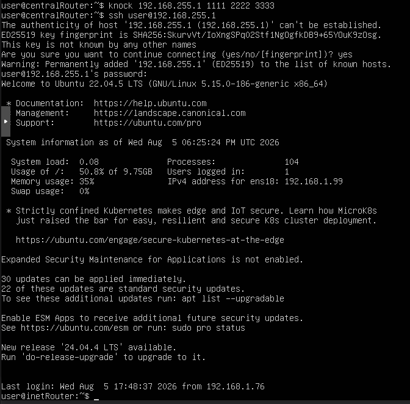
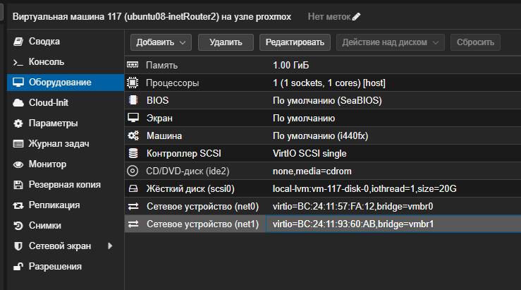
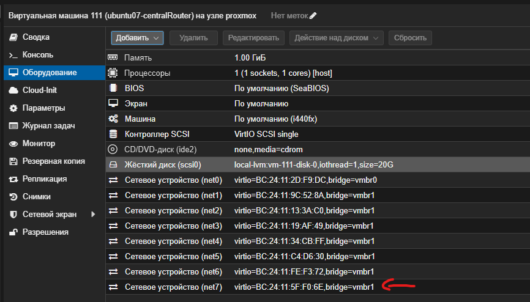
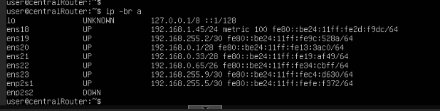
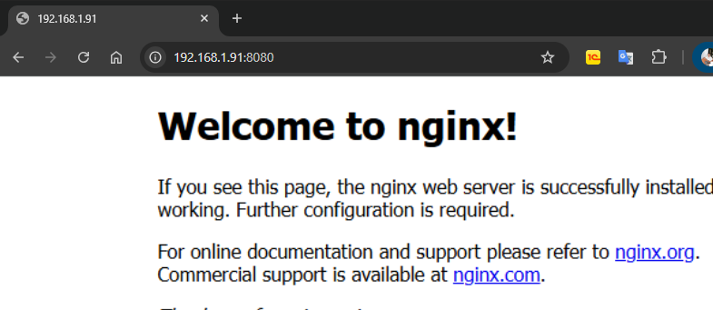

# Домашнее задание "Сценарии iptables"

## Цель
Написать сценарии iptables.

## Задание
1. реализовать knocking port
centralRouter может попасть на ssh inetrRouter через knock скрипт
пример в материалах https://wiki.archlinux.org/title/Port_knocking
2. добавить inetRouter2, который виден(маршрутизируется (host-only тип сети для виртуалки)) с хоста или форвардится порт через локалхост.
3. запустить nginx на centralServer.
4. пробросить 80й порт на inetRouter2 8080.
5. дефолт в инет оставить через inetRouter.
---

## Выполнение задания
Для выполнения задания будет использоваться ОС Ubuntu 22.04.5 LTS

# 1. 
Для реализации пункта 1 (port knocking на inetRouter для доступа к SSH с centralRouter) необходимо настроить фильтрацию пакетов на inetRouter с помощью iptables и организовать отправку последовательности портов с centralRouter.

- Подготовка на inetRouter

Устанавливаем пакет iptables-legacy
```bash
root@inetRouter:~# sudo apt update
root@inetRouter:~# sudo apt install iptables-legacy -y
```
Переключаем альтернативу для iptables
```bash
root@inetRouter:~# sudo update-alternatives --set iptables /usr/sbin/iptables-legacy
update-alternatives: using /usr/sbin/iptables-legacy to provide /usr/sbin/iptables (iptables) in manual mode
```
Проверяем, что теперь iptables работает корректно:
```bash
root@inetRouter:~# sudo iptables -L -n
Chain INPUT (policy ACCEPT)
target     prot opt source               destination         

Chain FORWARD (policy ACCEPT)
target     prot opt source               destination         

Chain OUTPUT (policy ACCEPT)
target     prot opt source               destination   
```

Создаём цепочку KNOCK и настраиваем port knocking
```bash
Создаём пользовательскую цепочку
root@inetRouter:~# sudo iptables -N KNOCK

Добавляем правила с правильным завершением (DROP для первых двух, ACCEPT для последнего)
root@inetRouter:~# sudo iptables -A KNOCK -p tcp --dport 1111 -m recent --set --name knock1 --rsource -j DROP

root@inetRouter:~# sudo iptables -A KNOCK -p tcp --dport 2222 -m recent --rcheck --name knock1 --rsource -m recent --set --name knock2 --rsource -m recent --remove --name knock1 --rsource -j DROP

root@inetRouter:~# sudo iptables -A KNOCK -p tcp --dport 3333 -m recent --rcheck --name knock2 --rsource -m recent --set --name sshallow --rsource -m recent --remove --name knock2 --rsource -j ACCEPT

root@inetRouter:~# sudo iptables -A KNOCK -p tcp --dport 3333 -j DROP

Сохраняем изменения
root@inetRouter:~# sudo netfilter-persistent save
run-parts: executing /usr/share/netfilter-persistent/plugins.d/15-ip4tables save
run-parts: executing /usr/share/netfilter-persistent/plugins.d/25-ip6tables save
```

Привязываем цепочку к интерфейсу ens19 и настраиваем SSH:
```bash
# Разрешаем SSH только для IP из списка sshallow (тайм-аут 60 секунд)
root@inetRouter:~# sudo iptables -A INPUT -i ens19 -p tcp --dport 22 -m recent --rcheck --name sshallow --rsource --seconds 60 -j ACCEPT

# Все остальные пакеты на порт 22 через ens19 направляем в цепочку KNOCK
root@inetRouter:~# sudo iptables -A INPUT -i ens19 -j KNOCK

# Запрещаем все прочие попытки SSH на этом интерфейсе
root@inetRouter:~# sudo iptables -A INPUT -i ens19 -p tcp --dport 22 -j DROP
```

Сохраняем правила, чтобы они не сбросились после перезагрузки
```bash
root@inetRouter:~# sudo apt install iptables-persistent -y
Reading package lists... Done
Building dependency tree... Done
Reading state information... Done
iptables-persistent is already the newest version (1.0.16).
The following packages were automatically installed and are no longer required:
  libfwupd2 libfwupdplugin5 libgcab-1.0-0 libgusb2 libmbim-glib4 libmbim-proxy
  libmm-glib0 libqmi-glib5 libqmi-proxy libsmbios-c2 libtcl8.6 modemmanager tcl tcl8.6
  usb-modeswitch usb-modeswitch-data
Use 'sudo apt autoremove' to remove them.
0 upgraded, 0 newly installed, 0 to remove and 25 not upgraded.

root@inetRouter:~# sudo netfilter-persistent save
run-parts: executing /usr/share/netfilter-persistent/plugins.d/15-ip4tables save
run-parts: executing /usr/share/netfilter-persistent/plugins.d/25-ip6tables save
```

Проверяем работу на centralRouter
```bash
# Установим утилиту knock
sudo apt install knockd -y

Отправим корректную последовательность
knock 192.168.255.1 1111 2222 3333

Сразу попробуем SSH
ssh user@192.168.255.1
```

Всё работает — пункт 1 выполнен.

# 2. Создание inetRouter2 (доступ с хоста)

Создаём ВМ inetRouter2 в Proxmox
Имя: inetRouter2, ОС: Ubuntu 22.04.

Сетевые интерфейсы:
net0 → мост vmbr0 (управление, для доступа с хоста).
net1 → мост vmbr1 (внутренняя связь с centralRouter).

Включаем ВМ, заходим по SSH через vmbr0. IP 192.168.1.91

Отключаем ufw:
```bash
root@inetRouter2:/home/user# sudo systemctl disable --now ufw
Synchronizing state of ufw.service with SysV service script with /lib/systemd/systemd-sysv-install.
Executing: /lib/systemd/systemd-sysv-install disable ufw
Removed /etc/systemd/system/multi-user.target.wants/ufw.service.
```

Настраиваем Netplan (/etc/netplan/01-netcfg.yaml):
```bash
root@inetRouter2:/home/user# rm /etc/netplan/50-cloud-init.yaml 
root@inetRouter2:/home/user# nano /etc/netplan/01-netcfg.yaml

network:
  version: 2
  renderer: networkd
  ethernets:
    ens18:                     # управление (vmbr0)
      dhcp4: true
    ens19:                     # внутренняя связь (vmbr1)
      addresses:
        - 192.168.255.14/30    # берём адрес из свободной подсети 192.168.255.8/29

root@inetRouter2:/home/user# sudo netplan apply

** (generate:1130): WARNING **: 18:45:50.159: Permissions for /etc/netplan/01-netcfg.yaml are too open. Netplan configuration should NOT be accessible by others.

** (process:1129): WARNING **: 18:45:50.540: Permissions for /etc/netplan/01-netcfg.yaml are too open. Netplan configuration should NOT be accessible by others.

** (process:1129): WARNING **: 18:45:50.658: Permissions for /etc/netplan/01-netcfg.yaml are too open. Netplan configuration should NOT be accessible by others.

** (process:1129): WARNING **: 18:45:50.658: Permissions for /etc/netplan/01-netcfg.yaml are too open. Netplan configuration should NOT be accessible by others.
```
Добавляем интерфейс на centralRouter для связи с inetRouter2

Включаем ВМ

Настроим новый интерфейс enp2s2 на centralRouter.
Заходим на centralRouter по SSH и открываем файл Netplan:
```bash
root@centralRouter:/home/user# sudo nano /etc/netplan/01-netcfg.yaml
В секцию ethernets добавляем блок для нового интерфейса enp2s2:

  enp2s2:
    addresses:
      - 192.168.255.13/30    # адрес для связи с inetRouter2
sudo netplan apply
** (process:968): WARNING **: 18:57:13.889: Permissions for /etc/netplan/01-netcfg.yaml are too open. Netplan configuration should NOT be accessible by others.
** (process:967): WARNING **: 18:57:14.242: Permissions for /etc/netplan/01-netcfg.yaml are too open. Netplan configuration should NOT be accessible by others.
** (process:967): WARNING **: 18:57:14.506: Permissions for /etc/netplan/01-netcfg.yaml are too open. Netplan configuration should NOT be accessible by others.
** (process:967): WARNING **: 18:57:14.507: Permissions for /etc/netplan/01-netcfg.yaml are too open. Netplan configuration should NOT be accessible by others.
root@centralRouter:/home/user# ip -br a
lo               UNKNOWN        127.0.0.1/8 ::1/128
ens18            UP             192.168.1.45/24 metric 100 fe80::be24:11ff:fe2d:f9dc/64
ens19            UP             192.168.255.2/30 fe80::be24:11ff:fe9c:528a/64
ens20            UP             192.168.0.1/24 fe80::be24:11ff:fe13:3ac0/64
ens21            UP             192.168.0.33/28 fe80::be24:11ff:fe19:af49/64
ens22            UP             192.168.0.65/26 fe80::be24:11ff:fe34:cbff/64
ens23            UP             192.168.255.9/30 fe80::be24:11ff:fe4c:d630/64
enp2s1           UP             192.168.255.5/30 fe80::be24:11ff:fe1e:f372/64
enp2s2           UP             192.168.255.13/30 fe80::be24:11ff:fe5f:f06e/64
```
# 3. запустить nginx на centralServer.

Зайддем на centralServer по SSH и выполним установку и запуск веб-сервера:
```bash
root@icentralServer:/home/user# sudo apt update
root@icentralServer:/home/user# sudo apt install nginx -y
root@icentralServer:/home/user# sudo systemctl enable --now nginx

root@icentralServer:/home/user# sudo ss -tulpn | grep 80
tcp   LISTEN 0      511               0.0.0.0:80        0.0.0.0:*    users:(("nginx",pid=3349,fd=6),("nginx",pid=3346,fd=6))
tcp   LISTEN 0      128               0.0.0.0:22        0.0.0.0:*    users:(("sshd",pid=680,fd=3))                          
tcp   LISTEN 0      511                  [::]:80           [::]:*    users:(("nginx",pid=3349,fd=7),("nginx",pid=3346,fd=7))
tcp   LISTEN 0      128                  [::]:22           [::]:*    users:(("sshd",pid=680,fd=4))  

Убедимся, что с centralRouter к нему есть доступ – выполните curl http://192.168.0.2. 

root@icentralServer:/home/user# curl http://192.168.0.2
<!DOCTYPE html>
<html>
<head>
<title>Welcome to nginx!</title>
<style>
    body {
        width: 35em;
        margin: 0 auto;
        font-family: Tahoma, Verdana, Arial, sans-serif;
    }
</style>
</head>
<body>
<h1>Welcome to nginx!</h1>
<p>If you see this page, the nginx web server is successfully installed and
working. Further configuration is required.</p>

<p>For online documentation and support please refer to
<a href="http://nginx.org/">nginx.org</a>.<br/>
Commercial support is available at
<a href="http://nginx.com/">nginx.com</a>.</p>

<p><em>Thank you for using nginx.</em></p>
</body>
</html>

```

# 4.Проброс 80-го порта на inetRouter2 (порт 8080)
```bash
Включаем маскарадинг (SNAT) для обратного трафика через внутренний интерфейс ens19
root@inetRouter2:~# sudo iptables -t nat -A POSTROUTING -o ens19 -j MASQUERADE

Добавляем правило DNAT: все пакеты на порт 8080 интерфейса ens18 (управление) отправляем на 192.168.0.2:80
root@inetRouter2:~# sudo iptables -t nat -A PREROUTING -i ens18 -p tcp --dport 8080 -j DNAT --to-destination 192.168.0.2:80

Разрешаем форвардинг пакетов в обоих направлениях
root@inetRouter2:~# sudo iptables -A FORWARD -i ens18 -o ens19 -p tcp --dport 80 -j ACCEPT
root@inetRouter2:~# sudo iptables -A FORWARD -i ens19 -o ens18 -m state --state ESTABLISHED,RELATED -j ACCEPT

Сохраняем правила, чтобы они не сбросились после перезагрузки
root@inetRouter2:~# sudo apt install iptables-persistent -y 
root@inetRouter2:/home/user# sudo netfilter-persistent saverun-parts: executing /usr/share/netfilter-persistent/plugins.d/15-ip4tables save
run-parts: executing /usr/share/netfilter-persistent/plugins.d/25-ip6tables save

```



# 5. дефолт в инет оставить через inetRouter.

Пункт 5 уже выполнен на предыдущих шагах.

Если кратко: дефолт в инет остаётся через inetRouter означает, что все внутренние узлы должны отправлять трафик в интернет по цепочке **сервер → centralRouter → inetRouter → (NAT) → внешний мир**.

Исходя из ваших логов, так оно и есть:

- На **centralServer** default via `192.168.0.1` (уходит на centralRouter).  
- На **centralRouter** default via `192.168.255.1` (уходит на inetRouter).  
- На **inetRouter2** default via `192.168.255.13` (уходит на centralRouter, а тот уже на inetRouter).

Выводы команд `ip route | grep default` (все в одном блоке):

```bash
root@icentralServer:/home/user# ip route | grep default
default via 192.168.0.1 dev ens19 proto static

root@centralRouter:/home/user# ip route | grep default
default via 192.168.255.1 dev ens19 proto static

root@inetRouter2:/home/user# ip route | grep default
default via 192.168.255.13 dev ens19
