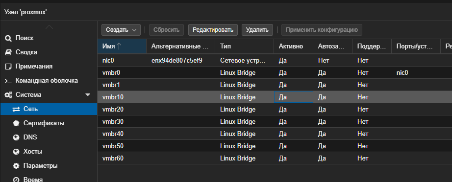
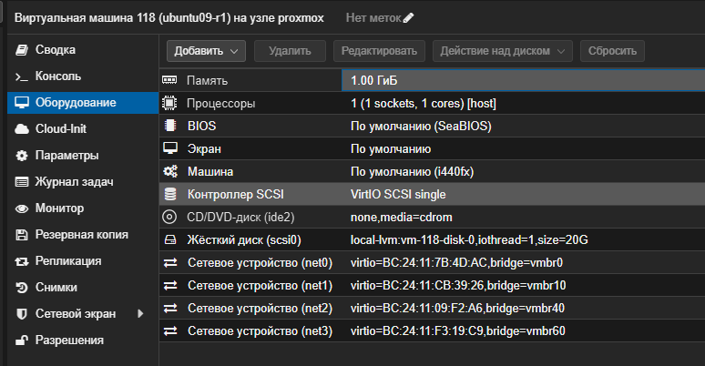
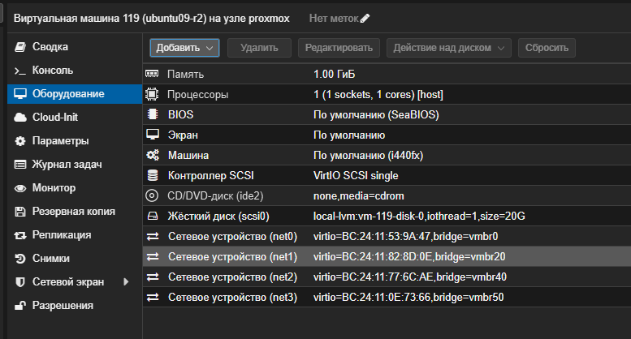
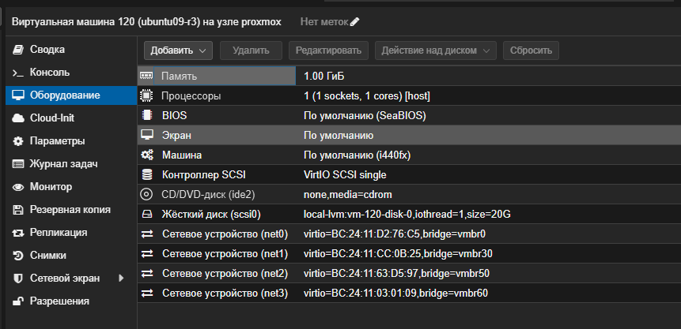

# Домашнее задание "OSPF"

## Цель
Создать домашнюю сетевую лабораторию;
Научится настраивать протокол OSPF в Linux-based системах.

## Задание
1. Поднять три виртуалки
2. Объединить их разными vlan
3. поднять OSPF между машинами на базе Quagga;
изобразить ассиметричный роутинг;
сделать один из линков "дорогим", но что бы при этом роутинг был симметричным.
---

## Выполнение задания
Для выполнения задания будет использоваться ОС Ubuntu 22.04.5 LTS

Создаем на proxmox 3 виртуальные машины r1, r2, r3.
r1: IP 192.168.1.109/24
r2: IP 192.168.1.48/24
r3: IP 192.168.1.102/24

Подготовим сеть в Proxmox
Создаем 6 мостов:
vmbr10 (для net1)
vmbr20 (для net2)
vmbr30 (для net3)
vmbr40 (линк R1-R2)
vmbr50 (линк R2-R3)
vmbr60 (линк R3-R1)



Подключим сетевые адаптеры к ВМ в Proxmox
| ВМ | Интерфейс в ОС | Мост (Bridge) в Proxmox | Назначение |
|----|----------------|-------------------------|------------|
| R1 | eth0 (уже есть) | vmbr0  | Управление (192.168.1.109/24) |
| R1 | eth1 | vmbr10 | net1 (192.168.10.1/24) |
| R1 | eth2 | vmbr40 | Линк R1-R2 (10.0.10.1/24) |
| R1 | eth3 | vmbr60 | Линк R1-R3 (10.0.12.1/24) |
| R2 | eth0 (уже есть) | vmbr0 | Управление (192.168.1.48/24) |
| R2 | eth1 | vmbr20 | net2 (192.168.20.1/24) |
| R2 | eth2 | vmbr40 | Линк R1-R2 (10.0.10.2/24) |
| R2 | eth3 | vmbr50 | Линк R2-R3 (10.0.11.2/24) |
| R3 | eth0 (уже есть) | vmbr0 | Управление (192.168.1.102/24) |
| R3 | eth1 | vmbr30 | net3 (192.168.30.1/24) |
| R3 | eth2 | vmbr50 | Линк R2-R3 (10.0.11.1/24) |
| R3 | eth3 | vmbr60 | Линк R1-R3 (10.0.12.2/24) |





настраиваем сеть ВМ r1:

```bash
root@r1:~# ip -br a
lo               UNKNOWN        127.0.0.1/8 ::1/128 
ens18            UP             192.168.1.109/24 metric 100 fe80::be24:11ff:fe7b:4dac/64 
ens19            DOWN           
ens20            DOWN           
ens21            DOWN 

root@r1:~# sudo nano /etc/netplan/00-installer-config.yaml

network:
  version: 2
  renderer: networkd
  ethernets:
    ens18:
      addresses: [192.168.1.109/24]
      routes:
        - to: default
          via: 192.168.1.1
    ens19:
      addresses: [192.168.10.1/24]
    ens20:
      addresses: [10.0.10.1/24]
    ens21:
      addresses: [10.0.12.1/24]

root@r1:~# sudo netplan apply

** (generate:2087): WARNING **: 10:44:34.711: Permissions for /etc/netplan/00-installer-config.yaml are too open. Netplan configuration should NOT be accessible by others.

** (process:2086): WARNING **: 10:44:36.572: Permissions for /etc/netplan/00-installer-config.yaml are too open. Netplan configuration should NOT be accessible by others.

** (process:2086): WARNING **: 10:44:37.387: Permissions for /etc/netplan/00-installer-config.yaml are too open. Netplan configuration should NOT be accessible by others.

** (process:2086): WARNING **: 10:44:37.387: Permissions for /etc/netplan/00-installer-config.yaml are too open. Netplan configuration should NOT be accessible by others.

root@r1:~# ip -br a
lo               UNKNOWN        127.0.0.1/8 ::1/128 
ens18            UP             192.168.1.109/24 metric 100 fe80::be24:11ff:fe7b:4dac/64 
ens19            UP             192.168.10.1/24 fe80::be24:11ff:fecb:3926/64 
ens20            UP             10.0.10.1/24 fe80::be24:11ff:fe09:f2a6/64 
ens21            UP             10.0.12.1/24 fe80::be24:11ff:fef3:19c9/64 

```

настраиваем сеть ВМ r2:

```bash
root@r2:~# ip -br a
lo               UNKNOWN        127.0.0.1/8 ::1/128 
ens18            UP             192.168.1.48/24 metric 100 fe80::be24:11ff:fe53:9a47/64 
ens19            DOWN           
ens20            DOWN           
ens21            DOWN  

root@r2:~# sudo nano /etc/netplan/00-installer-config.yaml

network:
  version: 2
  renderer: networkd
  ethernets:
    ens18:
      addresses: [192.168.1.48/24]
      routes:
        - to: default
          via: 192.168.1.1
    ens19:
      addresses: [192.168.20.1/24]
    ens20:
      addresses: [10.0.10.2/24]
    ens21:
      addresses: [10.0.11.2/24]

root@r2:~# sudo netplan apply

** (generate:31150): WARNING **: 10:47:39.871: Permissions for /etc/netplan/00-installer-config.yaml are too open. Netplan configuration should NOT be accessible by others.

** (process:31149): WARNING **: 10:47:40.286: Permissions for /etc/netplan/00-installer-config.yaml are too open. Netplan configuration should NOT be accessible by others.

** (process:31149): WARNING **: 10:47:40.843: Permissions for /etc/netplan/00-installer-config.yaml are too open. Netplan configuration should NOT be accessible by others.

** (process:31149): WARNING **: 10:47:40.843: Permissions for /etc/netplan/00-installer-config.yaml are too open. Netplan configuration should NOT be accessible by others.

root@r2:~# ip -br a
lo               UNKNOWN        127.0.0.1/8 ::1/128 
ens18            UP             192.168.1.48/24 metric 100 fe80::be24:11ff:fe53:9a47/64 
ens19            UP             192.168.20.1/24 fe80::be24:11ff:fe82:8d0e/64 
ens20            UP             10.0.10.2/24 fe80::be24:11ff:fe77:6cae/64 
ens21            UP             10.0.11.2/24 fe80::be24:11ff:fe0e:7366/64 
```
настраиваем сеть ВМ r3:

```bash
root@r3:~# ip -br a
lo               UNKNOWN        127.0.0.1/8 ::1/128 
ens18            UP             192.168.1.102/24 metric 100 fe80::be24:11ff:fed2:76c5/64 
ens19            DOWN           
ens20            DOWN           
ens21            DOWN   

root@r3:~# sudo nano /etc/netplan/00-installer-config.yaml

network:
  version: 2
  renderer: networkd
  ethernets:
    ens18:
      addresses: [192.168.1.102/24]
      routes:
        - to: default
          via: 192.168.1.1
    ens19:
      addresses: [192.168.30.1/24]
    ens20:
      addresses: [10.0.11.1/24]
    ens21:
      addresses: [10.0.12.2/24]

root@r3:~# sudo netplan apply

** (generate:30876): WARNING **: 10:49:51.315: Permissions for /etc/netplan/00-installer-config.yaml are too open. Netplan configuration should NOT be accessible by others.

** (process:30875): WARNING **: 10:49:51.747: Permissions for /etc/netplan/00-installer-config.yaml are too open. Netplan configuration should NOT be accessible by others.

** (process:30875): WARNING **: 10:49:52.099: Permissions for /etc/netplan/00-installer-config.yaml are too open. Netplan configuration should NOT be accessible by others.

** (process:30875): WARNING **: 10:49:52.099: Permissions for /etc/netplan/00-installer-config.yaml are too open. Netplan configuration should NOT be accessible by others.

root@r3:~# ip -br a
lo               UNKNOWN        127.0.0.1/8 ::1/128 
ens18            UP             192.168.1.102/24 metric 100 fe80::be24:11ff:fed2:76c5/64 
ens19            UP             192.168.30.1/24 fe80::be24:11ff:fecc:b25/64 
ens20            UP             10.0.11.1/24 fe80::be24:11ff:fe63:d597/64 
ens21            UP             10.0.12.2/24 fe80::be24:11ff:fe03:109/64 

```

Установка и запуск FRR (Quagga).
Выполним на всех трех виртуалках (r1, r2, r3):
```bash
sudo apt update
sudo apt install frr -y
sudo nano /etc/frr/daemons
```
В открывшемся файле находим строку ospfd=no и заменим на ospfd=yes. 
```bash
sudo systemctl enable --now frr

root@r1:~# sudo systemctl enable --now frr
Synchronizing state of frr.service with SysV service script with /lib/systemd/systemd-sysv-install.
Executing: /lib/systemd/systemd-sysv-install enable frr

root@r2:~# sudo systemctl enable --now frr
Synchronizing state of frr.service with SysV service script with /lib/systemd/systemd-sysv-install.
Executing: /lib/systemd/systemd-sysv-install enable frr

root@r3:~# sudo systemctl enable --now frr
Synchronizing state of frr.service with SysV service script with /lib/systemd/systemd-sysv-install.
Executing: /lib/systemd/systemd-sysv-install enable frr

```

Настройка OSPF.
Создаем конфигурационные файлы на каждой виртуалке.

Для r1:
```bash
root@r1:~# sudo nano /etc/frr/ospfd.conf

router ospf
 ospf router-id 1.1.1.1
 network 192.168.10.0/24 area 0
 network 10.0.10.0/24 area 0
 network 10.0.12.0/24 area 0
!
interface ens20
 ip ospf cost 1
!
interface ens21
 ip ospf cost 1
```

Для r2:
```bash
root@r2:~# sudo nano /etc/frr/ospfd.conf

router ospf
 ospf router-id 2.2.2.2
 network 192.168.20.0/24 area 0
 network 10.0.10.0/24 area 0
 network 10.0.11.0/24 area 0
!
interface ens20
 ip ospf cost 1
!
interface ens21
 ip ospf cost 1
```

Для r3:
```bash
root@r3:~# sudo nano /etc/frr/ospfd.conf

router ospf
 ospf router-id 3.3.3.3
 network 192.168.30.0/24 area 0
 network 10.0.11.0/24 area 0
 network 10.0.12.0/24 area 0
!
interface ens20
 ip ospf cost 1
!
interface ens21
 ip ospf cost 1
```

Перезапускаем службу FRR на всех трех машинах:
```bash
sudo systemctl restart frr
```

После перезапуска FRR на всех машинах, демон ospfd запустился, но не смог прочитать конфигурационные файлы из-за неправильных прав доступа. Это привело к ошибке % OSPF instance not found при проверке соседства.

Исправляем права на всех трех машинах (r1, r2, r3):
```bash
sudo chown frr:frr /etc/frr/ospfd.conf
sudo chmod 640 /etc/frr/ospfd.conf
sudo touch /etc/frr/zebra.conf
sudo chown frr:frr /etc/frr/zebra.conf
sudo chmod 640 /etc/frr/zebra.conf
sudo systemctl restart frr
```

Чтобы пакеты маршрутизировались между интерфейсами, необходимо включить IP Forwarding на всех трех машинах:
```bash
sudo sysctl -w net.ipv4.ip_forward=1
echo "net.ipv4.ip_forward=1" | sudo tee -a /etc/sysctl.conf
```
Далее вносим конфигурацию OSPF вручную через vtysh
Для R1:
```bash
sudo vtysh
configure terminal
ip forwarding
router ospf
 ospf router-id 1.1.1.1
 network 192.168.10.0/24 area 0
 network 10.0.10.0/24 area 0
 network 10.0.12.0/24 area 0
exit
interface ens20
 ip ospf cost 1
exit
interface ens21
 ip ospf cost 1
exit
end
write memory
exit
```

Для R2:
```bash
sudo vtysh
configure terminal
ip forwarding
router ospf
 ospf router-id 2.2.2.2
 network 192.168.20.0/24 area 0
 network 10.0.10.0/24 area 0
 network 10.0.11.0/24 area 0
exit
interface ens20
 ip ospf cost 1
exit
interface ens21
 ip ospf cost 1
exit
end
write memory
exit
```

Для R3:
```bash
sudo vtysh
configure terminal
ip forwarding
router ospf
 ospf router-id 3.3.3.3
 network 192.168.30.0/24 area 0
 network 10.0.11.0/24 area 0
 network 10.0.12.0/24 area 0
exit
interface ens20
 ip ospf cost 1
exit
interface ens21
 ip ospf cost 1
exit
end
write memory
exit
```
Теперь проверим состояние соседства на R1:
```bash
root@r1:~# sudo vtysh

Hello, this is FRRouting (version 8.1).
Copyright 1996-2005 Kunihiro Ishiguro, et al.

r1# show ip ospf neighbor

Neighbor ID     Pri State           Dead Time Address         Interface                        RXmtL RqstL DBsmL
2.2.2.2           1 Full/Backup       39.370s 10.0.10.2       ens20:10.0.10.1                      0     0     0
3.3.3.3           1 Full/Backup       33.399s 10.0.12.2       ens21:10.0.12.1                      0     0     0
```


Для создания асимметрии сделаем линк R1–R2 дорогим только на R1.
На R1 (в vtysh):
```bash
root@r1:~# sudo vtysh

Hello, this is FRRouting (version 8.1).
Copyright 1996-2005 Kunihiro Ishiguro, et al.

r1# configure terminal
r1(config)# interface ens20
r1(config-if)#  ip ospf cost 1000
r1(config-if)# end
r1# write memory
Note: this version of vtysh never writes vtysh.conf
Building Configuration...
Integrated configuration saved to /etc/frr/frr.conf
[OK]

r1# show ip route
Codes: K - kernel route, C - connected, S - static, R - RIP,
       O - OSPF, I - IS-IS, B - BGP, E - EIGRP, N - NHRP,
       T - Table, v - VNC, V - VNC-Direct, A - Babel, F - PBR,
       f - OpenFabric,
       > - selected route, * - FIB route, q - queued, r - rejected, b - backup
       t - trapped, o - offload failure

K * 0.0.0.0/0 [0/100] via 192.168.1.1, ens18, src 192.168.1.109, 00:23:26
K>* 0.0.0.0/0 [0/0] via 192.168.1.1, ens18, 00:23:26
O   10.0.10.0/24 [110/3] via 10.0.12.2, ens21, weight 1, 00:02:45
C>* 10.0.10.0/24 is directly connected, ens20, 00:23:26
O>* 10.0.11.0/24 [110/2] via 10.0.12.2, ens21, weight 1, 00:02:45
O   10.0.12.0/24 [110/1] is directly connected, ens21, weight 1, 00:19:22
C>* 10.0.12.0/24 is directly connected, ens21, 00:23:26
C>* 192.168.1.0/24 [0/100] is directly connected, ens18, 00:23:26
K>* 192.168.1.1/32 [0/100] is directly connected, ens18, 00:23:26
O   192.168.10.0/24 [110/1] is directly connected, ens19, weight 1, 00:19:22
C>* 192.168.10.0/24 is directly connected, ens19, 00:23:26
O>* 192.168.20.0/24 [110/3] via 10.0.12.2, ens21, weight 1, 00:02:45
O>* 192.168.30.0/24 [110/2] via 10.0.12.2, ens21, weight 1, 00:12:52

```

Строка O 10.0.10.0/24 [110/3] via 10.0.12.2, ens21 означает, что R1 до сети, соединяющей его с R2, теперь идет через R3 (потому что прямой линк стоит 1000 и игнорируется). А R2 в данный момент еще не знает о том, что линк дорогой, поэтому он будет ходить к R1 напрямую.
Это и есть требуемая асимметрия!


Настройка R2 для симметрии
Зайдем на R2 и выполним точно такие же команды:
```bash

sudo vtysh
Hello, this is FRRouting (version 8.1).
Copyright 1996-2005 Kunihiro Ishiguro, et al.

r2# configure terminal
r2(config)# interface ens20
r2(config-if)#  ip ospf cost 1000
r2(config-if)# end
r2# write memory
Note: this version of vtysh never writes vtysh.conf
Building Configuration...
Integrated configuration saved to /etc/frr/frr.conf
[OK]
```

После этого оба маршрутизатора будут считать линк R1-R2 дорогим (1000) и выберут путь через R3 (стоимость 2). Роутинг станет симметричным.
Финальная проверка
На R1:
```bash
root@r1:~# traceroute 192.168.20.1
traceroute to 192.168.20.1 (192.168.20.1), 30 hops max, 60 byte packets
 1  ip-10-0-12-2.citylink.pro (10.0.12.2)  0.267 ms  0.241 ms  0.290 ms
 2  192.168.20.1 (192.168.20.1)  0.482 ms  0.457 ms  0.445 ms
```
Как видно из вывода:
Hop 1: 10.0.12.2 — это IP-адрес R3 на линке с R1.
Hop 2: 192.168.20.1 — это конечный IP-адрес R2.
То есть пакет ушел R1 -> R3 -> R2, а прямой линк R1-R2 (10.0.10.x) не используется, потому что он «дорогой».

На R2:
```bash
root@r2:~# traceroute 192.168.10.1
traceroute to 192.168.10.1 (192.168.10.1), 30 hops max, 60 byte packets
 1  video1.citylink.pro (10.0.11.1)  0.195 ms  0.171 ms  0.163 ms
 2  192.168.10.1 (192.168.10.1)  0.338 ms  0.321 ms  0.357 ms
```

Hop 1: 10.0.11.1 (это IP-адрес R3 на линке с R2).
Hop 2: 192.168.10.1 (это IP-адрес R1).

Маршрут из R2 в R1 идет через R3. Вместе с предыдущей трассировкой R1 -> R2 (через 10.0.12.2 R3) видно, что пути в обе стороны полностью совпадают. Прямой линк R1-R2 исключен из маршрутизации (он "дорогой"), и роутинг является симметричным.
