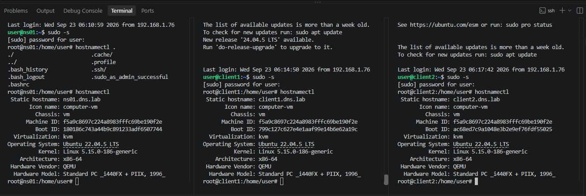
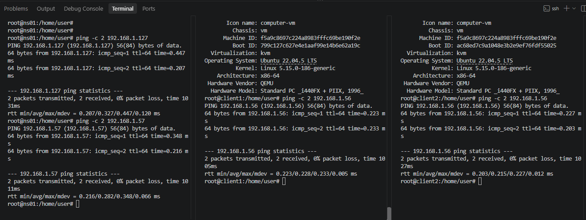

# Домашнее задание "Настраиваем split-dns"

## Цель
Создать домашнюю сетевую лабораторию;
Изучить основы DNS;
Научиться работать с технологией Split-DNS в Linux-based системах.

## Задание
1. Создать стенд из 3 ВМ (будет состоять из DNS-сервера (ns01) и двух клиентов (client1, client2))
завести в зоне dns.lab имена:
web1 - смотрит на клиент1
web2  смотрит на клиент2
завести еще одну зону newdns.lab
завести в ней запись
www - смотрит на обоих клиентов

2. настроить split-dns
клиент1 - видит обе зоны, но в зоне dns.lab только web1
клиент2 - видит только dns.lab

---

## Выполнение задания
Для выполнения задания будет использоваться ОС Ubuntu 22.04.5 LTS

Создаем на proxmox 3 виртуальные машины.
ns01: IP 192.168.1.56/24
client1: IP 192.168.1.127/24
client2: IP 192.168.1.57/24

## Настройка hostname и /etc/hosts на всех трёх ВМ
На каждой машине зададим имя хоста и пропишем соответствие IP/имя.

На ns01
```bash
sudo hostnamectl set-hostname ns01.dns.lab
```
Отредактируем /etc/hosts:
```bash
sudo nano /etc/hosts

127.0.0.1       localhost
127.0.1.1       ns01.dns.lab ns01

192.168.1.56    ns01.dns.lab ns01
192.168.1.127   client1.dns.lab client1
192.168.1.57    client2.dns.lab client2
```

На client1
```bash
sudo hostnamectl set-hostname client1.dns.lab

sudo nano /etc/hosts

127.0.0.1       localhost
127.0.1.1       client1.dns.lab client1

192.168.1.56    ns01.dns.lab ns01
192.168.1.127   client1.dns.lab client1
192.168.1.57    client2.dns.lab client2
```
На client2
```bash
sudo hostnamectl set-hostname client2.dns.lab

sudo nano /etc/hosts:

127.0.0.1       localhost
127.0.1.1       client2.dns.lab client2

192.168.1.56    ns01.dns.lab ns01
192.168.1.127   client1.dns.lab client1
192.168.1.57    client2.dns.lab client2
```



Проверяем сетевую связность
С ns01 пропингуем обоих клиентов:

```bash
ping -c 2 192.168.1.127
ping -c 2 192.168.1.57
```
С client1 и client2 пропингуем ns01:

```bash
ping -c 2 192.168.1.56
```


Укажем DNS-сервера на клиентах
На client1 и client2 откроем netplan-конфиг и убедимся, что в качестве DNS указан 192.168.1.56:
```bash
nano /etc/netplan/50-cloud-init.yaml

network:
  version: 2
  ethernets:
    ens18:
      addresses:
        - 192.168.1.127/24
      routes:
        - to: default
          via: 192.168.1.1
      nameservers:
        addresses: [192.168.1.56]
        search: [dns.lab, newdns.lab]

Для client2 — соответственно 192.168.1.57/24.

sudo netplan apply
```

Проверяем:

```bash
root@client1:/home/user# ip a show ens18
ping -c 2 192.168.1.56
2: ens18: <BROADCAST,MULTICAST,UP,LOWER_UP> mtu 1500 qdisc fq_codel state UP group default qlen 1000
    link/ether bc:24:11:c0:c6:0e brd ff:ff:ff:ff:ff:ff
    altname enp0s18
    inet 192.168.1.127/24 brd 192.168.1.255 scope global ens18
       valid_lft forever preferred_lft forever
    inet6 fe80::be24:11ff:fec0:c60e/64 scope link 
       valid_lft forever preferred_lft forever
PING 192.168.1.56 (192.168.1.56) 56(84) bytes of data.
64 bytes from 192.168.1.56: icmp_seq=1 ttl=64 time=0.532 ms
64 bytes from 192.168.1.56: icmp_seq=2 ttl=64 time=0.294 ms

--- 192.168.1.56 ping statistics ---
2 packets transmitted, 2 received, 0% packet loss, time 1017ms
rtt min/avg/max/mdev = 0.294/0.413/0.532/0.119 ms


root@client2:/home/user# ip a show ens18
ping -c 2 192.168.1.56
2: ens18: <BROADCAST,MULTICAST,UP,LOWER_UP> mtu 1500 qdisc fq_codel state UP group default qlen 1000
    link/ether bc:24:11:6c:b1:28 brd ff:ff:ff:ff:ff:ff
    altname enp0s18
    inet 192.168.1.57/24 brd 192.168.1.255 scope global ens18
       valid_lft forever preferred_lft forever
    inet6 fe80::be24:11ff:fe6c:b128/64 scope link 
       valid_lft forever preferred_lft forever
PING 192.168.1.56 (192.168.1.56) 56(84) bytes of data.
64 bytes from 192.168.1.56: icmp_seq=1 ttl=64 time=0.541 ms
64 bytes from 192.168.1.56: icmp_seq=2 ttl=64 time=0.301 ms

--- 192.168.1.56 ping statistics ---
2 packets transmitted, 2 received, 0% packet loss, time 1020ms
rtt min/avg/max/mdev = 0.301/0.421/0.541/0.120 ms
```

Установка BIND9 на ns01
```bash
root@ns01:/home/user# sudo apt update
root@ns01:/home/user# sudo apt install -y bind9 bind9utils bind9-doc dnsutils
```
На клиентах:
```bash
sudo apt update
sudo apt install -y dnsutils
```
Проверим, что bind9 запустился:
```bash
root@ns01:/home/user# sudo systemctl status bind9
● named.service - BIND Domain Name Server
     Loaded: loaded (/lib/systemd/system/named.service; e>     Active: active (running) since Wed 2026-09-23 06:34:>       Docs: man:named(8)
    Process: 1755 ExecStart=/usr/sbin/named $OPTIONS (cod>   Main PID: 1760 (named)
      Tasks: 5 (limit: 1008)
     Memory: 23.2M
        CPU: 81ms
     CGroup: /system.slice/named.service
             └─1760 /usr/sbin/named -u bind

Sep 23 06:34:27 ns01.dns.lab named[1760]: network unreach>Sep 23 06:34:27 ns01.dns.lab named[1760]: network unreach>Sep 23 06:34:27 ns01.dns.lab named[1760]: network unreach>Sep 23 06:34:27 ns01.dns.lab named[1760]: network unreach>Sep 23 06:34:27 ns01.dns.lab named[1760]: network unreach>Sep 23 06:34:27 ns01.dns.lab named[1760]: network unreach>Sep 23 06:34:27 ns01.dns.lab named[1760]: network unreach>Sep 23 06:34:30 ns01.dns.lab named[1760]: network unreach>Sep 23 06:34:30 ns01.dns.lab named[1760]: network unreach>Sep 23 06:34:30 ns01.dns.lab named[1760]: network unreach>lines 1-22/22 (END)
```

Создадим каталог для файлов зон
На ns01:

```bash
root@ns01:/home/user# sudo mkdir -p /etc/bind/zones
root@ns01:/home/user# ls -ld /etc/bind/zones
drwxr-sr-x 2 root bind 4096 Sep 23 06:38 /etc/bind/zones
```
Настроим named.conf.options
```bash
sudo nano /etc/bind/named.conf.options
Приведите его к следующему виду полностью (можно заменить содержимое):

acl "client1" { 192.168.1.127; };
acl "client2" { 192.168.1.57; };
acl "trusted" { 192.168.1.0/24; 127.0.0.1; };

options {
    directory "/var/cache/bind";

    // Слушаем только на своём адресе
    listen-on { 192.168.1.56; 127.0.0.1; };
    listen-on-v6 { none; };

    // Рекурсия только для доверенных
    recursion yes;
    allow-recursion { trusted; };
    allow-query     { trusted; };

    // Не пытаемся ходить во внешний интернет (лаборатория изолирована)
    // Если интернет есть и нужен — раскомментируйте forwarders
    // forwarders { 8.8.8.8; 1.1.1.1; };

    dnssec-validation no;

    auth-nxdomain no;

    // Логировать запросы — удобно для проверки split-DNS
    querylog yes;
};
```

Создадим файлы зон
Зона dns.lab (полная — для client2 и по умолчанию)
```bash
root@ns01:/home/user# sudo nano /etc/bind/zones/db.dns.lab

Содержимое:

$TTL 3600
@   IN  SOA ns01.dns.lab. admin.dns.lab. (
        2025010101 ; Serial
        3600       ; Refresh
        1800       ; Retry
        604800     ; Expire
        86400      ; Minimum TTL
)
    IN  NS  ns01.dns.lab.
ns01 IN  A   192.168.1.56
web1 IN  A   192.168.1.127
web2 IN  A   192.168.1.57
```

Зона dns.lab — урезанная версия (для client1: только web1)
```bash
root@ns01:/home/user# sudo nano /etc/bind/zones/db.dns.lab.client1
Содержимое (то же самое, но без строки web2):

$TTL 3600
@   IN  SOA ns01.dns.lab. admin.dns.lab. (
        2025010101
        3600
        1800
        604800
        86400
)
    IN  NS  ns01.dns.lab.
ns01 IN  A   192.168.1.56
web1 IN  A   192.168.1.127
```

Зона newdns.lab (общая для client1)
```bash
sudo nano /etc/bind/zones/db.newdns.lab
Содержимое:

$TTL 3600
@   IN  SOA ns01.newdns.lab. admin.newdns.lab. (
        2025010101
        3600
        1800
        604800
        86400
)
    IN  NS  ns01.newdns.lab.
ns01 IN  A   192.168.1.56
www  IN  A   192.168.1.127
www  IN  A   192.168.1.57
```
Две A-записи www — это round-robin, www.newdns.lab будет возвращать оба адреса.

Настроим views в named.conf.local
```bash
root@ns01:/home/user# sudo nano /etc/bind/named.conf.local
Заменим содержимое на:

conf
// ============ VIEW для client1 ============
view "client1-view" {
    match-clients { client1; };
    recursion yes;

    zone "dns.lab" {
        type master;
        file "/etc/bind/zones/db.dns.lab.client1";
    };

    zone "newdns.lab" {
        type master;
        file "/etc/bind/zones/db.newdns.lab";
    };

    include "/etc/bind/named.conf.default-zones";
};

// ============ VIEW для client2 ============
view "client2-view" {
    match-clients { client2; };
    recursion yes;

    zone "dns.lab" {
        type master;
        file "/etc/bind/zones/db.dns.lab";
    };

    include "/etc/bind/named.conf.default-zones";
};

// ============ VIEW по умолчанию ============
view "default-view" {
    match-clients { any; };
    recursion yes;

    // Зона dns.lab для всех остальных (localhost и т.п.) — полная
    zone "dns.lab" {
        type master;
        file "/etc/bind/zones/db.dns.lab";
    };

    include "/etc/bind/named.conf.default-zones";
};
```
Ключевые моменты:

Порядок view важен: client1-view идёт до client2-view, а default-view — последним, иначе any перехватит всех.
newdns.lab объявлена только в client1-view — для client2 этой зоны «не существует».
В client1-view используется db.dns.lab.client1 без web2.

Проверка синтаксиса и перезапуск
```bash
root@ns01:/home/user# sudo named-checkconf
/etc/bind/named.conf.default-zones:2: when using 'view' statements, all zones must be in views

root@ns01:/home/user# sudo named-checkzone dns.lab /etc/bind/zones/db.dns.lab
zone dns.lab/IN: loaded serial 2025010101
OK
root@ns01:/home/user# sudo named-checkzone dns.lab /etc/bind/zones/db.dns.lab.client1
zone dns.lab/IN: loaded serial 2025010101
OK
root@ns01:/home/user# sudo named-checkzone newdns.lab /etc/bind/zones/db.newdns.lab
zone newdns.lab/IN: loaded serial 2025010101
OK
```
Перезапустим BIND9:
```bash
root@ns01:/home/user# sudo systemctl restart bind9
root@ns01:/home/user# sudo systemctl status bind9
● named.service - BIND Domain Name Server
     Loaded: loaded (/lib/systemd/system/named.service; enabled; vendor preset: enabl>     Active: active (running) since Wed 2026-09-23 06:52:35 UTC; 3s ago
       Docs: man:named(8)
    Process: 1975 ExecStart=/usr/sbin/named $OPTIONS (code=exited, status=0/SUCCESS)
   Main PID: 1976 (named)
      Tasks: 4 (limit: 1008)
     Memory: 41.8M
        CPU: 56ms
     CGroup: /system.slice/named.service
             └─1976 /usr/sbin/named -u bind

Sep 23 06:52:35 ns01.dns.lab named[1976]: zone 255.in-addr.arpa/IN/default-view: load>Sep 23 06:52:35 ns01.dns.lab named[1976]: zone 127.in-addr.arpa/IN/client2-view: load>Sep 23 06:52:35 ns01.dns.lab named[1976]: zone 0.in-addr.arpa/IN/default-view: loaded>Sep 23 06:52:35 ns01.dns.lab named[1976]: zone 127.in-addr.arpa/IN/default-view: load>Sep 23 06:52:35 ns01.dns.lab named[1976]: zone dns.lab/IN/client2-view: loaded serial>Sep 23 06:52:35 ns01.dns.lab named[1976]: zone localhost/IN/client1-view: loaded seri>Sep 23 06:52:35 ns01.dns.lab named[1976]: zone localhost/IN/client2-view: loaded seri>Sep 23 06:52:35 ns01.dns.lab named[1976]: all zones loaded
Sep 23 06:52:35 ns01.dns.lab systemd[1]: Started BIND Domain Name Server.
Sep 23 06:52:35 ns01.dns.lab named[1976]: running


root@ns01:/home/user# ss -tulnp | grep :53
udp   UNCONN 0      0            192.168.1.56:53        0.0.0.0:*    users:(("named",pid=1976,fd=20))         
udp   UNCONN 0      0               127.0.0.1:53        0.0.0.0:*    users:(("named",pid=1976,fd=17))         
udp   UNCONN 0      0           127.0.0.53%lo:53        0.0.0.0:*    users:(("systemd-resolve",pid=597,fd=13))
tcp   LISTEN 0      10              127.0.0.1:53        0.0.0.0:*    users:(("named",pid=1976,fd=18))         
tcp   LISTEN 0      10           192.168.1.56:53        0.0.0.0:*    users:(("named",pid=1976,fd=21))         
tcp   LISTEN 0      4096        127.0.0.53%lo:53        0.0.0.0:*    users:(("systemd-resolve",pid=597,fd=14))
```

Локальная проверка на ns01
Сам ns01 попадает в default-view, поэтому увидит полную зону dns.lab:

```bash
root@ns01:/home/user# dig @127.0.0.1 web1.dns.lab +short
192.168.1.127
root@ns01:/home/user# dig @127.0.0.1 web2.dns.lab +short
192.168.1.57
root@ns01:/home/user# dig @127.0.0.1 www.newdns.lab +short
```
Всё верно:

web1.dns.lab → 192.168.1.127 ✅
web2.dns.lab → 192.168.1.57 ✅
www.newdns.lab → пусто ✅ (ns01 в default-view, зона newdns.lab туда не входит — как и задумано)
Сервер работает корректно. Переходим к главной проверке — split-DNS с клиентов.


# Проверка split-DNS.

Перейдем на client1
Убедимся, что резолвер указывает на ns01:

```bash
root@client1:/home/user# cat /etc/resolv.conf

nameserver 127.0.0.53
options edns0 trust-ad
search dns.lab newdns.lab

root@client1:/home/user# resolvectl status | grep -A2 "DNS Servers"
       DNS Servers: 192.168.1.56
        DNS Domain: dns.lab newdns.lab


root@client1:/home/user# dig web1.dns.lab +short
192.168.1.127
root@client1:/home/user# dig web2.dns.lab +short
root@client1:/home/user# dig www.newdns.lab +short
192.168.1.57
192.168.1.127
```
Перейдем на client2
```bash

root@client2:/home/user# cat /etc/resolv.conf

nameserver 127.0.0.53
options edns0 trust-ad
search dns.lab newdns.lab

root@client2:/home/user# dig web1.dns.lab +short
192.168.1.127
root@client2:/home/user# dig web2.dns.lab +short
192.168.1.57
root@client2:/home/user# dig www.newdns.lab +short
```

Проверено с обоих клиентов: client1 получает web1 и www, но не видит web2; client2 получает web1 и web2, но не видит newdns.lab. Split-DNS работает корректно.


